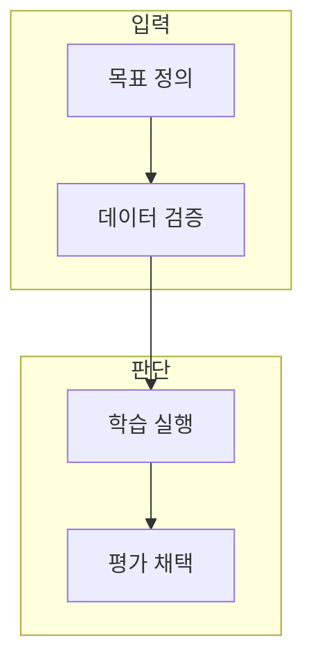

> [!abstract] 한 줄 요약
> Fine-Tuning은 반복 목표와 검증된 데이터가 있을 때 모델 행동을 조정하는 과정이며, 프롬프트와 평가를 대체하지 않는다.

## 이 노트의 지도



## 1. Fine-Tuning의 목적

반복되는 형식·톤·작업 행동을 안정화하려면 좋은 입출력 사례와 독립 평가 사례가 필요하다. ==학습 데이터== 는 원하는 입력과 출력 행동을 모델에 보여 주는 사례 집합.

> [!important] 학습 전 증거
> 학습용 데이터의 양보다 목표 대표성·정확성·평가 분리가 먼저다.

## 2. 상태와 평가

학습 상태가 완료되어도 목표 품질·안전성·비용이 개선됐는지 독립 사례에서 확인해야 한다.

<details>
<summary>학습 전후 비교</summary>

- 프롬프트 기준선
- 학습·평가 데이터 분리
- 실패 유형 비교
- 비용·지연·안전성 기록

</details>

## 데이터로 보기

```html preview
<div style="font-family:system-ui,sans-serif;padding:20px;color:var(--foreground)">
  <h3 style="margin:0 0 14px;font-size:15px;font-weight:600">Fine-Tuning 검증 흐름</h3>
  <div id="bars" style="display:flex;align-items:flex-end;gap:14px;height:170px"></div>
  <script>
    var data = [["목표",1],["데이터",1],["학습",1],["평가",1]];
    var max = Math.max.apply(null, data.map(function (d) { return d[1]; }));
    document.getElementById('bars').innerHTML = data.map(function (d, i) {
      return '<div style="flex:1;display:flex;flex-direction:column;align-items:center;' +
        'gap:6px;height:100%;justify-content:flex-end">' +
        '<span style="font-size:12px;font-weight:600">' + d[1] + '</span>' +
        '<div style="width:100%;height:' + (d[1] / max * 100) + '%;' +
        'background:var(--chart-' + (i + 1) + ');' +
        'border-radius:var(--radius) var(--radius) 0 0"></div>' +
        '<span style="font-size:12px;color:var(--muted-foreground)">' + d[0] + '</span>' +
        '</div>';
    }).join('');
  </script>
</div>
```

값 1은 네 단계가 모두 필요하다는 표시이며, 학습 품질이나 소요 시간의 수치가 아니다.

> [!important] 완료 상태의 한계
> 단계 수는 실제 프로젝트의 기간·비용·성공을 의미하지 않는다.

## 핵심 정리

| 개념 | 정의 | 왜 중요한가 |
| :-- | :-- | :-- |
| 목표 | 바꾸려는 행동 정의 | 학습 범위를 정한다 |
| 데이터 | 입출력 사례 | 모델이 따를 행동을 보여 준다 |
| 평가 | 독립 결과 비교 | 개선 여부를 판정한다 |

## 관련 개념

- 프롬프트: 학습 전에 세울 기준선
- 데이터 품질: 대표성·오류·안전을 검토하는 과정

> [!question]- 스스로 점검
> **Q.** 학습 작업이 완료됐다는 상태만으로 배포를 결정하면 왜 위험한가?
>
> **A.** 완료는 실행 상태일 뿐, 목표 품질·안전성·비용이 기준을 충족했다는 증거가 아니기 때문이다.
