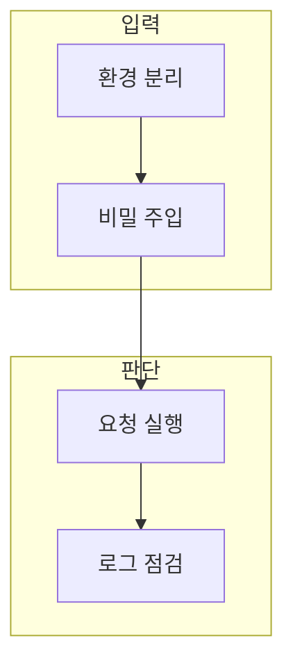

> [!abstract] 한 줄 요약
> 개발환경과 키 관리는 실행 편의가 아니라 비밀값 노출·권한 오용·재현 불가를 줄이는 운영 설계다.

## 이 노트의 지도



## 1. 환경 변수와 비밀값

키를 코드·노트·로그에 직접 넣지 않고 실행 환경에서 주입하며, 필요한 최소 권한과 범위로 관리한다. ==비밀값== 는 노출되면 계정·서비스·데이터에 접근할 수 있는 인증 정보.

> [!warning] 비밀값 경계
> 테스트·개발·운영의 값을 분리하고, 공유 전에는 출력·설정 파일·화면 캡처를 확인한다.

## 2. 재현 가능한 실행

패키지 버전, 설정, 키의 존재 여부, 실패 로그를 분리하면 다른 환경에서도 원인을 좁힐 수 있다.

<details>
<summary>키 관리 체크</summary>

- 코드와 문서에 키를 적지 않는다.
- 환경별로 값을 분리한다.
- 노출 의심 시 즉시 폐기·교체 절차를 따른다.
- 로그에서 민감 값을 마스킹한다.

</details>

## 데이터로 보기

```html preview
<div style="font-family:system-ui,sans-serif;padding:20px;color:var(--foreground)">
  <label for="amt" style="font-size:14px;font-weight:600">예시 키 교체 주기</label>
  <div id="out" style="font-size:30px;font-weight:700;color:var(--chart-1);margin:6px 0">일 90</div>
  <input id="amt" type="range" min="1" max="180" step="1" value="90"
    style="width:100%;accent-color:var(--primary)" />
  <p style="font-size:13px;color:var(--muted-foreground)">값을 바꿔 교체 계획을 생각한다. 실제 주기는 서비스 정책·권한·위험도에 따라 정한다.</p>
  <script>
    var amt = document.getElementById('amt');
    var out = document.getElementById('out');
    amt.addEventListener('input', function () {
      out.textContent = '일 ' + Number(amt.value).toLocaleString();
    });
  </script>
</div>
```

> [!warning] 교체 주기의 한계
> 이 값은 조직 정책이나 보안 적합성을 증명하지 않는다. 실제 권한·로그·노출 대응 절차를 확인한다.

## 핵심 정리

| 개념 | 정의 | 왜 중요한가 |
| :-- | :-- | :-- |
| 환경 변수 | 실행 환경의 설정 값 | 코드와 비밀값을 분리 |
| 최소 권한 | 필요 범위만 허용 | 노출 시 영향 축소 |
| 마스킹 | 로그의 민감 값 숨김 | 공유·디버깅 위험 감소 |

## 관련 개념

- API 계약: 요청 실패를 설정·권한·형식으로 분리하는 방법
- 운영 로그: 재현과 보안을 함께 고려하는 기록

> [!question]- 스스로 점검
> **Q.** 키를 환경 변수에 두면 모든 보안 문제가 해결되는가?
>
> **A.** 아니다. 값의 저장 위치만 바꾼다. 권한 범위, 로그 노출, 교체, 접근 제어를 함께 관리해야 한다.
