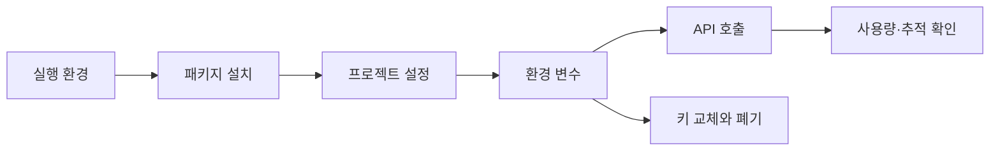

> [!abstract] 핵심 원칙
> 개발환경 구성은 패키지를 설치하는 일과 비밀값·비용·추적 정보를 분리해 관리하는 일을 함께 포함한다.

강의의 환경 구성 파트는 파이썬 실행 환경, 편집기, 노트북, API 키, 환경 변수, 추적 도구를 순서대로 다룬다. 이 흐름의 목적은 단순 설치가 아니라 **코드와 비밀값을 섞지 않는 재현 가능한 작업 공간**을 만드는 것이다.



## 관리 대상 분리

| 대상 | 저장 위치의 원칙 | 확인 방법 | 위험 |
| :-- | :-- | :-- | :-- |
| 코드 | 버전 관리 대상 | 실행·리뷰 | 비밀값이 섞일 수 있음 |
| 환경 변수 | 로컬 비밀 설정 | 값의 존재만 확인 | 출력·공유 시 노출 |
| 패키지 목록 | 재현 가능한 설정 | 설치 버전 점검 | 환경 차이 |
| 사용량 설정 | 계정의 한도 관리 | 비용·알림 확인 | 예상 밖 과금 |
| 추적 키 | 별도 비밀 설정 | 추적 동작 확인 | 요청 정보 노출 |

> [!important] 키는 출력하지 않는다
> 환경 변수를 사용하더라도 키 값을 화면·로그·노트북 출력에 그대로 표시하면 보호 효과가 사라진다. 존재 여부나 마스킹된 상태만 확인한다.

```html preview h=175
<div style="font-family:system-ui,sans-serif;padding:18px;color:var(--foreground)">
  <div style="font-weight:700;margin-bottom:11px">안전한 설정의 경계</div>
  <div style="display:flex;gap:10px;flex-wrap:wrap">
    <div style="flex:1;min-width:190px;padding:13px;border:1px solid var(--border);border-radius:var(--radius);background:var(--card)"><b style="color:var(--chart-2)">코드 저장소</b><br><span style="font-size:12px;color:var(--muted-foreground)">키가 아닌 참조와 설정</span></div>
    <div style="flex:1;min-width:190px;padding:13px;border:1px solid var(--border);border-radius:var(--radius);background:var(--card)"><b style="color:var(--chart-5)">비밀 설정</b><br><span style="font-size:12px;color:var(--muted-foreground)">키와 민감 환경 변수</span></div>
    <div style="flex:1;min-width:190px;padding:13px;border:1px solid var(--border);border-radius:var(--radius);background:var(--card)"><b>운영 기록</b><br><span style="font-size:12px;color:var(--muted-foreground)">마스킹된 상태와 사용량</span></div>
  </div>
</div>
```

## 작업 순서

<Tabs>
<Tab label="로컬 환경">

실행할 언어 버전과 패키지 설치 위치를 정한다. 프로젝트마다 독립 환경을 두면 의존성 충돌을 줄이기 쉽다.

</Tab>
<Tab label="비밀 설정">

키를 코드에 직접 쓰지 않고 환경 변수나 별도 설정 파일로 읽는다. 비밀 설정 파일은 공유·백업·출력 경로에서 제외한다.

</Tab>
<Tab label="운영 확인">

사용량 한도와 알림, 요청 추적 여부를 확인한다. 추적은 디버깅에 유용하지만 요청 내용의 민감도도 함께 평가해야 한다.

</Tab>
</Tabs>

<details>
<summary>키가 노출되었다고 의심될 때의 우선순위</summary>

해당 키 사용을 중단하고, 노출 경로를 제거하며, 새 키로 교체한다. 이후 사용량과 로그를 확인해 영향 범위를 점검한다. 키 문자열을 대화·문서·스크린샷에 다시 옮기지 않는다.

</details>

> [!tip] 재현성과 보안을 함께 기록하기
> 설치 절차는 명령과 버전으로 남기되, 비밀값은 이름·존재 여부·마스킹된 상태만 기록한다. 이 구분이 협업과 사고 대응을 모두 쉽게 만든다.

## 정리

- 개발환경은 실행 환경, 의존성, 비밀 설정, 사용량 관리의 조합이다.
- ==API 키는 코드와 로그에 직접 넣지 않는 값==이다.
- 추적 도구는 관찰 가능성을 높이지만, 무엇을 기록하는지 함께 관리해야 한다.

> [!warning] 소스 내부 보안 오류
> 강의의 한 확인 예시는 환경 변수에 저장한 키 전체를 출력한다. 같은 자료에서 키를 공유하지 말라고 경고하므로, 이 확인 방식은 사용하지 말고 마스킹 또는 존재 여부 확인으로 바꿔야 한다.
