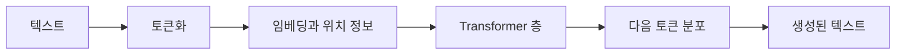

> [!abstract] 한 줄 요약
> GPT 계열은 입력을 토큰 표현으로 바꾸고, 문맥 관계를 계산한 뒤, 다음 토큰의 확률 분포에서 출력을 이어 붙인다.

“모델이 문장을 안다”는 표현은 편리하지만 모호하다. 강의의 구조 관점에서는 입력 토큰을 벡터로 표현하고, 여러 층에서 관계를 갱신하며, 마지막에 다음 토큰 후보의 점수를 계산하는 과정으로 풀어야 한다.



## 구성 요소의 역할

| 구성 요소 | 하는 일 | 결과가 나빠질 때 의심할 점 |
| :-- | :-- | :-- |
| Tokenizer | 문자열을 모델이 다룰 단위로 나눈다 | 낯선 표기·길이·비용 추정 |
| Embedding | 토큰에 수치 표현을 부여한다 | 의미 차이를 충분히 담는가 |
| Position 정보 | 토큰 순서를 구분한다 | 같은 단어의 위치 차이가 사라지는가 |
| Attention 층 | 문맥 안의 관련 위치를 반영한다 | 중요한 단서가 입력에 있는가 |
| 출력 층 | 다음 토큰 후보를 점수화한다 | 생성 제어와 종료 조건이 적절한가 |

> [!note] 다음 토큰 예측
> 언어 모델은 한 번에 완성 문장을 꺼내기보다, 현재까지의 토큰을 조건으로 다음 토큰 후보의 분포를 반복해서 계산하는 방식으로 설명할 수 있다.

```html preview h=180
<div style="font-family:system-ui,sans-serif;padding:18px;color:var(--foreground)">
  <div style="font-weight:700;margin-bottom:10px">생성은 하나의 답을 고르는 일이 아니라 후보 분포를 갱신하는 일이다</div>
  <div style="display:flex;gap:8px;align-items:end;height:88px">
    <div style="flex:1;height:32%;background:var(--chart-4);border-radius:var(--radius) var(--radius) 0 0"></div>
    <div style="flex:1;height:58%;background:var(--chart-3);border-radius:var(--radius) var(--radius) 0 0"></div>
    <div style="flex:1;height:88%;background:var(--chart-1);border-radius:var(--radius) var(--radius) 0 0"></div>
    <div style="flex:1;height:46%;background:var(--chart-2);border-radius:var(--radius) var(--radius) 0 0"></div>
  </div>
  <div style="display:flex;justify-content:space-between;font-size:12px;color:var(--muted-foreground);margin-top:7px"><span>후보 A</span><span>후보 B</span><span>선택 후보</span><span>후보 D</span></div>
</div>
```

## 구조를 읽는 관점

<Tabs>
<Tab label="표현">

토큰 임베딩은 모델 내부에서 문자열을 다루기 위한 좌표다. 같은 단어라도 주변 문맥에 따라 이후 층에서 다른 표현으로 갱신될 수 있다.

</Tab>
<Tab label="관계">

Attention은 특정 위치가 다른 위치를 얼마나 참고할지를 계산한다. 그래서 질문의 핵심 명사와 앞 문장의 조건이 함께 반영될 수 있다.

</Tab>
<Tab label="생성">

출력은 후보들 사이의 선택 문제다. 온도·확률 절단 같은 생성 제어는 모델 지식 자체가 아니라 후보를 고르는 방식을 바꾼다.

</Tab>
</Tabs>

<details>
<summary>왜 위치 정보가 필요한가</summary>

Attention은 여러 토큰 사이의 관계를 계산하지만, 토큰만 놓고 보면 순서 자체는 구분되지 않는다. 따라서 “누가 누구에게 무엇을 했는가”처럼 순서가 의미를 바꾸는 언어를 처리하려면 위치에 대한 정보가 결합되어야 한다.

</details>

> [!tip] 시험형 질문으로 바꾸기
> “Tokenizer·Embedding·Attention·출력 층을 한 문장으로 연결하라”는 질문에 답할 수 있으면, 구성 요소를 단편적으로 외운 것이 아니다.

## 정리

- GPT 구조는 입력 표현, 문맥 관계 계산, 다음 토큰 선택의 반복으로 볼 수 있다.
- ==Attention은 문맥을 참고하는 방식==이고, Tokenizer는 입력 단위를 정하는 방식이다.
- 생성 품질은 모델 구조뿐 아니라 주어진 문맥과 후보 선택 방식에도 좌우된다.

> [!warning] 혼동 방지
> “Transformer”와 “GPT”는 같은 범위의 말이 아니다. 전자는 강의가 설명하는 핵심 아키텍처이고, 후자는 그 계열을 활용한 언어 모델의 한 범주다.
