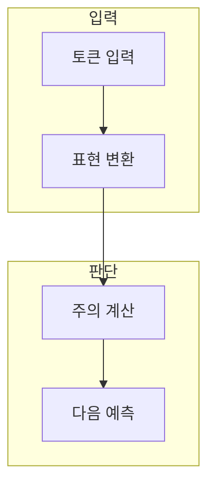

> [!abstract] 한 줄 요약
> GPT는 토큰을 표현으로 바꾸고 앞선 문맥에 주의를 배분해 다음 토큰의 확률을 계산한다.

## 이 노트의 지도



## 1. 토큰에서 확률까지

텍스트는 토큰 단위로 나뉘고, 각 토큰은 임베딩과 위치 정보를 통해 모델 내부 표현이 된다. ==다음 토큰 예측== 는 앞선 문맥이 주어졌을 때 뒤에 올 토큰의 분포를 계산하는 학습 목표.

> [!caution] 다음 토큰의 한계
> 그럴듯한 문장을 만든다는 사실과 사실성·근거·안전성이 보장된다는 사실은 다르다.

## 2. 주의 메커니즘

주의는 현재 토큰이 문맥의 어느 부분을 참고할지 가중치를 정하는 계산이다.

<details>
<summary>주의의 간단한 표현</summary>

질의·키·값을 이용한 가중 합은 다음처럼 쓸 수 있다.

$$
\operatorname{Attention}(Q,K,V) = \operatorname{softmax}\!\left(\frac{QK^{\mathsf T}}{\sqrt{d_k}}\right)V
$$

</details>

## 데이터로 보기

```html preview
<div style="font-family:system-ui,sans-serif;padding:20px;color:var(--foreground)">
  <label for="amt" style="font-size:14px;font-weight:600">예시 문맥 토큰 수</label>
  <div id="out" style="font-size:30px;font-weight:700;color:var(--chart-1);margin:6px 0">토큰 12</div>
  <input id="amt" type="range" min="1" max="64" step="1" value="12"
    style="width:100%;accent-color:var(--primary)" />
  <p style="font-size:13px;color:var(--muted-foreground)">값을 바꿔 문맥 길이와 계산·검토 범위의 관계를 생각한다.</p>
  <script>
    var amt = document.getElementById('amt');
    var out = document.getElementById('out');
    amt.addEventListener('input', function () {
      out.textContent = '토큰 ' + Number(amt.value).toLocaleString();
    });
  </script>
</div>
```

> [!important] 해석의 경계
> 토큰 수는 모델의 실제 최대 문맥이나 품질을 표시하지 않는다. 모델·요청·입력 내용에 따라 확인한다.

## 핵심 정리

| 개념 | 정의 | 왜 중요한가 |
| :-- | :-- | :-- |
| 토큰 | 모델이 읽는 입력 단위 | 길이·비용·절단 위치에 영향 |
| 임베딩 | 토큰의 수치 표현 | 관계 계산의 입력 |
| 주의 | 문맥에 대한 가중 참조 | 다음 토큰 예측의 근거 |

## 관련 개념

- Tokenizer: 문자열을 토큰으로 나누는 방식
- Embedding: 토큰·문서의 수치 표현

> [!question]- 스스로 점검
> **Q.** 다음 토큰 예측 모델이 긴 글의 사실성을 자동으로 보장하지 않는 이유는 무엇인가?
>
> **A.** 예측 목표는 문맥에서 그럴듯한 다음 단위를 고르는 것이며, 외부 사실 검증이나 출처 확인은 별도 과정이기 때문이다.
