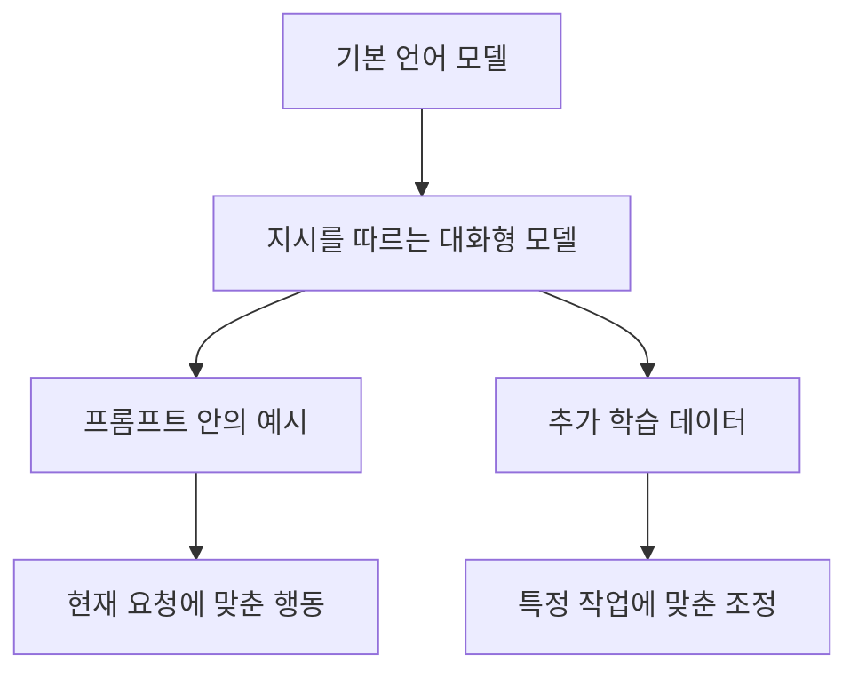

> [!abstract] 핵심 구분
> 같은 모델을 사용하는 것과, 예시를 프롬프트에 넣는 것과, 추가 데이터로 모델을 조정하는 것은 서로 다른 개입이다.

강의는 GPT 계열의 확장과 대화형 모델 학습을 함께 다룬다. 이때 중요한 것은 버전명을 줄 세우는 일이 아니라, **사용자가 모델 행동에 영향을 주는 세 층**을 구분하는 것이다.



## 세 가지 조정 방식

| 방식 | 무엇을 바꾸나 | 강의에서 보는 용도 | 주의점 |
| :-- | :-- | :-- | :-- |
| 기본 호출 | 요청의 입력만 바꾼다 | 질의·요약·번역 | 지시가 모호하면 결과도 흔들린다 |
| In-Context Learning | 프롬프트에 예시를 넣는다 | 형식·패턴을 즉시 보여 주기 | 예시가 토큰 예산을 사용한다 |
| Fine-Tuning | 학습 데이터로 모델을 조정한다 | 반복되는 전문 작업 | 데이터 품질·형식 검증이 필요하다 |
| 역할 지시 | 대화의 기준과 제약을 부여한다 | 응답 톤·범위 설정 | 사용자 요청과 충돌할 수 있다 |

> [!important] 결정 기준
> 반복되는 형식이 단순하고 예시 몇 개로 충분하면 먼저 프롬프트를 설계한다. 데이터가 지속적으로 쌓이고 작업 정의가 안정적일 때 Fine-Tuning을 검토한다.

```html preview h=170
<div style="font-family:system-ui,sans-serif;padding:18px;color:var(--foreground)">
  <div style="font-weight:700;margin-bottom:12px">모델 행동에 개입하는 깊이</div>
  <div style="display:grid;grid-template-columns:repeat(3,minmax(0,1fr));gap:10px">
    <div style="padding:12px;border:1px solid var(--border);border-radius:var(--radius);background:var(--card)"><b>요청</b><br><span style="font-size:12px;color:var(--muted-foreground)">현재 질문</span></div>
    <div style="padding:12px;border:1px solid var(--border);border-radius:var(--radius);background:var(--card)"><b style="color:var(--chart-3)">예시</b><br><span style="font-size:12px;color:var(--muted-foreground)">현재 문맥</span></div>
    <div style="padding:12px;border:1px solid var(--border);border-radius:var(--radius);background:var(--card)"><b style="color:var(--chart-5)">추가 학습</b><br><span style="font-size:12px;color:var(--muted-foreground)">지속적 조정</span></div>
  </div>
</div>
```

## 학습 흐름을 해석하는 법

<Tabs>
<Tab label="사전 학습">

대규모 텍스트에서 다음 토큰 예측을 반복해 언어 패턴과 표현을 학습하는 단계로 설명된다.

</Tab>
<Tab label="대화 정렬">

질문에 답하고 지시를 따르는 대화형 상호작용을 목표로 행동을 조정하는 단계다.

</Tab>
<Tab label="작업 적응">

프롬프트 예시 또는 별도의 Fine-Tuning으로 특정 업무의 입력·출력 형식을 안정시키는 단계다.

</Tab>
</Tabs>

<details>
<summary>In-Context Learning과 Fine-Tuning을 고르는 질문</summary>

“이 요청의 예시는 매번 달라지는가?”와 “입력·출력 형식이 오랫동안 고정되는가?”를 먼저 묻는다. 전자라면 문맥 안의 예시가, 후자라면 학습 데이터 기반 조정이 더 자연스러운 후보가 된다.

</details>

> [!tip] 입력을 분리해 쓰기
> 역할, 작업, 제약, 예시, 실제 질문을 구획해 적으면 결과가 어긋났을 때 어느 부분을 수정할지 추적하기 쉽다.

## 정리

- 모델 계열의 발전은 더 큰 모델이라는 한 축만으로 설명되지 않는다.
- ==In-Context Learning은 현재 프롬프트 안에서 일어나는 적응==이고, Fine-Tuning은 학습 데이터로 이루어지는 적응이다.
- 대화형 모델은 역할 지시와 메시지 맥락을 통해 응답의 형태를 조정한다.

> [!warning] 범위 주의
> 강의에 나온 모델명·세부 비교는 당시 수업의 예시다. 이 노트는 최신 모델 목록이나 배포 상태를 확정하지 않는다.
