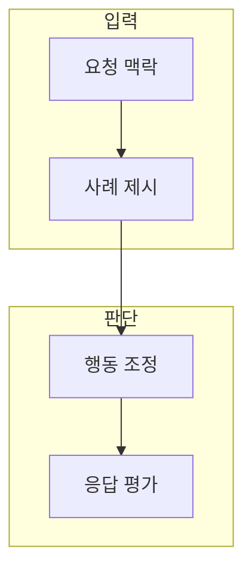

> [!abstract] 한 줄 요약
> 대화형 모델의 행동은 프롬프트 속 사례, 학습 데이터, 선호·안전 기준이 서로 다른 시간 범위에서 바꾼다.

## 이 노트의 지도



## 1. 세 가지 적응 경로

In-Context Learning은 요청 안의 사례로, Fine-Tuning은 학습 데이터로, 대화형 정렬은 선호·안전 신호로 행동을 조정한다. ==적응== 는 새 과제·형식·선호에 맞춰 모델의 출력을 바꾸는 과정.

> [!tip] 적응 선택
> 세 경로는 서로 대체 관계가 아니다. 반복성·데이터·평가 가능성에 따라 선택한다.

## 2. 대화형 응답의 평가

유용함뿐 아니라 사실성, 안전성, 지시 준수, 맥락 유지가 함께 검토 대상이 된다.

<details>
<summary>학습 경로를 고르는 질문</summary>

- 요청 안에 사례를 넣어도 되는가
- 반복 작업과 안정된 데이터가 있는가
- 원하는 행동을 독립 사례로 평가할 수 있는가

</details>

## 데이터로 보기

```html preview
<div style="font-family:system-ui,sans-serif;padding:20px">
  <div id="cards" style="display:flex;gap:14px;flex-wrap:wrap"></div>
  <script>
    var stats = [["맥락 사례","1","요청 안 조정","var(--chart-1)"],["학습 데이터","1","반복 행동","var(--chart-2)"],["응답 평가","1","채택 근거","var(--chart-3)"]];
    document.getElementById('cards').innerHTML = stats.map(function (s) {
      return '<div style="flex:1;min-width:150px;padding:16px;background:var(--card);' +
        'color:var(--card-foreground);border:1px solid var(--border);' +
        'border-radius:var(--radius)">' +
        '<div style="font-size:13px;color:var(--muted-foreground)">' + s[0] + '</div>' +
        '<div style="font-size:26px;font-weight:700;margin-top:4px">' + s[1] + '</div>' +
        '<div style="font-size:12px;font-weight:600;margin-top:4px;color:' + s[3] + '">' +
        s[2] + '</div>' +
        '</div>';
    }).join('');
  </script>
</div>
```

**해석의 경계.** 카드의 1은 성능 값이 아니라 세 적응 경로의 확인 요소를 뜻한다.

## 핵심 정리

| 개념 | 정의 | 왜 중요한가 |
| :-- | :-- | :-- |
| ICL | 요청 안의 예시로 적응 | 빠른 과제별 실험 |
| Fine-Tuning | 데이터로 행동을 조정 | 반복 형식의 일관성 검토 |
| 평가 | 응답을 기준과 비교 | 유용함과 위험을 구분 |

## 관련 개념

- 프롬프트: 요청 안의 역할·형식·사례 설계
- Fine-Tuning: 데이터 기반 행동 조정

> [!question]- 스스로 점검
> **Q.** 대화형 모델을 평가할 때 유용함 하나만 보면 안 되는 이유는 무엇인가?
>
> **A.** 도움이 되는 것처럼 보여도 사실 오류·안전 위반·문맥 불일치가 있을 수 있어 여러 기준을 분리해야 한다.
