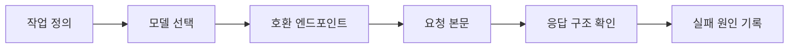

> [!abstract] 핵심 원리
> API 호출은 “모델 이름을 넣어 요청한다”보다, 요청 형식과 모델 기능이 맞는지 확인하는 계약 검증에 가깝다.

강의의 API 파트는 모델·엔드포인트·입력 형식·응답 객체를 구분한다. 같은 텍스트 작업이라도 어떤 입력을 기대하는 인터페이스인지에 따라 호출 구조가 달라진다.



## 호출 전 확인표

| 확인 항목 | 질문 | 불일치하면 생기는 일 |
| :-- | :-- | :-- |
| 작업 | 텍스트·이미지·음성 중 무엇인가 | 입력 자체가 맞지 않는다 |
| 모델 | 이 작업에 맞는 모델인가 | 기능 또는 출력 품질이 어긋난다 |
| 엔드포인트 | 해당 모델과 요청 형식이 연결되는가 | 요청이 거부되거나 다른 응답이 나온다 |
| 메시지 | 역할과 내용의 구조가 명확한가 | 대화 문맥이 모호해진다 |
| 응답 | choices·usage·종료 이유를 확인하는가 | 성공처럼 보이는 실패를 놓친다 |

> [!note] 호환성은 기능 목록이 아니다
> 모델이 “좋다”는 평가와 특정 요청 형식에서 호출할 수 있다는 사실은 별개다. 따라서 호출 전에 모델·엔드포인트·입력 형식을 한 묶음으로 점검한다.

```html preview h=170
<div style="font-family:system-ui,sans-serif;padding:18px;color:var(--foreground)">
  <div style="font-weight:700;margin-bottom:12px">요청 계약의 네 층</div>
  <div style="display:flex;gap:8px;flex-wrap:wrap">
    <div style="flex:1;min-width:130px;padding:11px;border-radius:var(--radius);background:var(--card);border:1px solid var(--border)">작업<br><span style="font-size:12px;color:var(--muted-foreground)">무엇을 만들까</span></div>
    <div style="flex:1;min-width:130px;padding:11px;border-radius:var(--radius);background:var(--card);border:1px solid var(--border)">입력<br><span style="font-size:12px;color:var(--muted-foreground)">어떤 구조인가</span></div>
    <div style="flex:1;min-width:130px;padding:11px;border-radius:var(--radius);background:var(--card);border:1px solid var(--border)">모델<br><span style="font-size:12px;color:var(--muted-foreground)">무엇이 처리하나</span></div>
    <div style="flex:1;min-width:130px;padding:11px;border-radius:var(--radius);background:var(--card);border:1px solid var(--border)">응답<br><span style="font-size:12px;color:var(--muted-foreground)">무엇을 검증하나</span></div>
  </div>
</div>
```

## 응답을 읽는 두 관점

<Tabs>
<Tab label="내용">

생성된 텍스트가 요청을 따르는지 확인한다. 내용 검토는 의미·형식·안전 제약을 함께 본다.

</Tab>
<Tab label="메타데이터">

응답 식별자, 사용량, 종료 이유 같은 정보는 호출이 어떤 상태로 끝났는지 해석하는 단서가 된다.

</Tab>
<Tab label="실패">

오류 메시지는 재시도 신호가 아니라, 요청 형식·권한·사용량·모델 선택 중 어디를 고칠지 알려 주는 진단 정보다.

</Tab>
</Tabs>

<details>
<summary>실습 전에 작성할 최소 요청 명세</summary>

작업 목적, 입력 형식, 기대 출력 형식, 사용할 모델, 최대 생성 범위, 실패 시 확인할 값까지 적는다. 이 명세가 있으면 코드 오류와 요구사항 오류를 분리하기 쉽다.

</details>

> [!tip] 재현 가능한 호출
> “성공했다” 대신 입력 메시지, 모델 선택, 생성 옵션, 응답의 종료 이유를 함께 기록하면 다른 사람이 같은 결과를 점검할 수 있다.

## 정리

- API 호출은 ==작업·모델·엔드포인트·입력 형식==의 일치가 핵심이다.
- 응답 본문만 읽지 말고 사용량과 종료 상태도 함께 해석한다.
- 호환성 표는 고정 지식이 아니라 호출 전에 확인할 조건의 목록으로 사용한다.

> [!warning] 원문 오류
> 강의의 한 코드 조각에는 모델 인자에 비교 연산자 형태가 들어가 있어 그대로 실행할 수 없다. 이 표현은 원문 오류로 남기며 정정된 코드로 바꾸지 않는다. 코드 예시는 실행 전에 문법과 요청 필드를 검토해야 한다.
