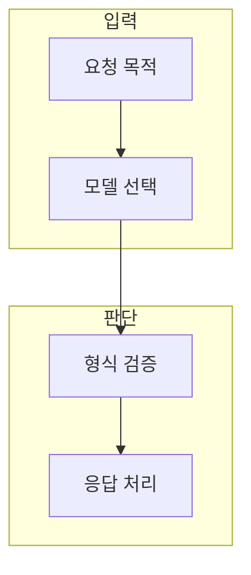

> [!abstract] 한 줄 요약
> API 요청은 모델 이름 하나가 아니라 엔드포인트·입력 형식·도구·응답 처리의 호환 계약이다.

## 이 노트의 지도



## 1. 요청 계약

호출 전에 작업 목적, 모델이 지원하는 입력·출력, 요청 필드, 오류 처리 방식을 함께 확인한다. ==호환성== 는 선택한 모델·엔드포인트·입력 형식이 함께 지원되는 상태.

> [!note] 판단 기준
> 문서의 예제와 현재 환경의 지원 범위는 다를 수 있으므로 요청 전에 실제 계약을 확인한다.

## 2. 응답을 받는 것과 처리하는 것

성공 응답도 구조·타입·비어 있는 결과·부분 실패를 검증해야 다음 단계가 안전하다.

<details>
<summary>요청 전 확인</summary>

- 모델과 엔드포인트의 지원 범위
- 메시지·도구·출력 형식
- 시간 초과·재시도·오류 기록
- 비밀값 분리

</details>

## 데이터로 보기

```html preview
<div style="font-family:system-ui,sans-serif;padding:20px;color:var(--foreground)">
  <label for="amt" style="font-size:14px;font-weight:600">요청 전 확인 항목 수</label>
  <div id="out" style="font-size:30px;font-weight:700;color:var(--chart-1);margin:6px 0">항목 4</div>
  <input id="amt" type="range" min="1" max="6" step="1" value="4"
    style="width:100%;accent-color:var(--primary)" />
  <p style="font-size:13px;color:var(--muted-foreground)">값을 바꿔 계약을 점검하는 순서를 생각한다. 실제 지원 필드는 해당 API 문서에서 확인한다.</p>
  <script>
    var amt = document.getElementById('amt');
    var out = document.getElementById('out');
    amt.addEventListener('input', function () {
      out.textContent = '항목 ' + Number(amt.value).toLocaleString();
    });
  </script>
</div>
```

> [!important] 해석의 경계
> 체크 항목 수는 호환성의 증명이나 실제 요청 성공률을 나타내지 않는다.

## 핵심 정리

| 개념 | 정의 | 왜 중요한가 |
| :-- | :-- | :-- |
| 엔드포인트 | 특정 작업의 요청 창구 | 입출력 계약을 정한다 |
| 모델 | 요청을 처리하는 능력 묶음 | 지원 기능과 비용을 확인 |
| 검증 | 응답 구조와 실패 처리 | 후속 단계 오류를 줄인다 |

## 관련 개념

- API 보안: 비밀값과 권한을 분리하는 방법
- 스트리밍: 부분 응답을 누적 처리하는 방법

> [!question]- 스스로 점검
> **Q.** 같은 모델 이름을 써도 요청이 실패할 수 있는 이유는 무엇인가?
>
> **A.** 엔드포인트·입력 형식·지원 기능이 맞지 않거나 환경 설정·권한·한도가 다를 수 있기 때문이다.
