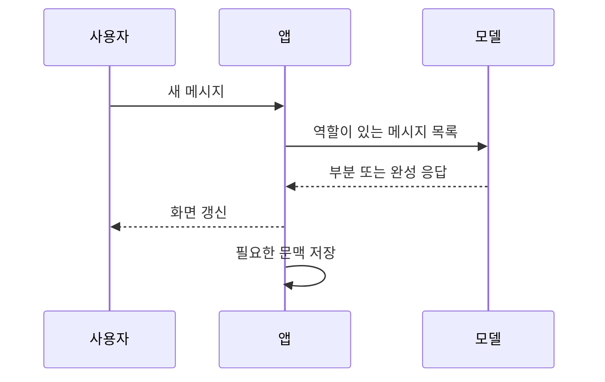

> [!abstract] 한 줄 요약
> 대화형 생성은 메시지 목록을 입력으로 받아, 역할·문맥·생성 제어를 통해 다음 응답을 만든다.

대화 API를 이해할 때 핵심 객체는 단일 문자열이 아니라 ==역할과 내용을 가진 메시지의 순서==다. 사용자의 새 질문만 보내는 것과 이전 응답까지 포함해 보내는 것은 모델이 볼 수 있는 문맥을 바꾼다.



## 메시지 설계

| 요소 | 맡는 역할 | 설계 질문 |
| :-- | :-- | :-- |
| system·developer 성격의 지시 | 응답의 기준·제약을 제시 | 무엇을 반드시 지켜야 하는가 |
| user 메시지 | 현재 요청을 제공 | 질문과 입력 자료가 충분한가 |
| assistant 메시지 | 이전 답변을 문맥으로 유지 | 어떤 대화 기록이 필요한가 |
| 생성 옵션 | 길이·다양성·종료 조건을 조절 | 일관성과 다양성 중 무엇이 중요한가 |
| 도구 요청 | 모델 밖의 기능을 연결 | 결과를 어떻게 검증할 것인가 |

> [!important] 문맥은 자동으로 남지 않는다
> 대화 기록을 다음 요청에 포함해야 모델이 그 흐름을 참조할 수 있다. 따라서 기록을 얼마나 보낼지와 무엇을 요약할지는 애플리케이션의 설계 문제다.

```html preview h=180
<div style="font-family:system-ui,sans-serif;padding:18px;color:var(--foreground)">
  <div style="font-weight:700;margin-bottom:12px">완성 응답과 스트리밍 응답의 차이</div>
  <div style="display:flex;gap:12px;flex-wrap:wrap">
    <div style="flex:1;min-width:220px;padding:14px;border:1px solid var(--border);border-radius:var(--radius);background:var(--card)"><b>완성 후 전달</b><br><span style="font-size:12px;color:var(--muted-foreground)">응답 전체가 준비된 뒤 화면에 표시</span><div style="height:9px;margin-top:12px;background:var(--border);border-radius:var(--radius)"></div></div>
    <div style="flex:1;min-width:220px;padding:14px;border:1px solid var(--border);border-radius:var(--radius);background:var(--card)"><b style="color:var(--chart-2)">스트리밍</b><br><span style="font-size:12px;color:var(--muted-foreground)">생성 조각을 받아 순차적으로 갱신</span><div style="display:flex;gap:5px;margin-top:12px"><span style="flex:1;height:9px;background:var(--chart-2);border-radius:var(--radius)"></span><span style="flex:1;height:9px;background:var(--chart-2);border-radius:var(--radius)"></span><span style="flex:1;height:9px;background:var(--border);border-radius:var(--radius)"></span></div></div>
  </div>
</div>
```

## 동작을 나눠 보기

<Tabs>
<Tab label="일반 응답">

완성된 응답 객체를 받은 뒤 내용을 표시한다. 후처리와 기록을 한 번에 다루기 편하다.

</Tab>
<Tab label="스트리밍">

생성 조각이 도착할 때마다 화면을 갱신한다. 사용자가 먼저 반응을 보지만, 중간 상태·취소·종료 처리를 설계해야 한다.

</Tab>
<Tab label="도구 연결">

모델이 함수나 외부 도구의 사용을 제안할 수 있다. 실제 실행과 결과 검증은 애플리케이션이 맡는다.

</Tab>
</Tabs>

<details>
<summary>대화가 길어질수록 필요한 정책</summary>

모든 기록을 계속 보내면 입력이 길어지고 핵심이 흐려질 수 있다. 최근 메시지는 그대로 두고, 오래된 대화는 목표·제약·결론 중심으로 요약하는 식의 보존 정책을 미리 정한다.

</details>

> [!tip] 응답 종료를 확인하자
> 화면에 텍스트가 보인다고 작업이 완전한 것은 아니다. 길이 제한, 중단, 도구 호출 대기 같은 종료 상태를 함께 기록하면 다음 처리를 결정할 수 있다.

## 정리

- 대화형 생성의 입력은 메시지 하나가 아니라 역할이 있는 메시지 목록이다.
- 스트리밍은 생성 방식을 바꾸지 않고 ==응답을 전달하는 시점==을 바꾼다.
- 도구 사용은 모델의 제안과 실제 실행을 분리해 다뤄야 한다.

> [!warning] 운영 관점
> 대화 기록을 무한히 쌓는 구현은 비용·지연·문맥 혼선을 키울 수 있다. 문맥 보존의 기준을 코드 밖의 요구사항으로 먼저 정한다.
