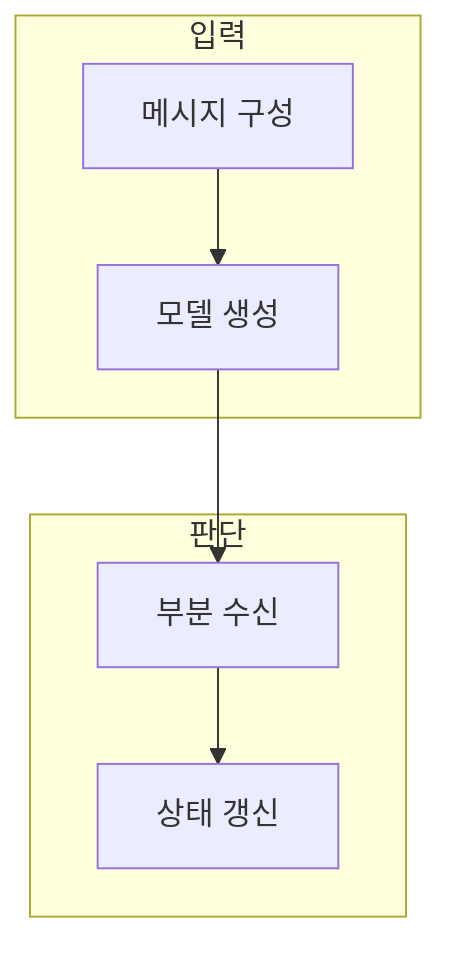

> [!abstract] 한 줄 요약
> 대화형 생성은 역할·문맥·부분 응답·도구 결과를 순서와 상태로 관리해야 한다.

## 이 노트의 지도



## 1. 메시지와 역할

시스템·사용자·도구 등 역할이 다르면 같은 문장도 대화에서 맡는 책임과 해석이 달라진다. ==대화 문맥== 는 현재 응답을 만들 때 모델에 전달되는 메시지와 상태의 묶음.

> [!warning] 부분 응답
> 모든 대화를 무한히 전달하기보다 작업에 필요한 맥락을 선택하고 민감 정보는 남기지 않는다.

## 2. 스트리밍의 상태 관리

부분 응답은 즉시 보여 줄 수 있지만, 중단·오류·도구 호출·완료 상태를 구분해 누적해야 한다.

<details>
<summary>부분 응답 처리 체크</summary>

- 시작·진행·완료 상태를 구분한다.
- 중단된 응답을 완성본으로 저장하지 않는다.
- 도구 결과와 모델 텍스트의 출처를 구분한다.

</details>

## 데이터로 보기

```html preview
<div style="font-family:system-ui,sans-serif;padding:20px;color:var(--foreground)">
  <label for="amt" style="font-size:14px;font-weight:600">예시 수신 청크 수</label>
  <div id="out" style="font-size:30px;font-weight:700;color:var(--chart-1);margin:6px 0">청크 5</div>
  <input id="amt" type="range" min="1" max="20" step="1" value="5"
    style="width:100%;accent-color:var(--primary)" />
  <p style="font-size:13px;color:var(--muted-foreground)">값을 바꿔 부분 수신과 최종 완료를 구분하는 상태 관리를 생각한다.</p>
  <script>
    var amt = document.getElementById('amt');
    var out = document.getElementById('out');
    amt.addEventListener('input', function () {
      out.textContent = '청크 ' + Number(amt.value).toLocaleString();
    });
  </script>
</div>
```

> [!warning] 완료 상태
> 청크 수는 지연 시간이나 품질 수치가 아니다. 실제 네트워크·모델·요청 조건에 따라 달라진다.

## 핵심 정리

| 개념 | 정의 | 왜 중요한가 |
| :-- | :-- | :-- |
| 역할 | 메시지의 책임 구분 | 지시와 맥락을 관리 |
| 스트리밍 | 부분 응답을 순차 수신 | 반응성을 높이되 상태 관리 필요 |
| 도구 호출 | 외부 작업 요청 | 입력·결과·오류를 분리 |

## 관련 개념

- API 계약: 요청과 응답 구조를 검증하는 방법
- 도구 안전성: 외부 실행 전 권한과 결과를 확인하는 방법

> [!question]- 스스로 점검
> **Q.** 스트리밍 응답을 바로 최종 답으로 취급하면 왜 위험한가?
>
> **A.** 중단·오류·도구 호출이 남은 상태일 수 있어 완료 신호와 결과 구조를 확인해야 하기 때문이다.
