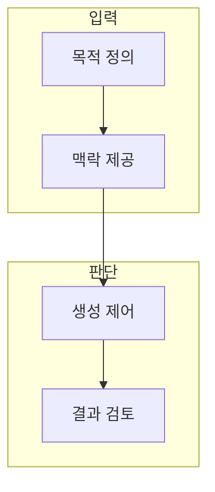

> [!abstract] 한 줄 요약
> 프롬프트는 모델에 원하는 결과의 목적·맥락·제약·검증 방식을 전달하는 작업 명세다.

## 이 노트의 지도



## 1. 프롬프트의 공통 구조

작업, 입력 자료, 출력 형식, 제약, 평가 기준을 분리하면 질의·요약·번역 같은 작업을 비교하기 쉽다. ==출력 계약== 는 결과가 따라야 할 형식·길이·금지 조건·검증 방식을 명시한 약속.

> [!note] 판단 기준
> 지시가 길다고 좋은 프롬프트가 되는 것은 아니다. 모호한 목적과 충돌하는 조건을 줄이는 것이 먼저다.

## 2. 생성 제어와 평가

생성 설정은 출력의 다양성과 결정성에 영향을 줄 수 있으나, 사실성이나 안전성을 자동 보장하지 않는다.

<details>
<summary>프롬프트 검토 순서</summary>

- 작업 목표를 한 문장으로 쓴다.
- 필요한 맥락만 제공한다.
- 출력 형식과 실패 조건을 명시한다.
- 독립 사례로 결과를 비교한다.

</details>

## 데이터로 보기

```html preview
<div style="font-family:system-ui,sans-serif;padding:20px;color:var(--foreground)">
  <label for="amt" style="font-size:14px;font-weight:600">예시 출력 길이 제한</label>
  <div id="out" style="font-size:30px;font-weight:700;color:var(--chart-1);margin:6px 0">토큰 128</div>
  <input id="amt" type="range" min="16" max="512" step="16" value="128"
    style="width:100%;accent-color:var(--primary)" />
  <p style="font-size:13px;color:var(--muted-foreground)">값을 바꿔 결과 형식과 길이 제약을 명시하는 필요성을 생각한다.</p>
  <script>
    var amt = document.getElementById('amt');
    var out = document.getElementById('out');
    amt.addEventListener('input', function () {
      out.textContent = '토큰 ' + Number(amt.value).toLocaleString();
    });
  </script>
</div>
```

> [!important] 해석의 경계
> 이 슬라이더는 실제 토큰 사용량·비용·응답 품질을 예측하지 않는다.

## 핵심 정리

| 개념 | 정의 | 왜 중요한가 |
| :-- | :-- | :-- |
| 목적 | 모델이 해야 할 일 | 불필요한 생성 범위를 줄인다 |
| 맥락 | 답에 필요한 입력 | 근거 없는 추측을 줄인다 |
| 계약 | 출력 형식과 제약 | 검토 가능한 결과를 만든다 |

## 관련 개념

- 토큰화: 입력·출력 길이를 모델 단위로 보는 방법
- 평가 설계: 좋은 결과와 실패를 비교하는 방법

> [!question]- 스스로 점검
> **Q.** 프롬프트에 출력 형식을 명시하면 왜 검토가 쉬워지는가?
>
> **A.** 결과가 어떤 기준을 만족해야 하는지 미리 정해 두므로, 내용과 형식을 분리해 비교할 수 있기 때문이다.
