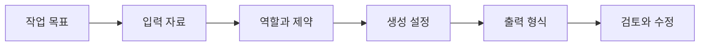

> [!abstract] 핵심 질문
> 같은 모델도 무엇을 입력하고 어떤 출력을 요구하며 얼마나 다양하게 선택하게 하는지에 따라 전혀 다른 결과를 만든다.

강의의 텍스트 생성 예시는 질의응답, 요약, 번역, 코드 생성을 다른 작업으로 보이게 한다. 그러나 모두 **목표·입력·제약·출력 형식**을 명시하는 프롬프트 설계로 묶어 읽을 수 있다.



## 생성 제어 표

| 항목 | 조절하는 것 | 사용할 때의 질문 |
| :-- | :-- | :-- |
| model | 작업을 수행할 모델 | 필요한 능력과 비용 범위는 무엇인가 |
| temperature | 후보 선택의 무작위성 | 일관성 또는 발상 중 무엇을 우선할까 |
| top_p | 후보 분포의 범위 | 다양한 후보를 얼마나 남길까 |
| max tokens | 생성 길이의 상한 | 답변에 필요한 범위는 얼마인가 |
| 반복 제어 | 같은 표현의 반복 성향 | 새 주제·다양성이 필요한가 |
| stop | 생성 종료 조건 | 어디에서 답을 끝내야 하는가 |

> [!note] 파라미터는 품질 보증 장치가 아니다
> 낮은 temperature가 사실성을 자동으로 보장하지는 않는다. 이는 후보 선택의 성향을 조절하는 값이며, 사실 검증은 입력 근거와 후속 점검이 맡는다.

```html preview h=175
<div style="font-family:system-ui,sans-serif;padding:18px;color:var(--foreground)">
  <div style="font-weight:700;margin-bottom:11px">프롬프트의 다섯 칸</div>
  <div style="display:grid;grid-template-columns:repeat(5,minmax(90px,1fr));gap:8px;overflow:auto">
    <div style="padding:10px;background:var(--card);border:1px solid var(--border);border-radius:var(--radius)">역할</div>
    <div style="padding:10px;background:var(--card);border:1px solid var(--border);border-radius:var(--radius)">목표</div>
    <div style="padding:10px;background:var(--card);border:1px solid var(--border);border-radius:var(--radius)">자료</div>
    <div style="padding:10px;background:var(--card);border:1px solid var(--border);border-radius:var(--radius)">제약</div>
    <div style="padding:10px;background:var(--card);border:1px solid var(--border);border-radius:var(--radius);color:var(--chart-1)">출력</div>
  </div>
</div>
```

## 작업별 변형

<Tabs>
<Tab label="질의응답">

질문의 범위, 필요한 근거, 모르는 경우의 행동을 명시한다. 답변의 길이보다 누락해서는 안 되는 조건을 먼저 적는다.

</Tab>
<Tab label="요약">

원문, 독자, 목표 길이, 남길 핵심, 제외할 내용을 구분한다. “짧게”보다 구조와 분량의 기준이 더 재현 가능하다.

</Tab>
<Tab label="번역·생성">

원문 언어, 대상 언어, 어조, 고유명사 처리, 형식 보존 여부를 분리한다. 창작이라면 금지 요소와 평가 기준도 함께 준다.

</Tab>
</Tabs>

<details>
<summary>좋은 프롬프트를 수정하는 순서</summary>

결과가 기대와 다르면 먼저 작업 정의가 모호한지 확인한다. 다음으로 입력 자료의 부족, 출력 형식의 부재, 예시의 불일치를 차례로 점검한다. 파라미터 조정은 이 구조가 분명해진 뒤에 한다.

</details>

> [!tip] 출력 계약을 먼저 쓴다
> 표인지, 항목 목록인지, 코드인지, 근거와 결론을 분리할지처럼 출력 형식을 먼저 정하면 생성 결과를 비교·검수하기 쉬워진다.

## 정리

- 텍스트 생성 실습은 프롬프트 구성 요소를 달리 조합하는 훈련으로 볼 수 있다.
- ==생성 파라미터는 후보 선택의 성향을 조절==한다.
- 작업의 성공 기준은 응답이 그럴듯한지보다 출력 계약을 만족하는지로 평가한다.

> [!warning] 소스 예시의 해석
> 강의에는 서로 다른 호출 스타일과 모델 예시가 함께 나온다. 코드 문법을 복사하기보다 요청·응답의 구조를 먼저 읽고, 실제 실행 환경의 인터페이스는 별도로 확인한다.
