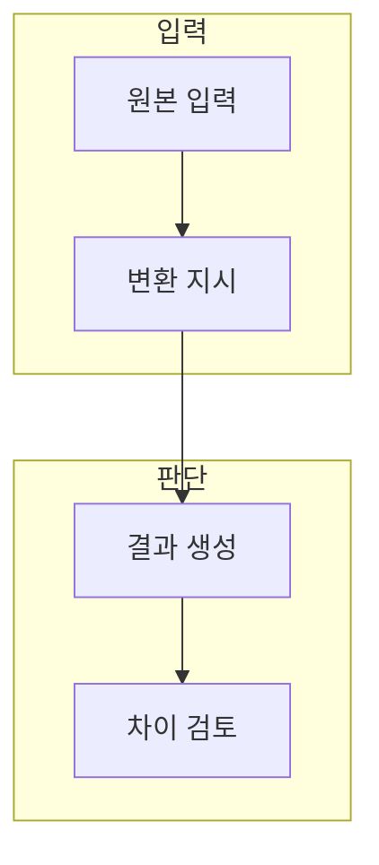

> [!abstract] 한 줄 요약
> 편집과 생성의 차이는 입력 자료를 유지할 범위와 변환 목표를 얼마나 분명히 정하는가에 있다.

## 이 노트의 지도



## 1. 편집 작업의 계약

텍스트 편집은 무엇을 유지·수정·삭제할지, 이미지 변환은 대상·구도·스타일 중 무엇을 바꿀지 명시한다. ==변환 목표== 는 입력 자료에서 의도적으로 바꿀 요소와 유지할 요소를 구분한 작업 정의.

**판단 기준.** 원본과 결과가 비슷해 보여도 금지된 변화·사실 오류·권리 위험은 별도로 확인한다.

## 2. 결과 검수

생성 결과는 작업 목표와 비교하고, 편집의 경우 유지해야 할 정보가 손실되지 않았는지 확인한다.

<details>
<summary>검수 항목</summary>

- 원본에서 보존할 요소
- 바꿀 요소와 금지할 변화
- 결과의 사실성·권리·안전성
- 재시도 사유

</details>

## 데이터로 보기

```html preview
<div style="font-family:system-ui,sans-serif;padding:20px">
  <div id="cards" style="display:flex;gap:14px;flex-wrap:wrap"></div>
  <script>
    var stats = [["유지","1","원본 범위","var(--chart-1)"],["변환","1","목표 명세","var(--chart-2)"],["검수","1","차이 확인","var(--chart-3)"]];
    document.getElementById('cards').innerHTML = stats.map(function (s) {
      return '<div style="flex:1;min-width:150px;padding:16px;background:var(--card);' +
        'color:var(--card-foreground);border:1px solid var(--border);' +
        'border-radius:var(--radius)">' +
        '<div style="font-size:13px;color:var(--muted-foreground)">' + s[0] + '</div>' +
        '<div style="font-size:26px;font-weight:700;margin-top:4px">' + s[1] + '</div>' +
        '<div style="font-size:12px;font-weight:600;margin-top:4px;color:' + s[3] + '">' +
        s[2] + '</div>' +
        '</div>';
    }).join('');
  </script>
</div>
```

**해석의 경계.** 카드의 1은 성능 수치가 아니라, 편집 작업에서 세 범주를 기록한다는 표시다.

## 핵심 정리

| 개념 | 정의 | 왜 중요한가 |
| :-- | :-- | :-- |
| 원본 | 변환의 기준 입력 | 보존 범위를 정한다 |
| 지시 | 목표와 제약 | 원하는 변화를 설명한다 |
| 검수 | 결과와 원본 비교 | 의도 밖 변화를 찾는다 |

## 관련 개념

- 프롬프트: 변환 목표를 명료하게 쓰는 방법
- 콘텐츠 검수: 사실성·권리·안전성을 확인하는 과정

> [!question]- 스스로 점검
> **Q.** 이미지 생성과 편집에서 원본을 유지할 범위를 먼저 적어야 하는 이유는 무엇인가?
>
> **A.** 바꿀 요소만 말하면 보존해야 할 대상·정보·구도가 함께 변할 수 있어 결과 차이를 검수하기 어렵기 때문이다.
