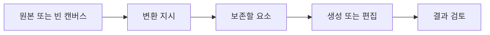

> [!abstract] 핵심 구분
> 생성은 새 결과를 만드는 일이고, 편집은 주어진 자료를 어떤 지시로 바꿀지 명시하는 일이다.

강의는 문장 교정·톤 변환 같은 텍스트 편집과 이미지 생성·마스킹 편집·변형을 함께 소개한다. 두 영역은 매체는 다르지만 **원본, 지시, 보존 조건, 결과 검토**라는 공통된 변환 구조를 가진다.



## 변환 작업 비교

| 작업 | 시작점 | 지시의 핵심 | 검토할 결과 |
| :-- | :-- | :-- | :-- |
| 문법 교정 | 원문 텍스트 | 오류만 고칠지 | 뜻과 어조 보존 |
| 톤 변환 | 원문 텍스트 | 대상 독자·문체 | 내용 손실 여부 |
| 새 이미지 생성 | 텍스트 설명 | 장면·대상·스타일 | 요구 요소 포함 여부 |
| 마스킹 편집 | 이미지와 마스크 | 바꿀 영역·남길 영역 | 경계·일관성 |
| 변형 생성 | 기준 이미지 | 무엇을 유지할지 | 원본과의 관계 |

> [!important] 편집의 계약
> “더 좋게 고쳐라”는 불충분하다. 무엇을 유지하고, 무엇을 바꾸며, 결과를 어떤 형식으로 낼지 적어야 편집 품질을 판단할 수 있다.

```html preview h=180
<div style="font-family:system-ui,sans-serif;padding:18px;color:var(--foreground)">
  <div style="font-weight:700;margin-bottom:12px">편집 지시는 네 가지를 분리한다</div>
  <div style="display:flex;gap:8px;flex-wrap:wrap">
    <div style="flex:1;min-width:130px;padding:12px;border:1px solid var(--border);border-radius:var(--radius);background:var(--card)">원본<br><span style="font-size:12px;color:var(--muted-foreground)">무엇을 바꾸나</span></div>
    <div style="flex:1;min-width:130px;padding:12px;border:1px solid var(--border);border-radius:var(--radius);background:var(--card)">변경<br><span style="font-size:12px;color:var(--muted-foreground)">무엇을 하게 하나</span></div>
    <div style="flex:1;min-width:130px;padding:12px;border:1px solid var(--border);border-radius:var(--radius);background:var(--card)">보존<br><span style="font-size:12px;color:var(--muted-foreground)">무엇을 남기나</span></div>
    <div style="flex:1;min-width:130px;padding:12px;border:1px solid var(--border);border-radius:var(--radius);background:var(--card);color:var(--chart-2)">검수<br><span style="font-size:12px;color:var(--muted-foreground)">무엇이 맞아야 하나</span></div>
  </div>
</div>
```

## 지시문을 구성하는 방법

<Tabs>
<Tab label="텍스트">

교정 범위, 변경하지 말아야 할 용어, 목표 어조, 반환 형식을 구체화한다. 원문과 수정본을 함께 반환하게 하면 검토가 쉬워진다.

</Tab>
<Tab label="이미지">

대상·행동·환경·구도·보존할 정체성을 분리한다. 마스킹 편집에는 변경 영역과 경계 처리 조건이 추가된다.

</Tab>
<Tab label="검토">

요구 요소가 빠졌는지, 보존할 요소가 달라졌는지, 생성 결과가 목적에 맞는지 확인한다. 생성 결과를 원본 근거로 오인하지 않는다.

</Tab>
</Tabs>

<details>
<summary>마스크가 필요한 이유</summary>

이미지 전체에 적용하는 생성과 달리, 부분 편집은 변경 범위를 알려야 한다. 마스크는 “여기는 바꾸고 나머지는 유지한다”는 공간적 제약을 제공하는 입력이다.

</details>

> [!tip] 수정 지시의 최소 문장
> “원문의 의미와 고유명사는 유지하고, 문법만 고쳐 표로 반환하라”처럼 보존·변경·형식을 한 문장에 넣으면 검토 기준이 선명해진다.

## 정리

- 텍스트 편집과 이미지 편집은 모두 입력 자료를 제약된 지시로 변환하는 작업이다.
- ==생성과 편집의 차이는 원본을 보존해야 하는가==에 있다.
- 결과 품질은 멋진 표현보다 변경·보존 조건을 만족하는지로 판단한다.

> [!warning] 소스의 코드 예시
> 강의에 제시된 편집 호출 예시는 당시 인터페이스 형식을 설명하는 자료다. 실제 사용 전에 현재 환경의 입력 필드와 반환 형식을 검증해야 한다.
