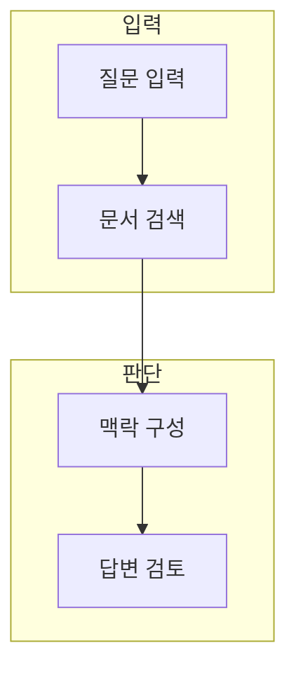

> [!abstract] 한 줄 요약
> RAG는 모델 파라미터를 바꾸지 않고, 질문에 맞는 외부 지식을 검색해 생성 맥락에 연결하는 방식이다.

## 이 노트의 지도



## 1. 검색과 생성의 결합

RAG는 질문과 문서의 관계를 검색한 뒤, 선택한 근거를 모델 입력에 넣어 답변을 생성한다. ==검색 증강== 는 생성 전에 외부 문서 후보를 찾아 필요한 맥락을 추가하는 방식.

> [!note] 판단 기준
> 검색 결과가 있다고 해서 답변이 자동으로 근거를 정확히 사용하거나 최신이라는 뜻은 아니다.

## 2. 파이프라인의 평가

로드·분할·색인·검색·생성·평가 중 어느 단계가 실패했는지 분리해야 개선 방법을 고를 수 있다.

<details>
<summary>RAG 검토 순서</summary>

- 어떤 문서를 포함·제외할지
- 어떻게 분할·메타데이터화할지
- 어떤 기준으로 검색·재정렬할지
- 답변이 근거를 사용했는지

</details>

## 데이터로 보기

```html preview
<div style="font-family:system-ui,sans-serif;padding:20px;color:var(--foreground)">
  <h3 style="margin:0 0 14px;font-size:15px;font-weight:600">RAG 검토 단계</h3>
  <div id="bars" style="display:flex;align-items:flex-end;gap:14px;height:170px"></div>
  <script>
    var data = [["로드",1],["분할",1],["검색",1],["생성",1],["평가",1]];
    var max = Math.max.apply(null, data.map(function (d) { return d[1]; }));
    document.getElementById('bars').innerHTML = data.map(function (d, i) {
      return '<div style="flex:1;display:flex;flex-direction:column;align-items:center;' +
        'gap:6px;height:100%;justify-content:flex-end">' +
        '<span style="font-size:12px;font-weight:600">' + d[1] + '</span>' +
        '<div style="width:100%;height:' + (d[1] / max * 100) + '%;' +
        'background:var(--chart-' + (i + 1) + ');' +
        'border-radius:var(--radius) var(--radius) 0 0"></div>' +
        '<span style="font-size:12px;color:var(--muted-foreground)">' + d[0] + '</span>' +
        '</div>';
    }).join('');
  </script>
</div>
```

값 1은 각 단계가 분리된 실패 지점을 가진다는 표시이며, 검색 품질 수치가 아니다.

> [!important] 해석의 경계
> 이 차트는 정확도·재현율·답변 품질을 나타내지 않는다. 실제 평가 집합과 측정 정의가 필요하다.

## 핵심 정리

| 개념 | 정의 | 왜 중요한가 |
| :-- | :-- | :-- |
| 로드 | 문서를 시스템에 넣음 | 검색 대상 범위를 정한다 |
| 검색 | 질문에 맞는 후보 선택 | 생성 맥락의 근거 |
| 생성 | 근거와 질문으로 답변 작성 | 최종 답의 품질 확인 필요 |

## 관련 개념

- Tokenizer와 Embedding: 문서와 질문을 비교 가능한 표현으로 만드는 과정
- 평가 설계: 검색과 답변 실패를 분리하는 방법

> [!question]- 스스로 점검
> **Q.** RAG에서 답변이 틀렸을 때 모델만 고치면 안 되는 이유는 무엇인가?
>
> **A.** 문서 선택·분할·검색·맥락 구성·생성 중 어디서 실패했는지에 따라 해결 방법이 다르기 때문이다.
