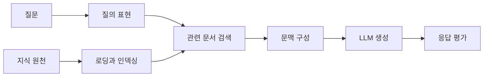

> [!abstract] 한 줄 요약
> RAG는 모델 파라미터를 매번 바꾸지 않고, 질문과 관련된 외부 지식을 찾아 생성의 문맥에 넣는 접근이다.

강의는 고정된 지식, 도메인 전문성, 상황 맥락, 사실처럼 보이는 잘못된 답변을 언어 모델의 한계로 제시하고, 검색 결과를 생성에 결합하는 방식으로 RAG를 설명한다. 중요한 점은 검색이 답을 대신하는 것이 아니라 ==생성이 참고할 근거 후보를 제공==한다는 것이다.



## 파이프라인의 다섯 단계

| 단계 | 하는 일 | 산출물 | 실패를 의심할 때 |
| :-- | :-- | :-- | :-- |
| Loading | 여러 원천에서 데이터를 가져온다 | 원문과 메타데이터 | 자료가 누락·오염됨 |
| Indexing | 검색 가능한 표현을 만든다 | 인덱스·벡터 | 의미가 잘리지 않음 |
| Storing | 인덱스를 보존한다 | 재사용 가능한 저장소 | 버전·동기화 혼선 |
| Querying | 질문과 관련 후보를 찾는다 | 문서 조각 | 질문과 무관한 검색 |
| Evaluation | 검색·응답 품질을 본다 | 측정 결과 | 그럴듯함만 평가함 |

> [!important] RAG가 보장하지 않는 것
> 외부 문서를 넣었다고 답변이 자동으로 정확해지지는 않는다. 검색된 문서의 품질·시점·관련성과 생성이 그 문서를 충실히 사용했는지를 별도로 점검해야 한다.

```html preview h=175
<div style="font-family:system-ui,sans-serif;padding:18px;color:var(--foreground)">
  <div style="font-weight:700;margin-bottom:11px">RAG는 지식과 답변 사이에 검색 단계를 둔다</div>
  <div style="display:flex;gap:8px;align-items:center;flex-wrap:wrap">
    <div style="padding:10px;background:var(--card);border:1px solid var(--border);border-radius:var(--radius)">질문</div><span style="color:var(--muted-foreground)">→</span>
    <div style="padding:10px;background:var(--card);border:1px solid var(--border);border-radius:var(--radius);color:var(--chart-3)">관련 문맥</div><span style="color:var(--muted-foreground)">→</span>
    <div style="padding:10px;background:var(--card);border:1px solid var(--border);border-radius:var(--radius)">생성 답변</div>
  </div>
</div>
```

## RAG의 가치를 판단하는 관점

<Tabs>
<Tab label="최신성">

모델 내부 지식만으로 부족한 자료를 검색 대상에 넣을 수 있다. 단, 원천의 갱신 주기와 색인 시점을 함께 관리해야 한다.

</Tab>
<Tab label="전문성">

도메인 자료를 연결해 특정 업무 문맥을 제공할 수 있다. 자료의 권위·접근 권한·개인정보 경계가 중요하다.

</Tab>
<Tab label="신뢰성">

검색 결과를 근거 후보로 삼아 답변을 검토하기 쉬워진다. 하지만 관련 문서를 찾는 것과 그 문서를 정확히 인용하는 것은 다른 평가 항목이다.

</Tab>
</Tabs>

<details>
<summary>평가를 둘로 나누는 이유</summary>

검색 평가는 “관련 문서를 찾았는가”를 보고, 생성 평가는 “찾은 문서를 바탕으로 질문에 맞게 답했는가”를 본다. 두 결과를 합치면 어느 단계가 실패했는지 알기 어렵다.

</details>

> [!tip] 첫 실습의 범위
> 자료 원천 하나, 질문 유형 하나, 평가 질문 몇 개로 시작한다. 저장소·모델·체인을 한꺼번에 바꾸면 개선 원인을 분리할 수 없다.

## 정리

- RAG는 검색과 생성을 연결해 외부 지식을 문맥으로 제공한다.
- ==검색 품질과 생성 품질은 분리해 평가==해야 한다.
- 로딩·색인·저장·질의·평가는 모두 시스템의 품질을 좌우한다.

> [!warning] 신뢰성의 경계
> 검색 결과가 있다고 해서 결과 문서가 최신·정확·권위 있다고 단정하지 않는다. 원천 자체의 품질 검토는 RAG 밖에서 계속 필요하다.
