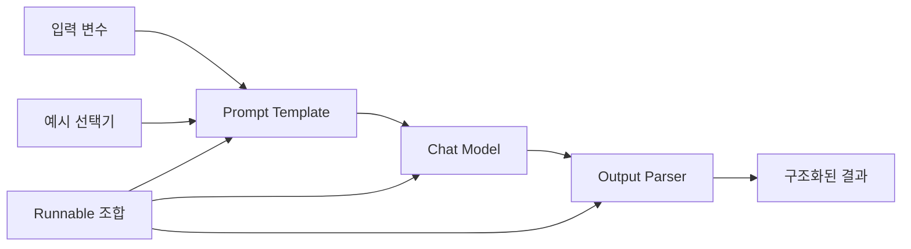

> [!abstract] 한 줄 요약
> Runnable과 LCEL은 프롬프트·모델·파서 같은 단계를 서로 맞물리는 입출력 인터페이스로 연결하려는 방식이다.

강의 후반부는 Runnable 프로토콜과 LCEL, 여러 Prompt Template, 예시 선택, 모델 파라미터, Output Parser, Chain을 다룬다. 공통된 질문은 “각 단계가 무엇을 받고 무엇을 내보내는가”다. 이 관점이 있어야 조합이 길어져도 오류 위치를 찾을 수 있다.



## 조합 가능한 단위

| 단위 | 입력 | 출력 | 설계 포인트 |
| :-- | :-- | :-- | :-- |
| Prompt Template | 변수·예시 | 메시지 또는 프롬프트 | 이름·누락 변수·형식 |
| Chat Prompt | 역할별 메시지 | 대화 입력 | 역할과 순서 |
| Example Selector | 현재 입력·예시 집합 | 선택된 예시 | 길이·다양성·관련성 |
| Chat Model | 메시지·옵션 | 모델 응답 | 모델·파라미터·종료 상태 |
| Output Parser | 원시 응답 | 리스트·JSON 등 구조 | 실패 시 복구 정책 |
| Runnable/LCEL | 앞 단계의 출력 | 다음 단계의 입력 | 인터페이스 일치 |

> [!note] 연결 기호보다 입출력이 먼저다
> LCEL 표기 자체를 외우기보다, 앞 단계가 만든 객체를 다음 단계가 받을 수 있는지 확인한다. 연결이 실패하면 어느 단계의 타입·필드가 맞지 않는지부터 본다.

```html preview h=180
<div style="font-family:system-ui,sans-serif;padding:18px;color:var(--foreground)">
  <div style="font-weight:700;margin-bottom:12px">한 단계의 출력은 다음 단계의 입력 계약이 된다</div>
  <div style="display:flex;gap:8px;align-items:center;flex-wrap:wrap">
    <div style="padding:10px;border:1px solid var(--border);border-radius:var(--radius);background:var(--card)">변수</div>
    <span style="color:var(--muted-foreground)">→</span>
    <div style="padding:10px;border:1px solid var(--border);border-radius:var(--radius);background:var(--card);color:var(--chart-1)">메시지</div>
    <span style="color:var(--muted-foreground)">→</span>
    <div style="padding:10px;border:1px solid var(--border);border-radius:var(--radius);background:var(--card)">응답</div>
    <span style="color:var(--muted-foreground)">→</span>
    <div style="padding:10px;border:1px solid var(--border);border-radius:var(--radius);background:var(--card)">구조화 결과</div>
  </div>
</div>
```

## 프롬프트 패턴 선택

<Tabs>
<Tab label="단일 템플릿">

정해진 변수로 반복되는 단일 작업에 쓴다. 누락 변수와 출력 형식을 명확히 하면 오류가 줄어든다.

</Tab>
<Tab label="대화 템플릿">

system·user·assistant 역할을 분리해 다중 메시지를 구성한다. 이전 대화나 자리표시자는 문맥 보존 정책과 함께 쓴다.

</Tab>
<Tab label="Few-shot">

작업 패턴을 보여 줄 예시를 선택해 프롬프트에 넣는다. 예시가 길어질수록 문맥 예산과 현재 질문의 공간이 줄어든다.

</Tab>
</Tabs>

<details>
<summary>구조화된 출력이 필요한 이유</summary>

자유 텍스트는 사람이 읽기 좋을 수 있지만, 다음 프로그램 단계가 사용하려면 필드·형식·누락 처리 규칙이 필요하다. Output Parser는 이 경계를 명시하고 실패를 감지하는 역할을 한다.

</details>

> [!tip] 조합 테스트 순서
> 템플릿만 렌더링하고, 모델만 호출하고, 파서만 샘플 응답에 적용한 뒤, 마지막에 전체 체인을 연결한다. 한꺼번에 실행하면 원인 위치가 섞인다.

## 정리

- Runnable/LCEL은 ==단계 사이의 입출력 계약==을 중심으로 조합을 표현한다.
- Prompt Template과 Example Selector는 모델 이전에 입력 문맥을 설계하는 도구다.
- Output Parser는 생성 결과를 다음 시스템이 다룰 구조로 바꾸고 실패를 드러낸다.

> [!warning] 파싱 실패의 처리
> 구조화된 결과가 필요할 때는 파싱 실패를 조용히 무시하지 않는다. 재요청·수정·사람 검토 중 어떤 경로로 보낼지 작업 요구사항에 맞춰 정한다.
