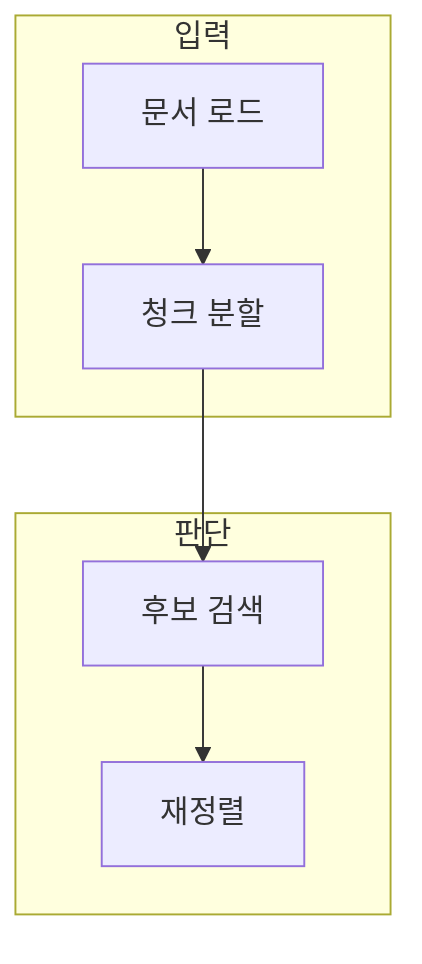

> [!abstract] 한 줄 요약
> 검색 품질은 임베딩 모델 하나가 아니라 문서 범위·분할·메타데이터·검색·재정렬의 연쇄 결과다.

## 이 노트의 지도



## 1. 문서에서 청크까지

문서를 작은 단위로 나누면 검색 대상의 초점은 좋아질 수 있지만, 중요한 맥락이 끊길 위험도 생긴다. ==청크== 는 검색과 생성에 쓰기 위해 문서를 나눈 정보 단위.

> [!note] 판단 기준
> 청크 크기와 겹침은 하나의 정답이 아니라 질문 유형·문서 구조·평가 결과로 정한다.

## 2. Retrieval과 Rerank

초기 검색은 넓게 후보를 찾고, 재정렬은 질문과 더 맞는 후보를 앞에 두는 역할을 한다.

<details>
<summary>검색 품질 체크</summary>

- 문서 형식과 제외 규칙
- 청크 경계와 메타데이터
- 후보 수와 재정렬 기준
- 근거와 답변의 연결

</details>

## 데이터로 보기

```html preview
<div style="font-family:system-ui,sans-serif;padding:20px;color:var(--foreground)">
  <label for="amt" style="font-size:14px;font-weight:600">예시 청크 길이</label>
  <div id="out" style="font-size:30px;font-weight:700;color:var(--chart-1);margin:6px 0">단위 600</div>
  <input id="amt" type="range" min="100" max="2000" step="100" value="600"
    style="width:100%;accent-color:var(--primary)" />
  <p style="font-size:13px;color:var(--muted-foreground)">값을 바꿔 정보 집중도와 문맥 보존 사이의 절충을 생각한다.</p>
  <script>
    var amt = document.getElementById('amt');
    var out = document.getElementById('out');
    amt.addEventListener('input', function () {
      out.textContent = '단위 ' + Number(amt.value).toLocaleString();
    });
  </script>
</div>
```

> [!important] 해석의 경계
> 값은 특정 문서의 최적 길이나 검색 품질을 의미하지 않는다. 질의·문서·평가 집합에서 검증한다.

## 핵심 정리

| 개념 | 정의 | 왜 중요한가 |
| :-- | :-- | :-- |
| 분할 | 문서를 검색 단위로 나눔 | 질문과 근거의 초점을 바꾼다 |
| 검색 | 후보 문서를 찾음 | 근거 선택의 첫 단계 |
| 재정렬 | 후보 순서를 다시 조정 | 상위 문서의 관련성을 높인다 |

## 관련 개념

- RAG: 검색 결과를 생성 맥락으로 연결하는 방식
- 벡터 저장소: 임베딩과 메타데이터를 찾는 저장 구조

> [!question]- 스스로 점검
> **Q.** 청크를 작게 만들면 항상 검색이 좋아지는가?
>
> **A.** 아니다. 필요한 맥락이 끊기거나 후보가 너무 세분화될 수 있어 질문과 평가 결과에 맞춰 조절해야 한다.
