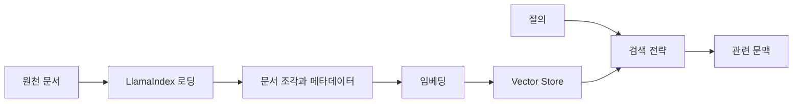

> [!abstract] 한 줄 요약
> LlamaIndex와 벡터 저장소는 문서를 모델이 읽게 만드는 도구가 아니라, 문서를 검색 가능한 구조로 만들고 질의와 연결하는 중간 계층이다.

강의는 데이터 로딩, 인덱스 생성, 로컬 모델 연결, 다양한 Vector Store, MMR, FAISS 기반 검색을 소개한다. 공통점은 “어떤 저장소가 최고인가”가 아니라 ==문서 표현·메타데이터·검색 전략이 질문에 맞는가==를 묻는 데 있다.



## 도구를 역할로 비교하기

| 요소 | 맡는 일 | 설계 질문 |
| :-- | :-- | :-- |
| LlamaIndex | 데이터·인덱스·질의 흐름을 연결 | 원천을 어떻게 수집하고 구조화할까 |
| Vector Store | 벡터와 메타데이터를 저장·검색 | 무엇을 필터·보존할까 |
| FAISS | 유사도 검색을 위한 인덱스 활용 | 속도·메모리·갱신이 맞는가 |
| Chroma 계열 저장소 | 벡터와 문서 속성 관리 | 컬렉션과 지속성을 어떻게 둘까 |
| MMR | 비슷한 후보의 반복을 줄임 | 관련성과 다양성을 어떻게 균형 잡을까 |

> [!important] 저장소 선택의 중심
> 저장소의 이름보다 문서 갱신 방식, 메타데이터 필터, 검색 지연, 복구·재생성 전략을 먼저 정한다. 저장소는 RAG 품질의 한 단계이지 지식의 진실성 자체가 아니다.

```html preview h=175
<div style="font-family:system-ui,sans-serif;padding:18px;color:var(--foreground)">
  <div style="font-weight:700;margin-bottom:11px">관련성만 높이면 비슷한 문서가 반복될 수 있다</div>
  <div style="display:flex;gap:8px">
    <div style="flex:1;padding:12px;border:1px solid var(--border);border-radius:var(--radius);background:var(--card)">최상위 유사도<br><span style="font-size:12px;color:var(--muted-foreground)">가까운 조각이 집중</span></div>
    <div style="flex:1;padding:12px;border:1px solid var(--border);border-radius:var(--radius);background:var(--card);color:var(--chart-3)">MMR 선택<br><span style="font-size:12px;color:var(--muted-foreground)">관련성과 다양성 균형</span></div>
  </div>
</div>
```

## 검색 전략의 차이

<Tabs>
<Tab label="순수 유사도">

질의 벡터와 가까운 문서를 우선한다. 직접적인 용어와 의미가 맞는 자료를 빠르게 찾는 기본 전략이다.

</Tab>
<Tab label="MMR">

이미 고른 후보와 너무 닮은 결과를 줄이며, 관련성이 있으면서 서로 다른 정보를 주는 조각을 고르려 한다.

</Tab>
<Tab label="메타데이터 필터">

문서의 날짜·주제·권한 같은 속성으로 후보를 제한한다. 벡터 유사도 이전에 검색 공간을 좁히는 역할을 한다.

</Tab>
</Tabs>

<details>
<summary>인덱스를 다시 만들 수 있어야 하는 이유</summary>

문서가 바뀌거나 분할·임베딩 방식이 달라지면 기존 인덱스가 현재 원천을 정확히 반영하지 않을 수 있다. 원본 문서, 생성 설정, 인덱스 버전을 분리해 관리하면 재생성을 검증할 수 있다.

</details>

> [!tip] 메타데이터를 늦게 붙이지 않는다
> 문서의 출처 유형, 갱신 시점, 권한 범위, 제목 같은 속성은 검색 후 설명에도 필요하다. 로딩 단계에서 함께 설계한다.

## 정리

- LlamaIndex는 문서·인덱스·질의를 연결하는 구성 계층이다.
- ==벡터 저장소는 의미 검색을 위한 인프라==이며, 원문과 메타데이터 관리가 함께 필요하다.
- MMR은 상위 결과의 중복을 줄여 다양한 문맥 후보를 제공하려는 전략이다.

> [!warning] 다양성의 한계
> 다양성을 높였다고 반드시 정답 근거가 포함되는 것은 아니다. 검색 결과의 적합성은 실제 질문과 문서 내용으로 계속 평가한다.
