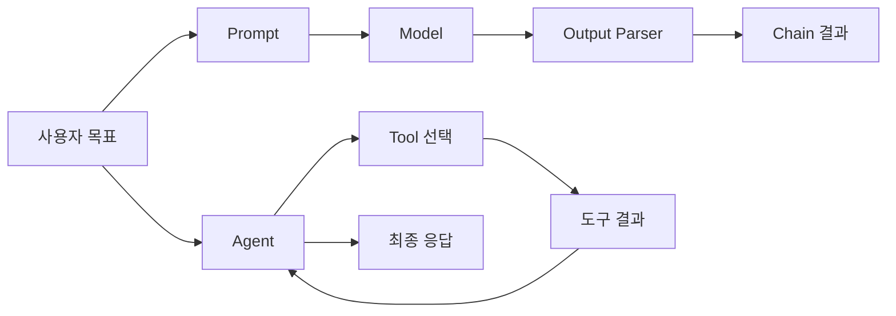

> [!abstract] 핵심 구분
> 체인은 정해진 단계를 연결하고, 에이전트는 주어진 목표에 따라 어떤 도구와 단계를 쓸지 선택하는 실행 주체로 설명할 수 있다.

강의의 LangChain 파트는 모델, 프롬프트, 출력 파서, 체인, 도구, 에이전트, 메모리, 추적을 연결한다. 이 구성은 기능 목록이 아니라, 입력을 만들고 실행을 선택하며 결과를 검증하는 책임의 분리로 읽을 수 있다.



## 구성 요소의 책임

| 요소 | 역할 | 실패를 볼 위치 |
| :-- | :-- | :-- |
| Prompt | 모델에 줄 입력을 구성 | 지시·변수·예시 누락 |
| Model | 생성 또는 판단을 수행 | 모델 설정·응답 상태 |
| Output Parser | 결과를 필요한 형식으로 변환 | 형식 불일치·파싱 실패 |
| Chain | 정해진 단계를 조합 | 단계 연결·입출력 이름 |
| Tool | 외부 기능을 수행 | 입력 검증·반환값 |
| Agent | 도구와 다음 행동을 선택 | 목표 해석·반복·종료 |
| Memory | 대화 또는 상태를 보존 | 오래된 정보·범위 초과 |
| Tracing | 실행 경로를 관찰 | 지연·오류·비용 |

> [!important] Agent는 권한 위임이 아니다
> 에이전트가 도구를 선택한다는 말은 도구가 어떤 입력을 받고 어떤 결과를 낼지 정의할 필요가 없다는 뜻이 아니다. 각 도구에는 입력 검증, 권한 범위, 실패 처리, 결과 검수가 있어야 한다.

```html preview h=180
<div style="font-family:system-ui,sans-serif;padding:18px;color:var(--foreground)">
  <div style="font-weight:700;margin-bottom:12px">고정 흐름과 선택 흐름</div>
  <div style="display:flex;gap:12px;flex-wrap:wrap">
    <div style="flex:1;min-width:230px;padding:14px;border:1px solid var(--border);border-radius:var(--radius);background:var(--card)"><b>Chain</b><br><span style="font-size:12px;color:var(--muted-foreground)">정해진 입력 → 정해진 단계 → 정해진 출력</span></div>
    <div style="flex:1;min-width:230px;padding:14px;border:1px solid var(--border);border-radius:var(--radius);background:var(--card)"><b style="color:var(--chart-3)">Agent</b><br><span style="font-size:12px;color:var(--muted-foreground)">목표에 따라 도구·순서를 선택하고 관찰</span></div>
  </div>
</div>
```

## 실행 흐름의 선택

<Tabs>
<Tab label="체인">

입력과 단계가 미리 정해진 작업에 적합하다. 데이터 흐름이 예측 가능하므로 테스트와 재현이 비교적 쉽다.

</Tab>
<Tab label="에이전트">

질문에 따라 필요한 도구나 순서가 달라질 수 있는 작업을 다룬다. 선택 이유와 종료 조건을 기록해야 디버깅할 수 있다.

</Tab>
<Tab label="메모리·추적">

메모리는 대화 문맥 또는 실행 상태를 보존하고, 추적은 어떤 입력·도구·응답을 거쳤는지 관찰한다. 둘 다 민감 데이터 범위를 고려한다.

</Tab>
</Tabs>

<details>
<summary>도구 호출 전후에 확인할 것</summary>

호출 전에는 입력 형식·권한·비용·타임아웃을 점검한다. 호출 후에는 결과의 출처·형식·실패 여부를 확인하고, 그 결과를 다음 프롬프트에 넣어도 되는지 검토한다.

</details>

> [!tip] 관찰 가능성을 설계에 넣기
> 에이전트가 예상과 다르게 행동하면 마지막 답변만 보지 말고, 프롬프트·도구 선택·도구 입력·반환값·종료 이유를 순서대로 추적한다.

## 정리

- Chain은 정해진 처리를 연결하고, Agent는 도구 선택이 필요한 실행 흐름을 다룬다.
- ==도구는 모델의 말이 아니라 검증 가능한 입력·출력을 가진 함수==로 관리한다.
- 메모리와 추적은 편의 기능이면서 개인정보·비용 관리 대상이기도 하다.

> [!warning] 무한 실행 방지
> 도구 호출과 재시도에는 횟수·시간·비용의 한도를 둔다. 에이전트가 실패를 설명하지 못한 채 같은 행동을 반복하지 않도록 종료 조건을 명시한다.
