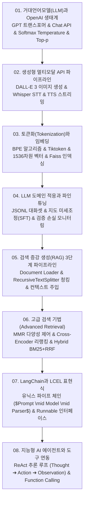

# 📚 거대언어모델 (Large Language Models & LangChain RAG) 전체 강의 로드맵

GPT 디코더 트랜스포머 아키텍처와 OpenAI Chat Completion API 파라미터 제어(Temperature, Top-p, Penalty), DALL-E 3/Whisper/TTS 멀티모달 파이프라인, BPE 토큰화 및 고차원 임베딩·Faiss 밀집 검색, JSONL 기반 도메인 지도 파인튜닝(SFT), 검색 증강 생성(RAG) 3단계(로딩-청킹-인덱싱-생성), MMR 및 Cross-Encoder 리랭킹 고급 검색, LangChain과 LCEL 파이프라인 합성, 그리고 ReAct 추론 루프 기반의 자율형 AI 에이전트와 도구 연동까지 LLM 애플리케이션 엔지니어링 전반을 다룹니다.

---

## 🗺️ 강의 목차 (Curriculum Overview)

---

## 📑 개별 정리 문서 목록

1. [01. 거대언어모델(LLM)과 OpenAI 생태계 - GPT 트랜스포머 아키텍처, Chat Completion API와 파라미터 제어](file:///Users/um-yunsang/work/edu/ComputerScience/03_ai-ml-data/large-language-models/notes/01.%20%EA%B1%B0%EB%8C%80%EC%96%B8%EC%96%B4%EB%AA%A8%EB%8D%B8(LLM)%EA%B3%BC%20OpenAI%20%EC%83%9D%ED%83%9C%EA%B3%84%20-%20GPT%20%ED%8A%B8%EB%9E%9C%EC%8A%A4%ED%8F%AC%EB%A8%B8%20%EC%95%84%ED%82%A4%ED%85%8D%EC%B2%98,%20Chat%20Completion%20API%EC%99%80%20%ED%8C%8C%EB%9D%BC%EB%AF%B8%ED%84%B0%20%EC%A0%9C%EC%96%B4.md)
   - Softmax Temperature 로짓 변환 수식, Top-p 핵 샘플링, 대화형 생성 확률 분포 시뮬레이터
2. [02. 생성형 멀티모달 API 파이프라인 - DALL-E 3 이미지 생성, Whisper 음성 인식 및 TTS 음성 합성](file:///Users/um-yunsang/work/edu/ComputerScience/03_ai-ml-data/large-language-models/notes/02.%20%EC%83%9D%EC%84%B1%ED%98%95%20%EB%A9%80%ED%8B%B0%EB%AA%A8%EB%8B%AC%20API%20%ED%8C%8C%EC%9D%B4%ED%94%84%EB%9D%BC%EC%9D%B8%20-%20DALL-E%203%20%EC%9D%B4%EB%AF%B8%EC%A7%80%20%EC%83%9D%EC%84%B1,%20Whisper%20%EC%9D%8C%EC%84%B1%20%EC%9D%B8%EC%8B%9D%20%EB%B0%8F%20TTS%20%EC%9D%8C%EC%84%B1%20%ED%95%A9%EC%84%B1.md)
   - 멀티모달 라우팅 아키텍처, Whisper 68만 시간 사전학습, 대화형 음성-이미지 파이프라인 데모
3. [03. 토큰화(Tokenization)와 임베딩(Embedding) - BPE 알고리즘, 고차원 벡터 임베딩과 Faiss 밀집 검색](file:///Users/um-yunsang/work/edu/ComputerScience/03_ai-ml-data/large-language-models/notes/03.%20%ED%86%A0%ED%81%B0%ED%99%94(Tokenization)%EC%99%80%20%EC%9E%84%EB%82%B4%EB%94%A9(Embedding)%20-%20BPE%20%EC%95%8C%EA%B3%A0%EB%A6%AC%EC%A6%98,%20%EA%B3%A0%EC%B0%A8%EC%9B%90%20%EB%B2%A1%ED%84%B0%20%EC%9E%84%EB%82%B4%EB%94%A9%EA%B3%BC%20Faiss%20%EB%B0%80%EC%A7%91%20%EA%B2%80%EC%83%89.md)
   - BPE 서브워드 병합 알고리즘, Faiss IndexFlat vs IVFFlat Voronoi 클러스터링 시뮬레이터
4. [04. LLM 도메인 적응과 파인튜닝(Fine-Tuning) - JSONL 데이터셋 구축, 하이퍼파라미터 최적화와 과적합 방지](file:///Users/um-yunsang/work/edu/ComputerScience/03_ai-ml-data/large-language-models/notes/04.%20LLM%20%EB%8F%84%EB%A9%94%EC%9D%B8%20%EC%A0%81%EC%9D%91%EA%B3%BC%20%ED%8C%8C%EC%9D%B8%ED%8A%9C%EB%8B%9D(Fine-Tuning)%20-%20JSONL%20%EB%8D%B0%EC%9D%B4%ED%84%B0%EC%85%8B%20%EA%B5%AC%EC%B6%95,%20%ED%95%98%EC%9D%B4%ED%8D%BC%ED%8C%8C%EB%9D%BC%EB%AF%B8%ED%84%B0%20%EC%B5%9C%EC%A0%81%ED%99%94%EC%99%80%20%EA%B3%BC%EC%A0%81%ED%95%A9%20%EB%B0%A9%EC%A7%80.md)
   - 프롬프트 vs RAG vs 파인튜닝 비교, JSONL 메시지 구조, 실시간 파인튜닝 학습 손실 시뮬레이터
5. [05. 검색 증강 생성(RAG) 3단계 파이프라인 - 로딩, 청킹(Chunking), 인덱싱과 생성 아키텍처](file:///Users/um-yunsang/work/edu/ComputerScience/03_ai-ml-data/large-language-models/notes/05.%20%EA%B2%80%EC%83%89%20%EC%A6%9D%EA%B0%95%20%EC%83%9D%EC%84%B1(RAG)%203%EB%8B%A8%EA%B3%84%20%ED%8C%8C%EC%9D%B4%ED%94%84%EB%9D%BC%EC%9D%B8%20-%20%EB%A1%9C%EB%94%A9,%20%EC%B2%AD%ED%82%B9(Chunking),%20%EC%9D%B8%EB%8D%B1%EC%8B%B1%EA%B3%BC%20%EC%83%9D%EC%84%B1%20%EC%95%84%ED%82%A4%ED%85%8D%EC%B2%98.md)
   - RAG 엔드투엔드 아키텍처, 청크 크기와 오버랩 트레이드오프, 대화형 문서 분할기 시뮬레이터
6. [06. 고급 검색 기법(Advanced Retrieval) - 최대 한계 관련성(MMR), 크로스 인코더 리랭킹(Re-ranking)과 하이브리드 검색](file:///Users/um-yunsang/work/edu/ComputerScience/03_ai-ml-data/large-language-models/notes/06.%20%EA%B3%A0%EA%B8%89%20%EA%B2%80%EC%83%89%20%EA%B8%B0%EB%B2%95(Advanced%20Retrieval)%20-%20%EC%B5%9C%EB%8C%80%20%ED%95%9C%EA%B3%84%20%EA%B4%80%EB%A0%A8%EC%84%B1(MMR),%20%ED%81%AC%EB%A1%9C%EC%8A%A4%20%EC%9D%B8%EC%BD%94%EB%8D%94%20%EB%A6%AC%EB%9E%AD%ED%82%B9(Re-ranking)%EA%B3%BC%20%ED%95%98%EC%9D%B4%EB%B8%8C%EB%A6%AC%EB%93%9C%20%EA%B2%80%EC%83%89.md)
   - MMR 목적 함수 수식, Cross-Encoder Re-ranker, 하이브리드 RRF, 대화형 MMR 람다 제어기
7. [07. LangChain과 LCEL 표현식 - Runnable 프로토콜, 프롬프트 템플릿, 출력 파서와 체인 합성](file:///Users/um-yunsang/work/edu/ComputerScience/03_ai-ml-data/large-language-models/notes/07.%20LangChain%EA%B3%BC%20LCEL%20%ED%91%9C%ED%98%84%EC%8B%9D%20-%20Runnable%20%ED%94%84%EB%A1%9C%ED%86%A0%EC%BD%9C,%20%ED%94%84%EB%A1%AC%ED%84%B0%20%ED%85%9C%ED%94%8C%EB%A6%BF,%20%EC%B6%9C%EB%A0%A5%20%ED%8C%8C%EC%84%9C%EC%99%80%20%EC%B2%B4%EC%9D%B8%20%ED%95%A9%EC%84%B1.md)
   - LCEL 파이프라인 문법, Runnable 4대 표준 메서드, 대화형 체인 조립 시뮬레이터
8. [08. 지능형 AI 에이전트와 도구 연동 - ReAct 추론 루프, 함수 호출(Function Calling)과 대화 메모리(Memory)](file:///Users/um-yunsang/work/edu/ComputerScience/03_ai-ml-data/large-language-models/notes/08.%20%EC%A7%80%EB%8A%A5%ED%98%95%20AI%20%EC%97%90%EC%9D%B4%EC%A0%84%ED%8A%B8%EC%99%80%20%EB%8F%84%EA%B5%AC%20%EC%97%B0%EB%8F%99%20-%20ReAct%20%EC%B6%94%EB%A1%A0%20%EB%A3%A8%ED%94%84,%20%ED%95%A8%EC%88%98%20%ED%98%B8%EC%B6%9C(Function%20Calling)%EA%B3%BC%20%EB%8C%80%ED%99%94%20%EB%A9%94%EB%AA%A8%EB%A6%AC(Memory).md)
   - ReAct 추론 루프, 함수 호출 API 스키마, 3대 대화 메모리 비교, 대화형 에이전트 추론기
