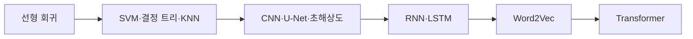

## Machine Learning

원본 PDF의 서로 다른 주제 구간을 17개 문서로 나누어 정리한다. 각 문서는 해당 PDF의 정의·식·절차·예시를 우선하며, 원본 슬라이드 이미지는 포함하지 않는다.

## 학습 경로



```html preview
<div style="font-family:system-ui,sans-serif;padding:20px;color:var(--foreground)">
  <label for="topic" style="font-size:14px;font-weight:600">문서 순서(원본 PDF 기반)</label>
  <div id="topicOut" style="font-size:30px;font-weight:700;color:var(--chart-1);margin:6px 0">1 / 17</div>
  <input id="topic" type="range" min="1" max="17" step="1" value="1" style="width:100%;accent-color:var(--primary)" />
  <p id="topicLabel" style="font-size:13px;color:var(--muted-foreground)">선형 회귀의 두 해법</p>
  <script>
    var labels = [
      "선형 회귀의 두 해법",
      "단일 선형 회귀 실습",
      "다중 선형 회귀와 주택 가격",
      "우버 요금 다중 선형 회귀",
      "SVM 최대 마진과 힌지 손실",
      "SVM 구현 - GD와 QP",
      "엔트로피와 결정 트리",
      "KNN 분류·회귀와 직접 구현",
      "중간고사 대비 - SVM·KNN 영화 추천",
      "CNN과 LeNet-5 분류",
      "U-Net 기반 특징 압축과 분류",
      "초해상도와 SRCNN",
      "RNN과 LSTM의 순환 구조",
      "RNN·LSTM 실습",
      "Word2Vec와 단어 임베딩",
      "Transformer Self-Attention과 블록 구성",
      "Transformer 언어 모델링과 인코더-디코더"
    ];
    var topic = document.getElementById('topic');
    var out = document.getElementById('topicOut');
    var label = document.getElementById('topicLabel');
    topic.addEventListener('input', function () {
      var i = Number(topic.value) - 1;
      out.textContent = topic.value + " / " + labels.length;
      label.textContent = labels[i];
    });
  </script>
</div>
```

## 회귀와 최적화

- [선형 회귀의 두 해법](<./notes/01. 선형 회귀의 두 해법.md>)
- [단일 선형 회귀 실습 - LSM과 GDM](<./notes/01. 단일 선형 회귀 실습 - LSM과 GDM.md>)
- [다중 선형 회귀와 주택 가격](<./notes/01. 다중 선형 회귀와 주택 가격.md>)
- [우버 요금 다중 선형 회귀](<./notes/01. 우버 요금 다중 선형 회귀.md>)

## 분류와 평가

- [SVM 최대 마진과 힌지 손실](<./notes/02. SVM 최대 마진과 힌지 손실.md>)
- [SVM 구현 - GD와 QP](<./notes/21. SVM 구현 - GD와 QP.md>)
- [엔트로피와 결정 트리](<./notes/02. 엔트로피와 결정 트리.md>)
- [KNN 분류·회귀와 직접 구현](<./notes/09. KNN 분류·회귀와 직접 구현.md>)
- [중간고사 대비 - SVM·KNN 영화 추천](<./notes/90. 중간고사 대비 - SVM·KNN 영화 추천.md>)

## 영상 모델

- [CNN과 LeNet-5 분류](<./notes/01. CNN과 LeNet-5 분류.md>)
- [U-Net 기반 특징 압축과 분류](<./notes/19. U-Net 기반 특징 압축과 분류.md>)
- [초해상도와 SRCNN](<./notes/01. 초해상도와 SRCNN.md>)

## 순차·언어 모델

- [RNN과 LSTM의 순환 구조](<./notes/01. RNN과 LSTM의 순환 구조.md>)
- [RNN·LSTM 실습](<./notes/01. RNN·LSTM 실습.md>)
- [Word2Vec와 단어 임베딩](<./notes/33. Word2Vec와 단어 임베딩.md>)
- [Transformer Self-Attention과 블록 구성](<./notes/21. Transformer Self-Attention과 블록 구성.md>)
- [Transformer 언어 모델링과 인코더-디코더](<./notes/01. Transformer 언어 모델링과 인코더-디코더.md>)

> [!NOTE]
> 별도 문서로 만들지 않은 자료는 원본 추출이 전 페이지 공백인 RNN/LSTM 판서 PDF, 이미지·라벨만 남은 Transformer 예시 PDF, 그리고 내용이 같은 Transformer 복제 PDF다. 원본 이미지가 금지된 범위에서는 이 자료들에 근거 없는 설명을 덧붙이지 않는다.
