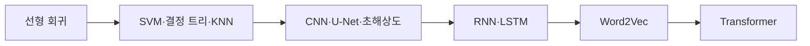

## Machine Learning

원본 PDF의 서로 다른 주제 구간을 17개 문서로 나누어 정리한다. 각 문서는 해당 PDF의 정의·식·절차·예시를 우선하며, 원본 슬라이드 이미지는 포함하지 않는다.

## 학습 경로



```html preview
<div style="font-family:system-ui,sans-serif;padding:20px;color:var(--foreground)">
  <label for="topic" style="font-size:14px;font-weight:600">문서 순서(원본 PDF 기반)</label>
  <div id="topicOut" style="font-size:30px;font-weight:700;color:var(--chart-1);margin:6px 0">1 / 17</div>
  <input id="topic" type="range" min="1" max="17" step="1" value="1" style="width:100%;accent-color:var(--primary)" />
  <p id="topicLabel" style="font-size:13px;color:var(--muted-foreground)">선형 회귀의 두 해법</p>
  <script>
    var labels = [
      "선형 회귀의 두 해법",
      "단일 선형 회귀 실습",
      "다중 선형 회귀와 주택 가격",
      "우버 요금 다중 선형 회귀",
      "SVM 최대 마진과 힌지 손실",
      "SVM 구현 - GD와 QP",
      "엔트로피와 결정 트리",
      "KNN 분류·회귀와 직접 구현",
      "중간고사 대비 - SVM·KNN 영화 추천",
      "CNN과 LeNet-5 분류",
      "U-Net 기반 특징 압축과 분류",
      "초해상도와 SRCNN",
      "RNN과 LSTM의 순환 구조",
      "RNN·LSTM 실습",
      "Word2Vec와 단어 임베딩",
      "Transformer Self-Attention과 블록 구성",
      "Transformer 언어 모델링과 인코더-디코더"
    ];
    var topic = document.getElementById('topic');
    var out = document.getElementById('topicOut');
    var label = document.getElementById('topicLabel');
    topic.addEventListener('input', function () {
      var i = Number(topic.value) - 1;
      out.textContent = topic.value + " / " + labels.length;
      label.textContent = labels[i];
    });
  </script>
</div>
```

## 회귀와 최적화

- [선형 회귀의 두 해법](<notes/01.%20%EC%84%A0%ED%98%95%20%ED%9A%8C%EA%B7%80%20%EA%B8%B0%EC%B4%88%EC%99%80%20%EB%91%90%20%ED%95%B4%EB%B2%95.md>)
- [단일 선형 회귀 실습 - LSM과 GDM](<notes/02.%20%EB%8B%A8%EC%9D%BC%20%EC%84%A0%ED%98%95%20%ED%9A%8C%EA%B7%80%20%EC%8B%A4%EC%8A%B5%20-%20LSM%EA%B3%BC%20GDM.md>)
- [다중 선형 회귀와 주택 가격](<notes/03.%20%EB%8B%A4%EC%A4%91%20%EC%84%A0%ED%98%95%20%ED%9A%8C%EA%B7%80%EC%99%80%20%EC%A3%BC%ED%83%9D%20%EA%B0%80%EA%B2%A9.md>)
- [우버 요금 다중 선형 회귀](<notes/04.%20%EC%9A%B0%EB%B2%84%20%EC%9A%94%EA%B8%88%20%EB%8B%A4%EC%A4%91%20%EC%84%A0%ED%98%95%20%ED%9A%8C%EA%B7%80.md>)

## 분류와 평가

- [SVM 최대 마진과 힌지 손실](<notes/05.%20SVM%20%EC%B5%9C%EB%8C%80%20%EB%A7%88%EC%A7%84%EA%B3%BC%20%ED%9E%8C%EC%A7%80%20%EC%86%90%EC%8B%A4.md>)
- [SVM 구현 - GD와 QP](<notes/06.%20SVM%20%EA%B5%AC%ED%98%84%20-%20%EA%B2%BD%EC%82%AC%20%ED%95%98%EA%B0%95%EB%B2%95%28GD%29%EA%B3%BC%20QP.md>)
- [엔트로피와 결정 트리](<notes/08.%20%EC%97%94%ED%8A%B8%EB%A1%9C%ED%94%BC%EC%99%80%20%EA%B2%B0%EC%A0%95%20%ED%8A%B8%EB%A6%AC.md>)
- [KNN 분류·회귀와 직접 구현](<./notes/09. KNN 분류·회귀와 직접 구현.md>)
- [중간고사 대비 - SVM·KNN 영화 추천](<notes/07.%20%EC%A4%91%EA%B0%84%EA%B3%A0%EC%82%AC%20%EB%8C%80%EB%B9%84%20-%20SVM%C2%B7KNN%20%EC%98%81%ED%99%94%20%EC%B6%94%EC%B2%9C.md>)

## 영상 모델

- [CNN과 LeNet-5 분류](<notes/10.%20CNN%EA%B3%BC%20LeNet-5%20%EB%B6%84%EB%A5%98.md>)
- [U-Net 기반 특징 압축과 분류](<notes/11.%20U-Net%20%EA%B8%B0%EB%B0%98%20%ED%8A%B9%EC%A7%95%20%EC%95%95%EC%B6%95%EA%B3%BC%20%EB%B6%84%EB%A5%98.md>)
- [초해상도와 SRCNN](<notes/12.%20%EC%B4%88%ED%95%B4%EC%83%81%EB%8F%84%EC%99%80%20SRCNN.md>)

## 순차·언어 모델

- [RNN과 LSTM의 순환 구조](<notes/13.%20RNN%EA%B3%BC%20LSTM%EC%9D%98%20%EC%88%9C%ED%99%98%20%EA%B5%AC%EC%A1%B0.md>)
- [RNN·LSTM 실습](<notes/14.%20RNN%C2%B7LSTM%20%EC%8B%A4%EC%8A%B5.md>)
- [Word2Vec와 단어 임베딩](<notes/15.%20Word2Vec%EC%99%80%20%EB%8B%A8%EC%96%B4%20%EC%9E%84%EB%B2%A0%EB%94%A9.md>)
- [Transformer Self-Attention과 블록 구성](<notes/17.%20Transformer%20Self-Attention%EA%B3%BC%20%EB%B8%94%EB%A1%9D%20%EA%B5%AC%EC%84%B1.md>)
- [Transformer 언어 모델링과 인코더-디코더](<notes/16.%20Transformer%20%EC%96%B8%EC%96%B4%20%EB%AA%A8%EB%8D%B8%EB%A7%81%EA%B3%BC%20%EC%9D%B8%EC%BD%94%EB%8D%94-%EB%94%94%EC%BD%94%EB%8D%94.md>)

> [!NOTE]
> 별도 문서로 만들지 않은 자료는 원본 추출이 전 페이지 공백인 RNN/LSTM 판서 PDF, 이미지·라벨만 남은 Transformer 예시 PDF, 그리고 내용이 같은 Transformer 복제 PDF다. 원본 이미지가 금지된 범위에서는 이 자료들에 근거 없는 설명을 덧붙이지 않는다.
