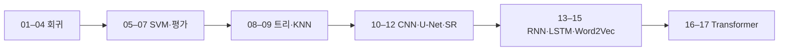

## Machine Learning

원본 PDF의 수업 흐름을 따라 17개 노트로 재구성했다. 번호는 PDF의 주차·날짜와 개념 전개 순서를 대조해 부여했으며, 같은 PDF를 이론·실습 단위로 나눈 경우 원본에서 먼저 등장한 단위를 앞에 둔다. 모든 수치와 식은 해당 PDF에 실제로 표시된 것만 사용한다. 원본 PDF는 `sources/`에 보존하며, 노트에는 전체 슬라이드/PDF를 삽입하지 않는다. HTML·SVG로 재현하기 어려운 U-Net·QKV·LSTM 구조 도식은 필요한 영역만 크롭해 해당 노트의 assets로 첨부했다.

## 번호와 파일명 규칙

- 01–04: 선형 회귀의 기초 → 단일 실습 → 다중 회귀 → 실제 좌표 특성화.
- 05–07: SVM 결정 경계·구현을 익힌 뒤 중간고사 문제로 평가한다.
- 08–09: 엔트로피와 결정 트리에서 KNN 거리·투표로 확장한다.
- 10–12: CNN 분류·U-Net 복원·초해상도 순서다(11·12주차 자료 표기 반영).
- 13–15: RNN·LSTM 순환 구조와 실습에서 Word2Vec embedding으로 이어진다.
- 16–17: Transformer의 언어 모델·encoder-decoder를 본 뒤 self-attention 블록을 전개한다.

## 학습 경로



```html preview
<div style="font-family:system-ui,sans-serif;padding:20px;color:var(--foreground)">
  <label for="topic" style="font-size:14px;font-weight:600">강의 흐름 번호</label>
  <div id="topicOut" style="font-size:30px;font-weight:700;color:var(--chart-1);margin:6px 0">1 / 17</div>
  <input id="topic" type="range" min="1" max="17" step="1" value="1" style="width:100%;accent-color:var(--primary)" />
  <p id="topicLabel" style="font-size:13px;color:var(--muted-foreground)">선형 회귀 기초와 두 해법</p>
  <script>
    var labels = [
      "선형 회귀 기초와 두 해법",
      "단일 선형 회귀 실습 - LSM과 GDM",
      "다중 선형 회귀와 주택 가격",
      "우버 요금 다중 선형 회귀",
      "SVM 최대 마진과 힌지 손실",
      "SVM 구현 - 경사 하강법(GD)과 QP",
      "중간고사 대비 - SVM·KNN 영화 추천",
      "엔트로피와 결정 트리",
      "KNN 분류·회귀와 직접 구현",
      "CNN과 LeNet-5 분류",
      "U-Net 기반 특징 압축과 분류",
      "초해상도와 SRCNN",
      "RNN과 LSTM의 순환 구조",
      "RNN·LSTM 실습",
      "Word2Vec와 단어 임베딩",
      "Transformer 언어 모델링과 인코더-디코더",
      "Transformer Self-Attention과 블록 구성"
    ];
    var topic = document.getElementById('topic');
    var out = document.getElementById('topicOut');
    var label = document.getElementById('topicLabel');
    topic.addEventListener('input', function () {
      var i = Number(topic.value) - 1;
      out.textContent = topic.value + " / " + labels.length;
      label.textContent = labels[i];
    });
  </script>
</div>
```

## 강의 흐름과 원본 근거

| 번호 | 정리 문서 | 원본 PDF 근거 |
| ---: | --- | --- |
| 01 | 선형 회귀 기초와 두 해법 | Linear_Regression_이론.pdf · LSM, GDM 선형 회귀모델.pdf |
| 02 | 단일 선형 회귀 실습 - LSM과 GDM | 250401_Linear_Regression_실습.pdf |
| 03 | 다중 선형 회귀와 주택 가격 | Multiple_Linear_Regression.pdf |
| 04 | 우버 요금 다중 선형 회귀 | 우버데이터_Multiple_Linear_Regression.pdf |
| 05 | SVM 최대 마진과 힌지 손실 | SVM.pdf |
| 06 | SVM 구현 - 경사 하강법(GD)과 QP | QP SVM.pdf · 20250415_Suport_vector_machine_실습 강의자료.pdf |
| 07 | 중간고사 대비 - SVM·KNN 영화 추천 | 머신러닝 중간고사 대비문제.pdf · 대비문제.pdf |
| 08 | 엔트로피와 결정 트리 | 250508_머신러닝_03분반_엔트로피(결정트리,KNN).pdf |
| 09 | KNN 분류·회귀와 직접 구현 | 250520_Decision_Tree_KNN_실습자료.pdf |
| 10 | CNN과 LeNet-5 분류 | 11주차_실습_CNN, U_Net.pdf |
| 11 | U-Net 기반 특징 압축과 분류 | 11주차_실습_CNN, U_Net.pdf |
| 12 | 초해상도와 SRCNN | 머신러닝_12주차_250522_Super Resolution using CNN.pdf |
| 13 | RNN과 LSTM의 순환 구조 | 머신러닝_RNN_LSTM.pdf |
| 14 | RNN·LSTM 실습 | 머신러닝_실습_RNN_LSTM.pdf |
| 15 | Word2Vec와 단어 임베딩 | 14주차_머신러닝_Word2Vec(RNN-LSTM 리뷰포함).pdf |
| 16 | Transformer 언어 모델링과 인코더-디코더 | 14주차_머신러닝_Transformer_강의자료.pdf |
| 17 | Transformer Self-Attention과 블록 구성 | 14주차_머신러닝_Transformer_강의자료.pdf |

## 회귀와 최적화

- [01. 선형 회귀 기초와 두 해법](<./notes/01. 선형 회귀 기초와 두 해법.md>)
- [02. 단일 선형 회귀 실습 - LSM과 GDM](<./notes/02. 단일 선형 회귀 실습 - LSM과 GDM.md>)
- [03. 다중 선형 회귀와 주택 가격](<./notes/03. 다중 선형 회귀와 주택 가격.md>)
- [04. 우버 요금 다중 선형 회귀](<./notes/04. 우버 요금 다중 선형 회귀.md>)

## 분류와 평가

- [05. SVM 최대 마진과 힌지 손실](<./notes/05. SVM 최대 마진과 힌지 손실.md>)
- [06. SVM 구현 - 경사 하강법(GD)과 QP](<./notes/06. SVM 구현 - 경사 하강법(GD)과 QP.md>)
- [07. 중간고사 대비 - SVM·KNN 영화 추천](<./notes/07. 중간고사 대비 - SVM·KNN 영화 추천.md>)
- [08. 엔트로피와 결정 트리](<./notes/08. 엔트로피와 결정 트리.md>)
- [09. KNN 분류·회귀와 직접 구현](<./notes/09. KNN 분류·회귀와 직접 구현.md>)

## 영상 모델

- [10. CNN과 LeNet-5 분류](<./notes/10. CNN과 LeNet-5 분류.md>)
- [11. U-Net 기반 특징 압축과 분류](<./notes/11. U-Net 기반 특징 압축과 분류.md>)
- [12. 초해상도와 SRCNN](<./notes/12. 초해상도와 SRCNN.md>)

## 순차·언어 모델

- [13. RNN과 LSTM의 순환 구조](<./notes/13. RNN과 LSTM의 순환 구조.md>)
- [14. RNN·LSTM 실습](<./notes/14. RNN·LSTM 실습.md>)
- [15. Word2Vec와 단어 임베딩](<./notes/15. Word2Vec와 단어 임베딩.md>)
- [16. Transformer 언어 모델링과 인코더-디코더](<./notes/16. Transformer 언어 모델링과 인코더-디코더.md>)
- [17. Transformer Self-Attention과 블록 구성](<./notes/17. Transformer Self-Attention과 블록 구성.md>)

> [!NOTE]
> 별도 문서로 만들지 않은 자료는 추출이 전 페이지 공백인 RNN/LSTM 판서 PDF, 이미지·라벨만 남은 Transformer 예시 PDF, 그리고 내용이 같은 Transformer 복제 PDF다. 텍스트 근거가 없는 자료에는 근거 없는 설명을 덧붙이지 않았다.
