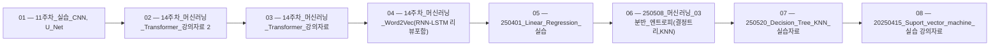

> [!abstract] 사용법
> 이 지도는 현재 폴더의 원본 PDF를 파일 순서대로 묶어 강의 진행 → 핵심 단서 → 점검 포인트를 연결합니다. 세부 개념은 같은 폴더의 주제 노트와 함께 대조하세요.

## 강의 흐름



<Tabs>
  <Tab label="파일 순서">파일명에 포함된 주차·장·버전 표기를 먼저 읽어 강의의 큰 흐름을 잡습니다.</Tab>
  <Tab label="중복 자료">같은 접두사나 버전이 겹치면 앞 자료를 기준으로 뒤 자료의 보충·실습 여부를 비교합니다.</Tab>
  <Tab label="검증">파일명과 쪽수는 탐색용 단서입니다. 정의·식·코드·도식은 각 원본 PDF에서 다시 확인합니다.</Tab>
</Tabs>

## 원본 PDF 목록

| 파일 | 쪽수 | 확인 메모 |
| :-- | --: | :-- |
| 11주차_실습_CNN, U_Net.pdf | 35 | 원본 첫 페이지·본문 대조 |
| 14주차_머신러닝_Transformer_강의자료 2.pdf | 46 | 원본 첫 페이지·본문 대조 |
| 14주차_머신러닝_Transformer_강의자료.pdf | 46 | 원본 첫 페이지·본문 대조 |
| 14주차_머신러닝_Word2Vec(RNN-LSTM 리뷰포함).pdf | 56 | 원본 첫 페이지·본문 대조 |
| 250401_Linear_Regression_실습.pdf | 34 | 원본 첫 페이지·본문 대조 |
| 250508_머신러닝_03분반_엔트로피(결정트리,KNN).pdf | 17 | 원본 첫 페이지·본문 대조 |
| 250520_Decision_Tree_KNN_실습자료.pdf | 22 | 원본 첫 페이지·본문 대조 |
| 20250415_Suport_vector_machine_실습 강의자료.pdf | 33 | 원본 첫 페이지·본문 대조 |
| 대비문제.pdf | 7 | 원본 첫 페이지·본문 대조 |
| 머신러닝 중간고사 대비문제.pdf | 3 | 원본 첫 페이지·본문 대조 |
| 머신러닝_03분반_13주차_강의영상_(RNN,LSTM))_판서.pdf | 13 | 원본 첫 페이지·본문 대조 |
| 머신러닝_12주차_250522_Super Resolution using CNN.pdf | 33 | 원본 첫 페이지·본문 대조 |
| 머신러닝_실습_RNN_LSTM.pdf | 21 | 원본 첫 페이지·본문 대조 |
| 머신러닝_RNN_LSTM.pdf | 54 | 원본 첫 페이지·본문 대조 |
| 머신러닝_Transformer-예시.pdf | 46 | 원본 첫 페이지·본문 대조 |
| 우버데이터_Multiple_Linear_Regression.pdf | 5 | 원본 첫 페이지·본문 대조 |
| Linear_Regression_이론.pdf | 21 | 원본 첫 페이지·본문 대조 |
| LSM, GDM 선형 회귀모델.pdf | 6 | 원본 첫 페이지·본문 대조 |
| Multiple_Linear_Regression.pdf | 5 | 원본 첫 페이지·본문 대조 |
| QP SVM.pdf | 1 | 원본 첫 페이지·본문 대조 |
| SVM.pdf | 6 | 원본 첫 페이지·본문 대조 |

## 원본 단계 인터랙티브

```html preview
<div style="font-family:system-ui,sans-serif;padding:20px;color:var(--foreground)">
  <label for="flow3851749866" style="font-size:14px;font-weight:600">원본 자료 단계</label>
  <div id="flow3851749866-out" style="font-size:24px;font-weight:700;color:var(--chart-1);margin:6px 0">11주차_실습_CNN, U_Net</div>
  <input id="flow3851749866" type="range" min="1" max="21" step="1" value="1" style="width:100%;accent-color:var(--primary)" />
  <p style="font-size:13px;color:var(--muted-foreground)">슬라이더를 움직이면 파일명 순서대로 자료의 위치를 확인합니다.</p>
  <script>
    var flow3851749866 = document.getElementById('flow3851749866');
    var flow3851749866Out = document.getElementById('flow3851749866-out');
    var flow3851749866Steps = ["11주차_실습_CNN, U_Net","14주차_머신러닝_Transformer_강의자료 2","14주차_머신러닝_Transformer_강의자료","14주차_머신러닝_Word2Vec(RNN-LSTM 리뷰포함)","250401_Linear_Regression_실습","250508_머신러닝_03분반_엔트로피(결정트리,KNN)","250520_Decision_Tree_KNN_실습자료","20250415_Suport_vector_machine_실습 강의자료","대비문제","머신러닝 중간고사 대비문제","머신러닝_03분반_13주차_강의영상_(RNN,LSTM))_판서","머신러닝_12주차_250522_Super Resolution using CNN","머신러닝_실습_RNN_LSTM","머신러닝_RNN_LSTM","머신러닝_Transformer-예시","우버데이터_Multiple_Linear_Regression","Linear_Regression_이론","LSM, GDM 선형 회귀모델","Multiple_Linear_Regression","QP SVM","SVM"];
    flow3851749866.addEventListener('input', function () {
      flow3851749866Out.textContent = flow3851749866Steps[Number(flow3851749866.value) - 1] || '';
    });
  </script>
</div>
```

## 점검 포인트

- **범위:** 21개 PDF, 총 510쪽.
- **근거:** 쪽수와 파일명은 현재 sources/ 디렉터리에서 직접 수집했습니다.
- **학습 순서:** 흐름도와 슬라이더를 먼저 훑은 뒤, 주제 노트의 정의·절차·실습 결과를 순서대로 대조합니다.

> [!warning] 과해석 방지
> 이 지도에는 파일명·쪽수·확인 메모만 기록했습니다. PDF에 없는 구현 세부, 성능 수치, 권장 설정은 추가하지 않습니다.

<details>
<summary>다음 읽기</summary>

현재 단계의 원본을 열어 제목·절차·도식을 확인한 뒤, 같은 폴더의 주제 노트에 해당 근거가 반영되었는지 점검하세요.

</details>
