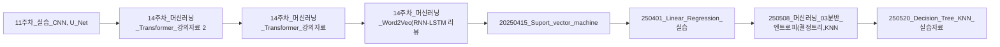

> [!abstract] 사용법
> 이 문서는 원본 PDF의 **순서 → 핵심 단서 → 학습 점검**을 한 번에 보는 지도입니다. 세부 개념은 같은 폴더의 주제 노트와 원본 PDF를 함께 대조하세요.

## 강의 흐름



<Tabs>
  <Tab label="파일 순서">파일명과 주차·장 제목을 강의 진행 신호로 삼아 처음부터 읽습니다.</Tab>
  <Tab label="읽기 전략">이론에서 실습·평가로 이동하며 같은 주제의 중복 PDF는 보조 자료로 비교합니다.</Tab>
  <Tab label="검증">텍스트가 빈약한 자료는 추출되지 않은 도식·수식을 임의로 채우지 않고 원본에서 확인합니다.</Tab>
</Tabs>

## 원본 PDF 목록

| 파일 | 쪽수 | 첫 페이지 단서 |
| :-- | --: | :-- |
| 11주차_실습_CNN, U_Net.pdf | — | Dong-A Univ. (ISPL) (실습) Convolutional Neural Network 컴퓨터AI공학부 컴퓨터공학과 |
| 14주차_머신러닝_Transformer_강의자료 2.pdf | — | Dong-A Univ. (ISPL) Transformer 컴퓨터AI공학부 |
| 14주차_머신러닝_Transformer_강의자료.pdf | — | Dong-A Univ. (ISPL) Transformer 컴퓨터AI공학부 |
| 14주차_머신러닝_Word2Vec(RNN-LSTM 리뷰포함).pdf | — | Dong-A Univ. (ISPL) (Language Model) Word2Vec 이론 컴퓨터AI공학부 |
| 20250415_Suport_vector_machine_실습 강의자료.pdf | — | Dong-A Univ. (ISPL) 컴퓨터AI공학부 2025년 1학기 머신러닝 1/31 |
| 250401_Linear_Regression_실습.pdf | — | Dong-A Univ. (ISPL) 컴퓨터AI공학부 2025년 1학기 머신러닝 1/33 |
| 250508_머신러닝_03분반_엔트로피(결정트리,KNN).pdf | — | Dong-A Univ. (ISPL) 컴퓨터공학과 2025년 1학기 머신러닝 1/16 |
| 250520_Decision_Tree_KNN_실습자료.pdf | — | Dong-A Univ. (ISPL) K Nearest Neighbors – 실습 컴퓨터AI공학부 |
| 대비문제.pdf | — | 대비문제 문제 2. 고객이 action 장르와 romance 장르에 각각 점수를 매겼을 때 3개의 영화 중 1개를 추천하는 시스템을 설계하고자 한다. 문제 2-1, 2-2, 2-3을 수행하여라 (총 70점) Import packages ( 수정X) import pandas as p |
| 머신러닝 중간고사 대비문제.pdf | — | 2025년 1학기 머신러닝 중간고사 대비문제 |
| 머신러닝_03분반_13주차_강의영상_(RNN,LSTM))_판서.pdf | — | 텍스트 추출 빈약 — 원본 시각 자료 확인 필요 |
| 머신러닝_12주차_250522_Super Resolution using CNN.pdf | — | Dong-A Univ. (ISPL) (실습) Super Resolution using CNN 컴퓨터AI공학부 AI학과 |
| 머신러닝_실습_RNN_LSTM.pdf | — | Dong-A Univ. (ISPL) (실습) LLM 기초 – RNN, LSTM 컴퓨터AI공학부 |
| 머신러닝_RNN_LSTM.pdf | — | Dong-A Univ. (ISPL) LLM 기초 – RNN, LSTM 컴퓨터AI공학부 |
| 머신러닝_Transformer-예시.pdf | — | Dong-A Univ. (ISPL) 소프트웨어대학 AI학과 전동산 |
| 우버데이터_Multiple_Linear_Regression.pdf | — | 우버데이터_Multiple_Linear_Regression Multiple Linear Regression with Uber Dataset 다중 선형 회귀란? 여러 개의 독립 변수를 사용하여 종속 변수를 예측하는 통계적 방법 수식: |
| Linear_Regression_이론.pdf | — | Dong-A Univ. (ISPL) 컴퓨터AI공학부 컴퓨터공학과 머신러닝 1/21 |
| LSM, GDM 선형 회귀모델.pdf | — | LSM, GDM 선형 회귀모델 Simple Linear Regression 데이터셋 로딩 및 전처리 kc_house_data: 미국 워싱턴주 시애틀 지역의 주택 가격 데이터를 포함한 공개 데이터셋 price: 주택의 판매 가격 (종속 변수, 목표 값). sq |
| Multiple_Linear_Regression.pdf | — | Multiple_Linear_Regression Multiple Linear Regression 핵심 개념 다중 선형 회귀(Multiple Linear Regression): 여러 개의 독립 변수를 사용하여 종속 변수를 예측하는 모델 최소 제곱법(Least Sq |
| QP SVM.pdf | — | QP SVM Quadratic Programming 기반 SVM(Support Vector Machine) 1. scikit-learn 라이브러리를 활용한 SVM 구현 scikit-learn 의 SVC 클래스를 사용하여 SVM 모델을 구 |
| SVM.pdf | — | SVM 20250415_Suport_vector_machine_ 실습 강의자료, p.15 SVM Gradient Decent Method (GD) |

## 원본 단계 인터랙티브

```html preview
<div style="font-family:system-ui,sans-serif;padding:20px;color:var(--foreground)">
  <label for="flow956946" style="font-size:14px;font-weight:600">원본 자료 단계</label>
  <div id="flow956946-out" style="font-size:24px;font-weight:700;color:var(--chart-1);margin:6px 0">11주차_실습_CNN, U_Net</div>
  <input id="flow956946" type="range" min="1" max="21" step="1" value="1" style="width:100%;accent-color:var(--primary)" />
  <p style="font-size:13px;color:var(--muted-foreground)">슬라이더를 움직이면 파일명 순서대로 자료의 역할을 확인합니다.</p>
  <script>
    var flow956946 = document.getElementById('flow956946');
    var flow956946Out = document.getElementById('flow956946-out');
    var flow956946Steps = ["11주차_실습_CNN, U_Net","14주차_머신러닝_Transformer_강의자료 2","14주차_머신러닝_Transformer_강의자료","14주차_머신러닝_Word2Vec(RNN-LSTM 리뷰포함)","20250415_Suport_vector_machine_실습 강의자료","250401_Linear_Regression_실습","250508_머신러닝_03분반_엔트로피(결정트리,KNN)","250520_Decision_Tree_KNN_실습자료","대비문제","머신러닝 중간고사 대비문제","머신러닝_03분반_13주차_강의영상_(RNN,LSTM))_판서","머신러닝_12주차_250522_Super Resolution using CNN","머신러닝_실습_RNN_LSTM","머신러닝_RNN_LSTM","머신러닝_Transformer-예시","우버데이터_Multiple_Linear_Regression","Linear_Regression_이론","LSM, GDM 선형 회귀모델","Multiple_Linear_Regression","QP SVM","SVM"];
    flow956946.addEventListener('input', function () {
      flow956946Out.textContent = flow956946Steps[Number(flow956946.value) - 1];
    });
  </script>
</div>
```

## 점검 포인트

- **범위:** 21개 PDF, 총 0쪽.
- **근거:** 첫 페이지 추출 단서를 표에 남겨 주제명과 흐름을 확인했습니다.
- **시각 자료:** 2개 파일은 첫 페이지 텍스트가 빈약하므로 필요한 경우 승인된 크롭 후보로만 별도 검토합니다.

> [!warning] 과해석 방지
> 이 지도에는 파일명·쪽수·추출된 첫 페이지 단서만 기록했습니다. PDF에 없는 구현 세부, 성능 수치, 권장 설정은 추가하지 않습니다.

<details>
<summary>다음 읽기</summary>

현재 단계의 파일을 선택한 뒤, 같은 폴더의 주제 노트에서 정의·절차·실습 결과를 대조하세요.

</details>
