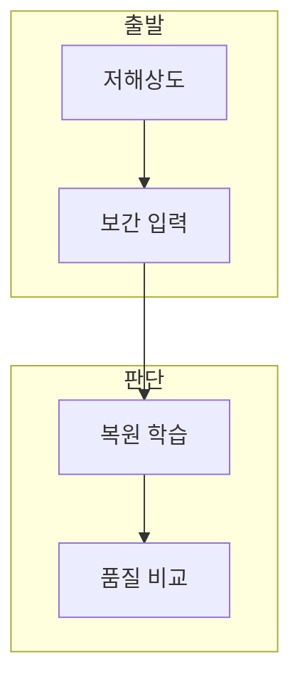

> [!abstract] 한 줄 요약
> 초해상도는 저해상도 입력을 더 높은 해상도의 출력으로 바꾸되, 보간의 부드러움과 학습 기반 복원의 선명도를 비교하는 작업이다.

## 이 노트의 지도



## 1. 초해상도의 두 접근

단일 이미지 초해상도는 저해상도 이미지 하나에서 고해상도 이미지 하나를 만든다. ==보간 기반 SR== 는 주변 픽셀로 빈 위치 값을 추정하는 방식.

**고주파 경계.** 보간은 매끄러운 결과를 주지만 평균화 효과로 고주파 세부 정보가 약해질 수 있다.

## 2. SRCNN의 학습 단위

강의의 SRCNN은 보간된 저해상도 입력과 원본 고해상도 레이블을 패치 단위로 짝지어 학습한다.

<Tabs>
  <Tab label="보간">주변 픽셀로 값을 채운다. 계산은 단순하지만 세부 복원에는 한계가 있다.</Tab>
  <Tab label="SRCNN">입력과 레이블의 대응을 학습해 예측 이미지를 만든다.</Tab>
</Tabs>

<details>
<summary>데이터셋을 읽는 순서</summary>

학습에는 T-91 이미지의 32×32 패치를 구성하고, 평가는 Set5에서 입력·레이블·예측을 같은 조건으로 비교한다.

</details>

<details>
<summary>비교 조건</summary>

입력 보간 방식과 평가 데이터, 배율을 고정해야 복원 차이를 해석할 수 있다.

</details>

## 데이터로 보기

```html preview
<div style="font-family:system-ui,sans-serif;padding:20px;color:var(--foreground)">
  <h3 style="margin:0 0 14px;font-size:15px;font-weight:600">복원 비교 예시, dB</h3>
  <div id="bars" style="display:flex;align-items:flex-end;gap:14px;height:170px"></div>
  <script>
    var data = [['보간', 30.4304], ['SRCNN', 31.1327]];
    var max = Math.max.apply(null, data.map(function (d) { return d[1]; }));
    document.getElementById('bars').innerHTML = data.map(function (d, i) {
      return '<div style="flex:1;display:flex;flex-direction:column;align-items:center;' +
        'gap:6px;height:100%;justify-content:flex-end">' +
        '<span style="font-size:12px;font-weight:600">' + d[1] + '</span>' +
        '<div style="width:100%;height:' + (d[1] / max * 100) + '%;' +
        'background:var(--chart-' + (i + 1) + ');' +
        'border-radius:var(--radius) var(--radius) 0 0"></div>' +
        '<span style="font-size:12px;color:var(--muted-foreground)">' + d[0] + '</span>' +
        '</div>';
    }).join('');
  </script>
</div>
```

> [!warning] 수치의 적용 범위
> 두 수치는 강의의 특정 비교 예시다. 다른 배율·데이터셋으로 일반화하지 않는다.

## 핵심 정리

| 개념 | 정의 | 학습 판단 |
| :-- | :-- | :-- |
| SISR | 한 장 입력의 SR | 입력·출력 쌍을 정한다 |
| ILR | 보간된 저해상도 입력 | 학습 입력을 구분한다 |
| HR | 원본 고해상도 레이블 | 복원 품질을 비교한다 |

## 관련 개념

- CNN은 공간적 특징을 학습하는 합성곱 모델이다.
- U-Net은 인코더·디코더로 공간 출력을 복원한다.

> [!question]- 스스로 점검
> **Q.** SRCNN 평가에서 보간 결과와 예측 결과를 같은 조건으로 비교하는 이유는 무엇인가?
>
> **A.** 조건이 달라지면 수치 차이를 모델의 복원 능력으로 해석할 수 없기 때문이다.
