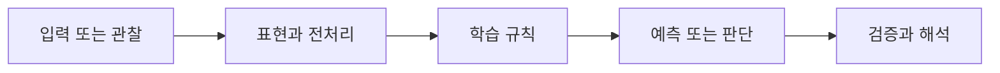

> [!abstract] 핵심
> 초해상도는 저해상도 입력에서 더 높은 해상도의 출력을 복원하는 과제이며, SRCNN은 이미지 입력과 이미지 출력을 잇는 합성곱 기반 접근이다.

## 문제를 모델로 바꾸기

초해상도 학습에서는 저해상도 이미지와 목표 고해상도 이미지를 짝으로 준비한다. 저해상도 이미지를 보간한 입력을 사용해 CNN이 출력 이미지를 예측하도록 구성할 수 있다. SRCNN은 이미지 입력·출력 구조의 세 층 CNN으로 소개되며, 예측과 기준 이미지의 오차는 MSE와 PSNR로 점검한다.



| 관점 | 이 노트에서 확인할 질문 | 학습할 때의 점검 |
| --- | --- | --- |
| LR·ILR·HR | 저해상도·보간 입력·목표 이미지 | 짝의 크기와 위치를 정확히 맞춘다 |
| SRCNN | 이미지에서 이미지로의 합성곱 예측 | 층별 채널과 활성화를 기록한다 |
| PSNR | MSE에 기반한 품질 지표 | 같은 범위·같은 기준 이미지로 비교한다 |

> [!note] 흐름
> 목표 이미지에서 저해상도 입력을 만들고, 입력과 정답의 크기·정렬을 맞춘다. 학습 뒤에는 보간 기준과 CNN 출력 모두를 동일한 기준 이미지에 대해 MSE·PSNR로 비교한다.

```html preview h=170
<div style="font-family:system-ui,sans-serif;padding:16px;border:1px solid var(--background-modifier-border);background:var(--background-primary-alt);color:var(--foreground);border-radius:10px">
  <div style="font-weight:700;margin-bottom:10px">01. CNN 기반 초해상도 · 학습 흐름</div>
  <div style="display:grid;grid-template-columns:repeat(4,1fr);gap:8px">
    <div style="padding:10px;border:1px solid var(--background-modifier-border);border-radius:8px">입력</div>
    <div style="padding:10px;border:1px solid var(--background-modifier-border);border-radius:8px">표현</div>
    <div style="padding:10px;border:1px solid var(--background-modifier-border);border-radius:8px">학습</div>
    <div style="padding:10px;border:1px solid var(--background-modifier-border);border-radius:8px">점검</div>
  </div>
</div>
```

## 관점을 나누어 보기

<Tabs>
<Tab label="개념">

초해상도는 픽셀 수를 단순히 늘리는 것보다 입력에서 복원 단서를 학습하는 문제다. 보간 이미지는 모델 입력의 한 기준선이 될 수 있다.

</Tab>
<Tab label="실행">

데이터셋은 목표 이미지와 그로부터 만든 저해상도·보간 입력을 연결한다. 입력·정답의 정렬이 어긋나면 손실 해석이 무너진다.

</Tab>
<Tab label="검증">

PSNR은 MSE와 연결된 수치 지표다. 수치와 함께 어떤 입력 대비 얼마나 개선됐는지, 시각적 결함이 남는지도 분리해 확인한다.

</Tab>
</Tabs>

<details>
<summary>복습 질문</summary>

보간된 저해상도 입력을 기준선으로 두는 이유는 무엇인가? MSE가 작아졌는데도 출력 품질을 추가로 점검해야 하는 이유는 무엇인가?

</details>

> [!tip] 학습 전략
> 입력, 모델의 가정, 평가 기준을 한 문장씩 연결해 설명해 본다. 계산 결과만 적지 말고 어떤 선택이 결과를 바꾸는지도 기록한다.
> [!warning] 해석 주의
> PSNR은 비교 조건이 같을 때만 의미가 있다. 이미지 범위나 기준 이미지를 다르게 두고 수치를 나란히 비교하면 안 된다.
