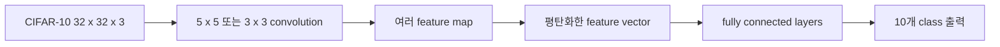

CNN 실습 자료의 앞부분은 MNIST와 CIFAR-10의 입력 표현을 복습한 뒤, 평탄화로 공간 정보가 사라지는 문제를 합성곱 층으로 해결하고 LeNet-5 분류기로 연결한다.

> [!IMPORTANT]
> 원본의 데이터셋 크기·층 크기·필터 설정만 사용했다. 원본 이미지와 페이지 표시는 공개 노트에 포함하지 않는다.

---

## MNIST와 CIFAR-10 입력

MNIST는 손글씨 숫자 데이터베이스로 train 60,000개, test 10,000개다. 28×28 이미지는 perceptron에 넣기 위해 784×1로 평탄화하고 10개 숫자의 예측 결과를 얻는다.

| 모델 | 층 구성 | 활성화·손실 |
| --- | --- | --- |
| Single Layer Perceptron | 784 → 10 | Softmax, Cross Entropy |
| Multi Layer Perceptron | 784 → 100 → 10 | Softmax·Sigmoid, Cross Entropy |

CIFAR-10은 32×32×3 RGB 이미지, 10개 클래스이며 train 50,000개·test 10,000개다. 평탄화하면 3,072×1 입력이 된다.

```html preview
<div style="font-family:system-ui,sans-serif;padding:20px;color:var(--foreground)">
  <label for="amt" style="font-size:14px;font-weight:600">CIFAR-10 class index</label>
  <div id="out" style="font-size:30px;font-weight:700;color:var(--chart-1);margin:6px 0">0</div>
  <input id="amt" type="range" min="0" max="9" step="1" value="0"
    style="width:100%;accent-color:var(--primary)" />
  <p style="font-size:13px;color:var(--muted-foreground)">자료의 10개 출력 클래스(0~9)를 선택한다.</p>
  <script>
    var amt = document.getElementById('amt');
    var out = document.getElementById('out');
    amt.addEventListener('input', function () {
      out.textContent = '' + Number(amt.value).toLocaleString();
    });
  </script>
</div>
```

---

## 평탄화가 만드는 문제

CIFAR-10 실습의 단순 fully connected 모델은 5개 층, 각 100개 노드, ReLU를 사용하고 최종 10개 결과를 낸다. 자료 예시의 예측 결과는 48%로 표시된다.

2D 이미지의 인접 픽셀 관계를 1차원으로 펴면 공간적 형상이 사라진다. 또한 가중치가 커진다.

| 비교 | 가중치 수 |
| --- | ---: |
| 784×10 fully connected | 7,840 |
| 5×5×1 convolution × 64 | 1,600 |

> [!WARNING]
> 48%는 원본 실습 그림에 표시된 예시 결과이며, 모든 데이터셋이나 모델의 정확도를 뜻하지 않는다.

---

## 합성곱으로 특징 맵 만들기

합성곱은 입력 이미지에 여러 filter(또는 kernel)를 적용해 특징을 추출한다. 자료의 예시는 32×32×3 입력에 3×3×3 filter를 32개 적용해 30×30×32 feature map을 만든다.



<Tabs>
  <Tab label="공간 보존">
    합성곱 층은 국소 이웃과 채널 구조를 유지한 채 특징 맵을 만든다.
  </Tab>
  <Tab label="분류 출력">
    feature map을 평탄화한 뒤 fully connected 층을 거쳐 10개 class를 예측한다.
  </Tab>
</Tabs>

---

## LeNet-5 구조

자료의 LeNet-5는 convolutional layer 2개와 fully connected layer 3개로 구성된다.

1. 입력: 32×32×3
2. Conv1: [5×5×3]×6, stride 1, padding 0 → ReLU
3. Average Pooling: kernel 2, stride 2
4. Conv2: [5×5×6]×16, stride 1, padding 0 → ReLU
5. Average Pooling: kernel 2, stride 2
6. 평탄화 후 FC1 400×120 → ReLU
7. FC2 120×84 → ReLU
8. FC3 84×10 → 10개 예측

표기 [KW×KH×C]×N에서 N은 filter 수, C는 입력 채널 수를 뜻한다고 자료가 설명한다.

<details>
<summary>LeNet-5 구현 확인</summary>

- convolution은 filter size 5×5, stride 1, padding 0이다.
- pooling은 average pooling, kernel 2, stride 2다.
- 마지막 결과는 10×1 예측 벡터다.
- 자료는 PyTorch nn 문서를 참고자료로 제시한다.

</details>

> [!CAUTION]
> 합성곱 층의 출력은 cube 형태의 feature map이므로 바로 class 확률로 읽지 않는다. 평탄화·fully connected 단계를 거쳐야 10×1 결과가 된다.
