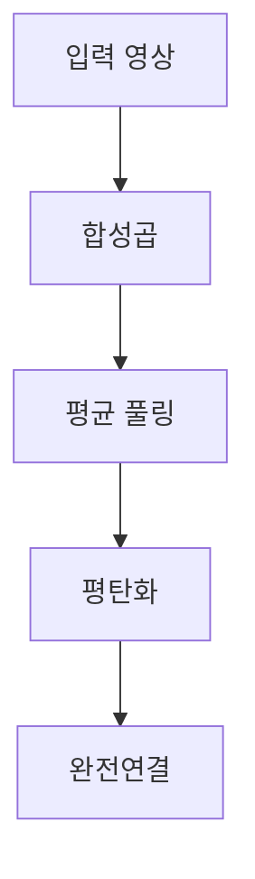

> [!NOTE]
> 이미지 분류에서 CNN의 핵심은 평탄화 전에 공간 구조를 보존한 채 특징을 추출하고, 마지막에 특징 벡터를 분류기로 넘기는 것이다.

---

## 분류 입력의 크기

**핵심:** MNIST와 CIFAR-10은 입력 형상과 데이터 규모가 다르지만 최종 출력은 모두 10개 클래스다.

| 데이터셋 | 입력 형상 | 평탄화 결과 | 학습 데이터 | 테스트 데이터 |
| :-- | :-- | :-- | --: | --: |
| MNIST | $28 \times 28$ | $784 \times 1$ | 60,000개 | 10,000개 |
| CIFAR-10 | $32 \times 32 \times 3$ | 3,072개 값 | 50,000개 | 10,000개 |

> [!IMPORTANT]
> Perceptron에 2차원 영상을 넣으려면 평탄화가 필요하다. 원본은 이 과정에서 위치와 형상에 관한 공간 정보가 사라진다는 문제를 CNN 도입의 출발점으로 삼는다.

---

## Perceptron과 CNN

<Tabs>
  <Tab label="Perceptron">모든 입력을 완전연결층으로 보낸다. MNIST 단일층 예시는 784개 입력에서 10개 출력으로, 다층 예시는 784→100→10으로 이어진다.</Tab>
  <Tab label="CNN">필터를 영상 위로 이동시키며 국소 특징을 추출한다. 원본 예시는 $3 \times 3 \times 3$ 필터 32개가 $32 \times 32$ 입력에서 $30 \times 30$ 특징 맵을 만든다.</Tab>
</Tabs>

```html preview
<div style="font-family:system-ui,sans-serif;padding:20px;color:var(--foreground)">
  <h3 style="margin:0 0 14px;font-size:15px;font-weight:600">완전연결층과 합성곱층의 가중치 수</h3>
  <div id="bars" style="display:flex;align-items:flex-end;gap:14px;height:170px"></div>
  <script>
    var data = [['완전연결층', 7840], ['합성곱층', 1600]];
    var max = Math.max.apply(null, data.map(function (d) { return d[1]; }));
    document.getElementById('bars').innerHTML = data.map(function (d, i) {
      return '<div style="flex:1;display:flex;flex-direction:column;align-items:center;' +
        'gap:6px;height:100%;justify-content:flex-end">' +
        '<span style="font-size:12px;font-weight:600">' + d[1] + '</span>' +
        '<div style="width:100%;height:' + (d[1] / max * 100) + '%;' +
        'background:var(--chart-' + (i + 1) + ');' +
        'border-radius:var(--radius) var(--radius) 0 0"></div>' +
        '<span style="font-size:12px;color:var(--muted-foreground)">' + d[0] + '</span>' +
        '</div>';
    }).join('');
  </script>
</div>
```

---

## LeNet-5의 다섯 학습층

**핵심:** 원본의 LeNet-5는 합성곱층 2개와 완전연결층 3개로 구성된다.

| 순서 | 계층 | 원본 설정 |
| :-- | :-- | :-- |
| 1 | Conv 1 | $[5 \times 5 \times 3] \times 6$, stride 1, padding 0 |
| 2 | Average Pooling | kernel 2, stride 2 |
| 3 | Conv 2 | $[5 \times 5 \times 6] \times 16$, stride 1, padding 0 |
| 4 | Average Pooling | kernel 2, stride 2 |
| 5 | Fully Connected | $400 \to 120 \to 84 \to 10$ |

ReLU는 두 합성곱 뒤와 앞의 두 완전연결 변환 사이에 놓이고, 마지막 10개 출력이 클래스 예측을 담당한다.

---

## 영상에서 클래스로



이 흐름에서 합성곱과 풀링은 특징 맵을 만들고, 평탄화는 이를 완전연결층이 받을 수 있는 벡터로 바꾼다.

<details>
<summary>모델 작성 때 확인할 항목</summary>

- 입력 channel과 첫 필터의 channel 수를 맞춘다.
- 두 합성곱층에는 원본이 제시한 $5 \times 5$ filter, stride 1, padding 0을 적용한다.
- 평균 풀링 뒤 특징 맵을 평탄화한 뒤 $400 \to 120 \to 84 \to 10$ 순서로 연결한다.
- 활성화 함수와 분류 출력의 위치를 계층 순서에 맞춰 확인한다.

</details>

---

## 예제 결과의 해석 경계

> [!WARNING]
> CIFAR-10 다층 perceptron 도식에는 예측 결과 48%가 표시되지만, 이를 재현하는 실행 로그·학습 조건·평가 절차는 원본 텍스트에 없다. 따라서 검증된 CNN 정확도로 해석하지 않는다.

원본은 CNN이 image classification뿐 아니라 super-resolution과 denoising에도 쓰인다고 제시하지만, 이 문서의 책임은 CIFAR-10 분류와 LeNet-5 구조까지다.

---

## 정리

| 핵심 개념 | 의미 | 적용 또는 경계 |
| :-- | :-- | :-- |
| 평탄화 | 영상을 1차원 입력으로 변환 | 공간 정보가 사라질 수 있음 |
| 합성곱 | 국소 필터로 특징 맵 생성 | filter 크기와 channel을 맞춤 |
| 평균 풀링 | 특징 맵의 공간 크기 축소 | LeNet-5의 두 합성곱 뒤에 배치 |
| 완전연결층 | 특징 벡터를 10개 클래스로 변환 | 실행 정확도는 원본에서 검증되지 않음 |