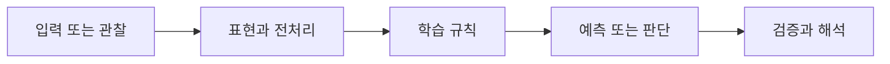

> [!abstract] 핵심
> CNN의 합성곱 기반 특징 추출과 U-Net의 압축·복원 흐름을 분류 실습의 구조와 검증 관점에서 정리한다.

## 문제를 모델로 바꾸기

CNN은 합성곱 층을 통해 이미지의 지역적 패턴을 단계적으로 추출한다. U-Net은 입력 정보를 압축하는 자동인코더 계열의 흐름과, 공간 크기를 되돌리는 업샘플링을 함께 사용한다. 전치 합성곱은 업샘플링을 위한 합성곱 층으로 활용될 수 있다.



| 관점 | 이 노트에서 확인할 질문 | 학습할 때의 점검 |
| --- | --- | --- |
| 합성곱 | 지역적 패턴 추출 | 입력·출력 채널과 공간 크기를 추적한다 |
| 압축 | 입력 정보의 요약 | 정보 손실과 표현 차원을 점검한다 |
| 업샘플링 | 공간 크기 확대 | 전치 합성곱 뒤 형태를 확인한다 |

> [!note] 흐름
> 이미지 입력의 형태와 범주 라벨을 확인하고, CNN과 U-Net의 출력이 분류 손실과 맞도록 만든다. 학습 중에는 구조별 파라미터 수, 정확도, 오분류 사례를 같은 분할에서 비교한다.

```html preview h=170
<div style="font-family:system-ui,sans-serif;padding:16px;border:1px solid var(--background-modifier-border);background:var(--background-primary-alt);color:var(--foreground);border-radius:10px">
  <div style="font-weight:700;margin-bottom:10px">01. CNN과 U-Net 실습 · 학습 흐름</div>
  <div style="display:grid;grid-template-columns:repeat(4,1fr);gap:8px">
    <div style="padding:10px;border:1px solid var(--background-modifier-border);border-radius:8px">입력</div>
    <div style="padding:10px;border:1px solid var(--background-modifier-border);border-radius:8px">표현</div>
    <div style="padding:10px;border:1px solid var(--background-modifier-border);border-radius:8px">학습</div>
    <div style="padding:10px;border:1px solid var(--background-modifier-border);border-radius:8px">점검</div>
  </div>
</div>
```

## 관점을 나누어 보기

<Tabs>
<Tab label="개념">

CNN은 여러 합성곱 층으로 이미지 특징을 만들고, 분류기는 그 특징에서 범주 점수를 만든다. U-Net은 압축과 복원의 관점을 포함한다.

</Tab>
<Tab label="실행">

모델을 작성할 때 각 층 뒤 텐서의 크기를 먼저 계산한다. 입력 이미지의 정규화와 라벨 부호화도 동일한 파이프라인에 둔다.

</Tab>
<Tab label="검증">

정확도와 손실을 함께 보며, 모델 구조가 달라졌을 때 학습 시간과 과적합 징후가 어떻게 변하는지 비교한다.

</Tab>
</Tabs>

<details>
<summary>복습 질문</summary>

합성곱 층과 완전연결 층이 이미지 입력을 다루는 방식은 어떻게 다른가? 전치 합성곱 뒤 공간 크기를 확인해야 하는 이유는 무엇인가?

</details>

> [!tip] 학습 전략
> 입력, 모델의 가정, 평가 기준을 한 문장씩 연결해 설명해 본다. 계산 결과만 적지 말고 어떤 선택이 결과를 바꾸는지도 기록한다.
> [!warning] 해석 주의
> 업샘플링으로 공간 크기가 맞아도 분류 목적에 필요한 특징이 보존됐다는 뜻은 아니다. 출력 형태와 실제 평가 지표를 함께 확인한다.
