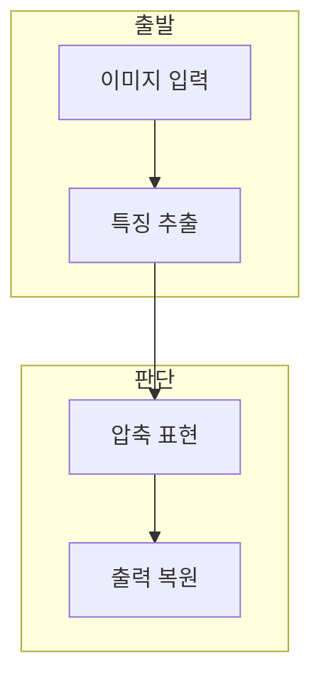

> [!abstract] 한 줄 요약
> CNN은 평탄화로 잃기 쉬운 공간 구조를 특징 맵으로 학습하고, U-Net은 압축된 특징을 다시 공간 출력으로 복원한다.

## 이 노트의 지도



## 1. 공간 정보를 남기는 이유

다층 퍼셉트론은 이미지를 일렬 벡터로 바꾸면서 위치 관계를 직접 보존하지 않는다. ==공간적 정보== 는 픽셀의 이웃·형상·배치에서 얻는 관계.

> [!tip] 분류와 복원의 초점
> CNN은 특징을 모아 분류에 쓰고, U-Net은 인코더와 디코더를 이어 공간 출력도 다룬다.

## 2. U-Net의 인코더와 디코더

강의 실습은 합성곱과 풀링으로 특징을 압축한 뒤 전치 합성곱으로 출력 크기를 되돌린다.

<Tabs>
  <Tab label="CNN">합성곱 필터로 공간 특징을 추출해 분류 판단에 전달한다.</Tab>
  <Tab label="U-Net">인코더의 압축 표현을 디코더에서 복원해 공간 출력을 만든다.</Tab>
</Tabs>

<details>
<summary>입력 형상 확인</summary>

CIFAR-10 입력은 32×32×3이며 10개 클래스로 구성된다. 평탄화 여부와 합성곱 출력 형상을 구분한다.

</details>

## 데이터로 보기

```html preview
<div style="font-family:system-ui,sans-serif;padding:20px">
  <div id="cards" style="display:flex;gap:14px;flex-wrap:wrap"></div>
  <script>
    var stats = [
      ['입력', '32×32×3', 'RGB 형상', 'var(--chart-1)'],
      ['학습', '50,000', 'CIFAR-10 train', 'var(--chart-2)'],
      ['평가', '10,000', 'CIFAR-10 test', 'var(--chart-3)']
    ];
    document.getElementById('cards').innerHTML = stats.map(function (s) {
      return '<div style="flex:1;min-width:150px;padding:16px;background:var(--card);' +
        'color:var(--card-foreground);border:1px solid var(--border);' +
        'border-radius:var(--radius)">' +
        '<div style="font-size:13px;color:var(--muted-foreground)">' + s[0] + '</div>' +
        '<div style="font-size:26px;font-weight:700;margin-top:4px">' + s[1] + '</div>' +
        '<div style="font-size:12px;font-weight:600;margin-top:4px;color:' + s[3] + '">' + s[2] + '</div>' +
        '</div>';
    }).join('');
  </script>
</div>
```

> [!warning] 압축 벡터의 해석
> 압축 표현의 의미가 자동으로 드러나는 것은 아니다. 성능과 출력 검토를 함께 한다.

## 핵심 정리

| 개념 | 정의 | 학습 판단 |
| :-- | :-- | :-- |
| 합성곱 | 국소 필터의 특징 추출 | 공간 관계를 유지한다 |
| 풀링 | 특징 맵 크기 축소 | 표현을 압축한다 |
| 전치 합성곱 | 특징 맵 업샘플링 | 복원에 사용한다 |

## 관련 개념

- 초해상도는 저해상도 입력에서 고해상도 출력을 복원한다.
- 분류는 입력 전체에 하나의 레이블을 부여한다.

> [!question]- 스스로 점검
> **Q.** U-Net에서 인코더와 디코더를 함께 추적해야 하는 이유는?
>
> **A.** 압축된 특징이 어떤 경로로 공간 출력으로 되돌아가는지 검증해야 하기 때문이다.
