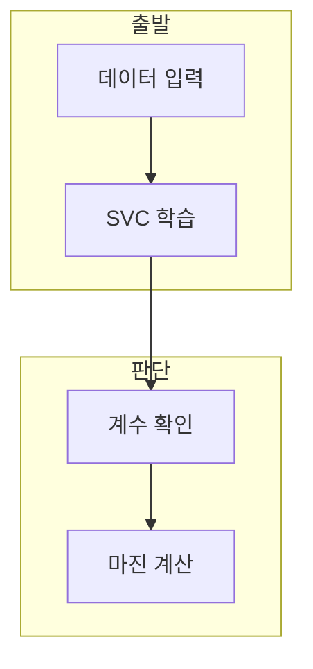

> [!abstract] 한 줄 요약
> 선형 SVM은 학습된 가중치와 편향으로 경계를 정하고, 가중치 벡터의 크기로 마진을 계산한다.

## 이 노트의 지도



## 1. SVC의 입력과 커널

강의 예시는 scikit-learn의 SVC에 입력 X와 레이블 y를 주고 선형 커널을 설정해 학습한다. ==커널==은 입력 공간에서 분류 경계를 구성하는 설정이다.

> [!important] 선형 설정의 범위
> 예시의 `kernel='linear'`는 선형 경계를 위한 설정이다. 다른 커널 이름이 나열되어도 같은 결과를 보장하지 않는다.

## 2. 마진의 크기

학습 뒤에는 계수 벡터와 절편을 확인하고, 계수 벡터의 크기가 커질수록 아래 식의 마진은 작아진다.

<details>
<summary>식의 변수</summary>

$w$는 학습된 계수 벡터다. 이 식은 강의의 선형 SVM 예시에서 마진 크기를 계산할 때 쓰며, 입력 데이터의 품질을 직접 평가하는 값은 아니다.

$$
\operatorname{margin}=\frac{2}{\lVert w\rVert_2}
$$

</details>

## 데이터로 보기

```html preview
<div style="font-family:system-ui,sans-serif;padding:20px">
  <div id="cards" style="display:flex;gap:14px;flex-wrap:wrap"></div>
  <script>
    var stats = [
      ['입력', 'X, y', '특징과 레이블', 'var(--chart-1)'],
      ['학습', 'SVC', '선형 커널 예시', 'var(--chart-2)'],
      ['마진', '2/||w||', '계수 크기로 계산', 'var(--chart-3)']
    ];
    document.getElementById('cards').innerHTML = stats.map(function (s) {
      return '<div style="flex:1;min-width:150px;padding:16px;background:var(--card);' +
        'color:var(--card-foreground);border:1px solid var(--border);' +
        'border-radius:var(--radius)">' +
        '<div style="font-size:13px;color:var(--muted-foreground)">' + s[0] + '</div>' +
        '<div style="font-size:26px;font-weight:700;margin-top:4px">' + s[1] + '</div>' +
        '<div style="font-size:12px;font-weight:600;margin-top:4px;color:' + s[3] + '">' + s[2] + '</div>' +
        '</div>';
    }).join('');
  </script>
</div>
```

> [!warning] 마진만으로 판단하지 않기
> 마진 계산은 선형 SVM 설정의 한 단계다. 데이터 분리 가능성, 레이블, 평가 결과를 생략한 채 모델 품질로 단정하지 않는다.

## 핵심 정리

| 개념 | 정의 | 학습 판단 |
| :-- | :-- | :-- |
| SVC | SVM 모델 클래스 | 학습 인터페이스를 정한다 |
| 계수 벡터 | 결정 경계의 방향 정보 | 마진 계산에 쓰인다 |
| 절편 | 결정 함수의 상수항 | 경계 위치에 관여한다 |

## 관련 개념

- SVM의 결정 경계는 $w^T x+b=0$ 형태로 표현한다.
- 경사 하강법은 파라미터를 반복 갱신하는 한 방법이다.

> [!question]- 스스로 점검
> **Q.** 같은 정의에서 $\lVert w\rVert_2$가 커지면 마진은 어떻게 변하는가?
>
> **A.** 분모가 커지므로 계산된 마진은 작아진다.
