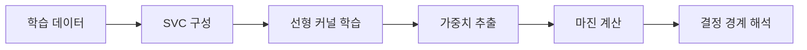

> [!abstract] 핵심
> Quadratic Programming 기반 SVM 예시에서는 SVC로 선형 커널 모델을 학습하고, 학습된 가중치로 마진 크기를 계산한다.

## 모델과 마진의 연결

선형 커널을 사용하면 결정 경계의 가중치를 얻을 수 있다. 마진 크기는 $2/\sqrt{w^Tw}$로 계산되며, 가중치 벡터의 크기와 연결된다.



| 항목 | 내용 | 확인 대상 |
| --- | --- | --- |
| 분류기 | SVC | 학습 가능한 모델 구성 |
| 커널 | linear | 선형 경계 사용 |
| 가중치 | $w$ | 경계 방향 |
| 마진 | $2/\sqrt{w^Tw}$ | 경계 사이의 간격 |

> [!note] 커널 선택
> 예시의 SVC는 선형 커널을 사용한다. SVC에는 linear, rbf, poly, sigmoid처럼 다른 커널 선택지도 있다.

```html preview h=170
<div style="font-family:system-ui,sans-serif;padding:16px;border:1px solid var(--border);background:var(--card);color:var(--foreground)">
  <div style="display:grid;grid-template-columns:repeat(3,minmax(0,1fr));gap:8px;text-align:center">
    <div style="padding:10px;border:1px solid var(--border)">커널</div>
    <div style="padding:10px;border:1px solid var(--border)">가중치</div>
    <div style="padding:10px;border:1px solid var(--border)">마진</div>
  </div>
  <div style="margin-top:10px;color:var(--muted)">모델의 파라미터가 마진 계산으로 이어진다.</div>
</div>
```

<Tabs>
<Tab label="학습">
입력과 레이블을 SVC에 전달해 선형 분류기를 학습한다.
</Tab>
<Tab label="시각화">
학습된 가중치와 절편은 결정 경계를 시각적으로 점검하는 데 사용할 수 있다.
</Tab>
<Tab label="계산">
가중치의 전치와 내적을 이용해 마진 크기를 계산한다.
</Tab>
</Tabs>

<details>
<summary>마진 계산 전 점검</summary>

- 선형 커널 모델을 학습했는가?
- 학습된 가중치 벡터를 가져왔는가?
- 내적 결과가 가중치 크기의 제곱이라는 점을 확인했는가?
- 계산 결과를 결정 경계와 함께 해석했는가?

</details>

> [!tip] 수식과 모델 속성 연결하기
> 마진 공식을 따로 암기하기보다, 학습 뒤 얻는 가중치 벡터가 식의 어느 자리에 들어가는지 연결해서 확인한다.
> [!warning] 커널별 해석 차이
> 선형 커널에서의 가중치 기반 해석을 다른 커널에 그대로 옮기기 전에, 해당 모델이 제공하는 파라미터와 표현 방식을 점검한다.
