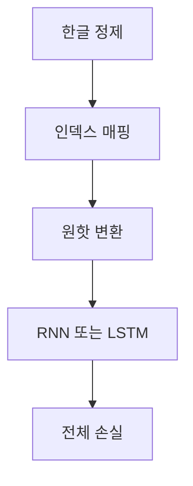

> [!NOTE]
> 이 자료의 고유한 실습 책임은 훈민정음 문장을 문자 sequence로 바꾸고, 첫 입력에서 다음 문자를 반복 예측하도록 RNN·LSTM 흐름을 설계하는 데 있다.

> [!WARNING]
> 원본에는 실행된 notebook, epoch, optimizer, learning rate, loss 수치, 생성 결과가 없다. 따라서 이 문서는 측정된 실습 결과가 아니라 source-backed 절차 설명이다.

---

## 생성 과제의 형태

**핵심:** 훈민정음 현대어 서문의 첫 단어를 입력하고, 뒤따르는 문장 sequence를 차례로 생성하는 문제로 구성한다.

| 요소 | 원본에서 맡는 역할 |
| :-- | :-- |
| 첫 단어 | 생성 시작 입력 |
| 전체 문장 | 예측해야 할 target sequence |
| 문자 목록 | data와 index를 잇는 vocabulary |
| 이전 hidden state | 다음 문자 예측에 전달되는 상태 |
| 전체 예측 sequence | target과 loss를 계산할 출력 |

앞부분의 RNN 구조 복습은 별도 이론 설명과 겹치므로, 여기서는 데이터 준비와 반복 생성 절차에만 사용한다.

---

## 데이터 준비에서 loss까지

| 순서 | 처리 | 확인할 결과 |
| --: | :-- | :-- |
| 1 | 한글이 아닌 문자를 제거하고 문자 목록 저장 | 사용할 symbol 집합 |
| 2 | data와 index의 양방향 mapping 정의 | 문자와 정수 index 연결 |
| 3 | 각 문자를 one-hot vector로 변환 | sequence 입력 |
| 4 | 시점별 입력과 이전 상태를 recurrent cell에 전달 | 예측과 다음 상태 |
| 5 | 예측한 전체 sequence와 target 비교 | 학습 loss |

---

## 벡터 표현

원본은 자연어를 수치 벡터로 바꾸는 예로 embedding vector $[0.5,0.3,0.8]$을 제시하고, 각 단어 또는 문자를 고유 index의 one-hot vector로 표현하는 방법을 함께 설명한다.

<Tabs>
  <Tab label="One-hot">vocabulary 크기만큼의 차원을 만들고 현재 symbol의 index만 1로 둔다. 이 자료의 전처리 단계에서 직접 사용하는 입력 표현이다.</Tab>
  <Tab label="Embedding">자연어 항목을 낮은 차원의 실수 벡터로 바꾸는 표현이다. 원본은 개념을 소개하지만 이 실습의 구체적인 embedding 학습 설정은 제시하지 않는다.</Tab>
</Tabs>

---

## RNN 반복 구조

**핵심:** 현재 입력과 이전 hidden state를 함께 받아 현재 출력과 다음 hidden state를 만든다.

| 입력 | recurrent cell | 출력 |
| :-- | :-- | :-- |
| 현재 one-hot vector | $x_t$와 $h_{t-1}$ 결합 후 tanh | 현재 예측과 $h_t$ |
| 다음 one-hot vector | 같은 계층과 가중치를 반복 사용 | 다음 예측과 다음 상태 |

Sequence loop의 읽는 순서

1. 첫 symbol과 초기 hidden state를 준비한다.
2. 현재 입력으로 다음 symbol의 출력 분포를 만든다.
3. 현재 hidden state를 다음 시점에 전달한다.
4. sequence 길이만큼 같은 과정을 반복한다.
5. 모은 전체 출력과 target sequence 사이의 loss를 계산한다.

---

## LSTM gate 계산

원본은 LSTM cell을 다음 네 식으로 나누어 제시한다.

$$
f_t=\sigma(W_{xhf}x_t+W_{hhf}h_{t-1}+\mathrm{bias})
$$

$$
i_t=\sigma(W_{xhi}x_t+W_{hhi}h_{t-1}+\mathrm{bias})
$$

$$
\widetilde{C}_t=\tanh(W_{xhc}x_t+W_{hhc}h_{t-1}+\mathrm{bias})
$$

$$
o_t=\sigma(W_{xho}x_t+W_{hho}h_{t-1}+\mathrm{bias})
$$

forget, input, output gate는 sigmoid를 사용하고 candidate cell 정보는 tanh로 만든다.

---

## 학습과 평가의 경계

| 단계 | 원본에 있는 것 | 원본에 없는 것 |
| :-- | :-- | :-- |
| 입력 | 초기 입력과 target sequence 개념 | 실제 tensor shape |
| 모델 | RNN·LSTM cell과 recurrent loop | 완전한 구현 코드 |
| 학습 | 전체 sequence loss 계산 | optimizer·epoch·loss 기록 |
| 결과 | 생성 목표 설명 | 생성 문장·정확도·검증값 |

> [!CAUTION]
> 실행 증거가 추가되기 전에는 이 자료를 재현 완료된 practice로 분류하거나 성능을 주장할 수 없다.

---

## 정리

| 핵심 개념 | 의미 | 적용 또는 경계 |
| :-- | :-- | :-- |
| 문자 정제 | 사용할 한글 symbol만 남김 | 제거 규칙의 구현은 추출되지 않음 |
| Index mapping | 문자와 정수를 연결 | one-hot 생성의 기준 |
| Recurrent loop | 상태를 넘기며 다음 symbol 예측 | sequence 길이만큼 반복 |
| LSTM gate | 기억·망각·출력을 분리 | 식은 source 표기를 유지 |
| Loss | 전체 예측과 target 비교 | 측정 수치는 없음 |