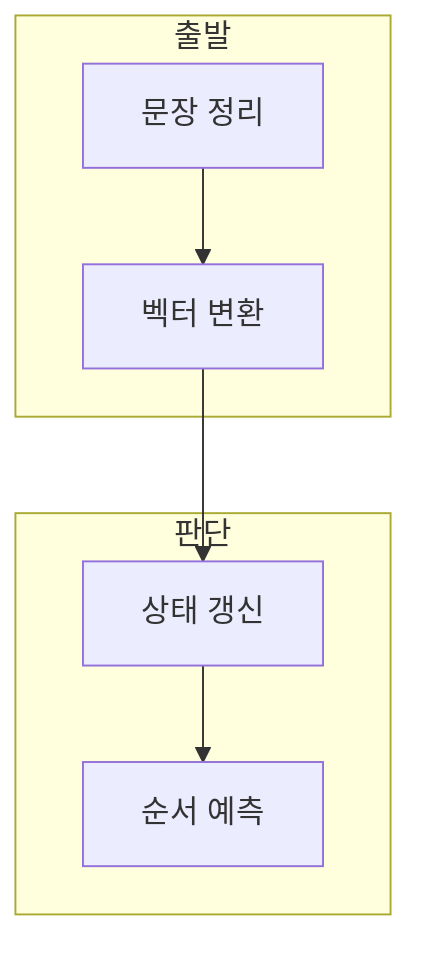

> [!abstract] 한 줄 요약
> RNN·LSTM 실습은 문장을 벡터화한 뒤 이전 상태와 현재 입력을 함께 사용해 다음 순서의 출력을 학습한다.

## 이 노트의 지도



## 1. 텍스트를 모델 입력으로 바꾸기

실습은 한글 외 문자를 정리하고 단어와 인덱스의 관계를 만든 뒤 one-hot 표현을 구성한다. ==one-hot encoding== 는 한 요소만 1인 희소 단어 벡터.

> [!important] 입력과 정답의 정렬
> 입력 시퀀스와 목표 시퀀스의 한 단계 이동 관계를 먼저 확인한다.

## 2. RNN의 상태 전달

RNN은 현재 입력과 직전 은닉 상태를 이용해 현재 은닉 상태와 출력을 계산한다.

$$
h_t=f\!\left(W_{xh}x_t+W_{hh}h_{t-1}+b\right)
$$

<details>
<summary>상태식 읽기</summary>

$x_t$는 현재 입력, $h_{t-1}$은 직전 은닉 상태다. 전체 시퀀스의 예측과 정답을 비교해 손실을 계산한다.

</details>

## 데이터로 보기

```html preview
<div style="font-family:system-ui,sans-serif;padding:20px;color:var(--foreground)">
  <label for="amt" style="font-size:14px;font-weight:600">순서 단계</label>
  <div id="out" style="font-size:30px;font-weight:700;color:var(--chart-1);margin:6px 0">3</div>
  <input id="amt" type="range" min="1" max="12" step="1" value="3"
    style="width:100%;accent-color:var(--primary)" />
  <p style="font-size:13px;color:var(--muted-foreground)">현재 단계와 이전 상태의 연결을 생각해 본다.</p>
  <script>
    var amt = document.getElementById('amt');
    var out = document.getElementById('out');
    amt.addEventListener('input', function () {
      out.textContent = Number(amt.value).toLocaleString();
    });
  </script>
</div>
```

> [!warning] 순서 정보의 누락
> 단어 목록만 맞추고 순서가 어긋나면 상태 전달의 목적이 사라진다.

## 핵심 정리

| 개념 | 정의 | 학습 판단 |
| :-- | :-- | :-- |
| 토큰 인덱스 | 단어와 정수 대응 | 입력을 재현한다 |
| 은닉 상태 | 이전 시점 요약 | 문맥을 전달한다 |
| 손실 | 예측과 정답의 차이 | 갱신의 근거가 된다 |

## 관련 개념

- LSTM은 cell state와 gate로 장기 정보를 다룬다.
- Word2Vec은 단어를 밀집 벡터로 바꾼다.

> [!question]- 스스로 점검
> **Q.** 현재 입력만으로 RNN 예측이 충분하지 않은 이유는?
>
> **A.** 순차 데이터는 이전 단계 정보가 현재 예측에 영향을 주기 때문이다.
