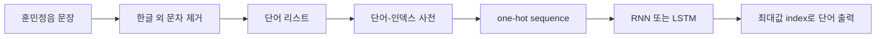

이 실습은 훈민정음 서문의 현대어 번역본을 학습해 첫 단어를 입력하면 전체 문장이 출력되도록 RNN을 구성하고, 같은 순환 구조를 LSTM으로 확장한다.

> [!IMPORTANT]
> 문장·전처리 순서·층 수식은 실습 PDF에서 확인한 범위만 기록했다. 원본 그림은 포함하지 않는다.

---

## 실습 데이터와 목표

모델이 예측할 문장은 다음과 같다.

> 나라의 말이 중국과 달라 문자와 서로 통하지 아니하니, 이런 까닭으로 어리석은 백성이 이르고자 할 바가 있어도 마침내 제 뜻을 능히 펴지 못할 사람이 많으니라. 내가 이를 위하여 가엾이 여겨 새로 스물여덟 자를 만드노니 사람마다 하여금 쉬이 익혀 날로 쓰는 데 편하게 하고자 할 따름이니라.

첫 단어를 입력으로 주고 나머지 sequence를 출력하도록 학습한다. 입력과 출력이 시간 순서를 공유하므로 단순 이미지 분류와 다르다.

```html preview
<div style="font-family:system-ui,sans-serif;padding:20px;color:var(--foreground)">
  <label for="amt" style="font-size:14px;font-weight:600">one-hot 활성 값</label>
  <div id="out" style="font-size:30px;font-weight:700;color:var(--chart-1);margin:6px 0">1</div>
  <input id="amt" type="range" min="0" max="1" step="1" value="1"
    style="width:100%;accent-color:var(--primary)" />
  <p style="font-size:13px;color:var(--muted-foreground)">one-hot 벡터에서 자료가 사용하는 0과 1을 전환한다.</p>
  <script>
    var amt = document.getElementById('amt');
    var out = document.getElementById('out');
    amt.addEventListener('input', function () {
      out.textContent = '' + Number(amt.value).toLocaleString();
    });
  </script>
</div>
```

---

## 자연어를 벡터로 바꾸기

컴퓨터는 자연어를 직접 이해하지 못하므로 각 단어를 숫자 벡터로 바꾼다.

1. 데이터에서 한글 외 문자를 제거하고 리스트로 저장한다.
2. 단어와 인덱스 사이의 관계를 정의한다.
3. 각 단어를 one-hot encoding한다.
4. 최대값의 index로 예측된 단어를 복원한다.

One-hot은 단어 집합 길이의 벡터에서 한 요소만 1이고 나머지는 0인 희소 벡터다. 자료는 Word2Vec도 주어진 단어를 벡터로 변환하는 기계학습 모델로 소개한다.



---

## RNN 네트워크 구조

한 시점의 구조는 입력 $x_t$와 이전 hidden state $h_{t-1}$를 각각 가중치로 변환한 뒤 더하고 tanh를 적용해 $h_t$를 만든다. hidden state에서 $y_t$를 출력한다.

$$
h_t=\tanh(W_{xh}x_t+W_{hh}h_{t-1}+b)
$$

반복 구조를 전체 sequence에 적용하면 입력 sequence에 대한 출력 sequence와 loss를 계산할 수 있다.

<Tabs>
  <Tab label="Forward">
    각 t에서 x_t와 h_{t-1}로 y_t와 h_t를 계산하고, 다음 t로 h_t를 전달한다.
  </Tab>
  <Tab label="Training">
    초기 입력값을 정의하고 예측한 전체 sequence와 정답 데이터의 loss를 계산한다.
  </Tab>
</Tabs>

---

## LSTM 네트워크

실습의 LSTM은 cell state $C_t$, hidden state $h_t$와 세 gate를 사용한다.

$$
f_t=\sigma(W_{xhf}x_t+W_{hhf}h_{t-1}+b)
$$

$$
i_t=\sigma(W_{xhi}x_t+W_{hhi}h_{t-1}+b)
$$

$$
\tilde C_t=\tanh(W_{xhc}x_t+W_{hhc}h_{t-1}+b)
$$

$$
o_t=\sigma(W_{xho}x_t+W_{hho}h_{t-1}+b)
$$

forget·input·output gate는 sigmoid, 후보 cell은 tanh로 계산한다. 실습 자료는 이 구조를 RNN 네트워크 뒤에 배치해 비교한다.

<details>
<summary>실습 전 점검</summary>

- sequence를 단어와 index로 바꾼 뒤 one-hot했는가?
- 입력과 출력의 시점 순서를 유지했는가?
- hidden state와 cell state를 혼동하지 않았는가?
- 전체 sequence loss를 계산했는가?

</details>

> [!WARNING]
> PDF는 학습 정확도나 생성 문장의 정량 결과를 제공하지 않는다. “첫 단어 입력 → 문장 출력”은 실습 목표이지 측정된 성공률이 아니다.
