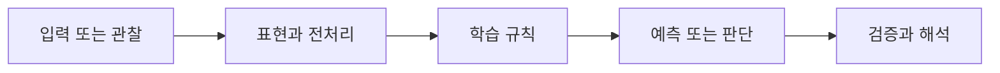

> [!abstract] 핵심
> 이 자료는 읽을 수 있는 본문 텍스트가 추출되지 않아, 원본 이미지를 사용하지 않는 조건에서는 RNN·LSTM 내용 정리를 확정할 수 없다.

## 문제를 모델로 바꾸기

확인 가능한 텍스트가 없는 상태에서는 모델의 구조, 수식, 구현 절차를 추정해 적지 않는다. 이 문서는 학습 내용의 대체 설명이 아니라, 재구성 가능한 근거의 경계를 기록한다.



| 관점 | 이 노트에서 확인할 질문 | 학습할 때의 점검 |
| --- | --- | --- |
| 확인 가능 | 자료명 수준의 주제 | 세부 주장으로 확장하지 않는다 |
| 확인 불가 | 수식·판서·예시의 본문 | 추정이나 외부 지식으로 채우지 않는다 |
| 후속 조건 | 읽을 수 있는 텍스트 | 근거마다 내용과 검증 항목을 분리한다 |

> [!note] 흐름
> 텍스트 근거가 확보되기 전에는 제목 수준의 분류만 유지한다. 이후 읽을 수 있는 텍스트가 제공되면 개념, 과정, 예시를 분리해 새 노트로 작성하고 이 한계 기록을 갱신한다.

```html preview h=170
<div style="font-family:system-ui,sans-serif;padding:16px;border:1px solid var(--background-modifier-border);background:var(--background-primary-alt);color:var(--foreground);border-radius:10px">
  <div style="font-weight:700;margin-bottom:10px">01. RNN·LSTM 판서 자료의 텍스트 추출 한계 · 학습 흐름</div>
  <div style="display:grid;grid-template-columns:repeat(4,1fr);gap:8px">
    <div style="padding:10px;border:1px solid var(--background-modifier-border);border-radius:8px">입력</div>
    <div style="padding:10px;border:1px solid var(--background-modifier-border);border-radius:8px">표현</div>
    <div style="padding:10px;border:1px solid var(--background-modifier-border);border-radius:8px">학습</div>
    <div style="padding:10px;border:1px solid var(--background-modifier-border);border-radius:8px">점검</div>
  </div>
</div>
```

## 관점을 나누어 보기

<Tabs>
<Tab label="개념">

이 문서는 RNN·LSTM의 사실 노트가 아니다. 현재 확인 가능한 정보와 확인할 수 없는 정보를 분리하는 기록이다.

</Tab>
<Tab label="실행">

원본 이미지를 읽거나 옮기지 않는다. 본문 텍스트가 확보될 때까지 내용 재구성 작업을 보류한다.

</Tab>
<Tab label="검증">

세부 개념을 질문받았을 때 이 문서만으로 답을 확정하지 않는다. 텍스트 근거가 추가됐는지 먼저 확인한다.

</Tab>
</Tabs>

<details>
<summary>복습 질문</summary>

왜 제목만으로 수식이나 구현 순서를 채우면 안 되는가? 읽을 수 있는 본문이 제공되면 어떤 항목부터 근거화해야 하는가?

</details>

> [!tip] 학습 전략
> 입력, 모델의 가정, 평가 기준을 한 문장씩 연결해 설명해 본다. 계산 결과만 적지 말고 어떤 선택이 결과를 바꾸는지도 기록한다.
> [!warning] 원문 텍스트 추출 한계
> 원문 텍스트 추출 한계: 확인 가능한 학습 본문이 없어 원본 내용을 보정하거나 추정해 서술하지 않았다. 원본 이미지는 사용하지 않았다.
