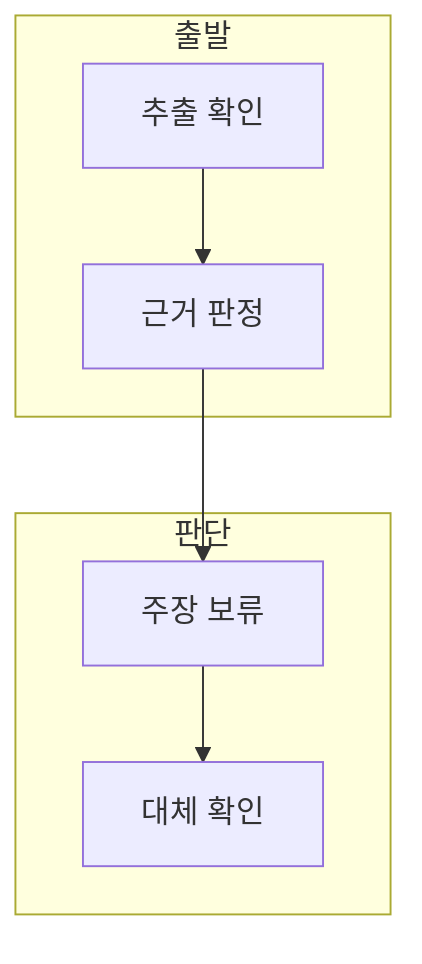

> [!abstract] 한 줄 요약
> 추출 텍스트에 RNN·LSTM 내용을 뒷받침할 본문이 없으므로, 공개 노트는 모델 설명 대신 근거 한계와 확인 절차만 기록한다.

## 이 노트의 지도



## 1. 텍스트 근거의 부재

이 추출본에서 ==텍스트 추출== 는 PDF에서 기계적으로 읽힌 문자 기반 근거.

> [!important] 주장 보류
> 제목만으로 RNN·LSTM의 구조·수식·성능을 서술하지 않는다.

## 2. 공개 노트의 안전한 범위

원본 슬라이드 이미지·자산과 텍스트형 페이지 표시는 공개 노트에 넣지 않는다.

<details>
<summary>확인 가능한 사실</summary>

파일명은 주제 단서이나, 추출 본문만으로는 학습 내용의 세부 항목을 독립 검증할 수 없다.

</details>

<details>
<summary>후속 학습 경로</summary>

RNN·LSTM 개념은 텍스트가 확보된 이론·실습 자료에서 확인하고 이 문서는 근거 경계를 기억하기 위한 기록으로만 사용한다.

</details>

## 데이터로 보기

```html preview
<div style="font-family:system-ui,sans-serif;padding:20px">
  <div id="cards" style="display:flex;gap:14px;flex-wrap:wrap"></div>
  <script>
    var stats = [
      ['본문 주장', '0', '추출 근거 없음', 'var(--chart-1)'],
      ['독립 정리', '보류', '제목만으로 불가', 'var(--chart-2)'],
      ['안전 경로', '텍스트', '별도 자료 사용', 'var(--chart-3)']
    ];
    document.getElementById('cards').innerHTML = stats.map(function (s) {
      return '<div style="flex:1;min-width:150px;padding:16px;background:var(--card);' +
        'color:var(--card-foreground);border:1px solid var(--border);' +
        'border-radius:var(--radius)">' +
        '<div style="font-size:13px;color:var(--muted-foreground)">' + s[0] + '</div>' +
        '<div style="font-size:26px;font-weight:700;margin-top:4px">' + s[1] + '</div>' +
        '<div style="font-size:12px;font-weight:600;margin-top:4px;color:' + s[3] + '">' + s[2] + '</div>' +
        '</div>';
    }).join('');
  </script>
</div>
```

> [!warning] 이미지로 우회하지 않기
> 추출이 비어 있다는 이유로 원본 이미지나 자산을 공개 노트에 삽입하지 않는다.

## 핵심 정리

| 개념 | 정의 | 학습 판단 |
| :-- | :-- | :-- |
| 파일 제목 | 주제 단서 | 독립 근거가 아니다 |
| 추출 본문 | 모델 설명 근거 | 현재 확인 불가 |
| 별도 텍스트 | 학습 근거 | 개념 노트에 사용 |

## 관련 개념

- RNN·LSTM 이론 자료는 상태와 gate를 텍스트로 설명한다.
- RNN·LSTM 실습 자료는 전처리와 학습 순서를 설명한다.

> [!question]- 스스로 점검
> **Q.** 이 자료만으로 LSTM gate 수식을 적을 수 있는가?
>
> **A.** 아니다. 별도 텍스트 근거가 필요하다.
