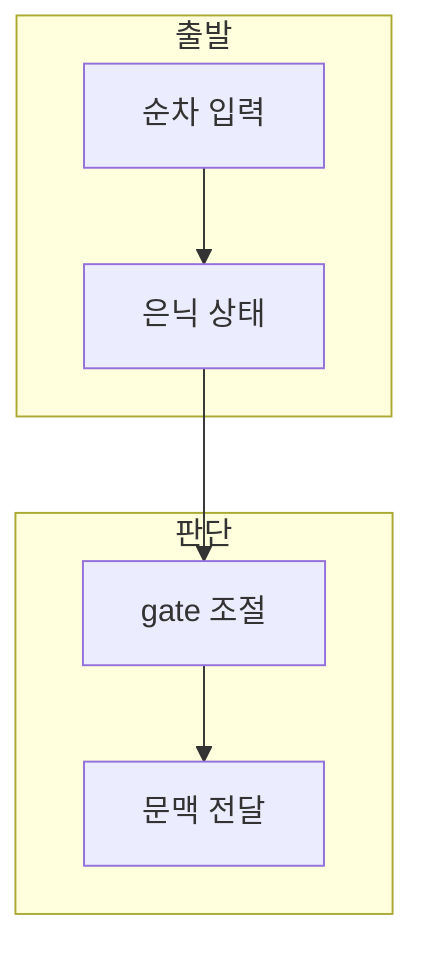

> [!abstract] 한 줄 요약
> RNN은 이전 상태를 재사용해 순서를 학습하고, LSTM은 gate와 cell state로 장기 정보 전달을 조절한다.

## 이 노트의 지도



## 1. RNN이 다루는 순서

RNN은 시간 순서가 있는 데이터를 위해 현재 입력과 이전 은닉 상태를 함께 사용한다. ==은닉 상태== 는 이전 단계 정보를 현재 단계로 전달하는 내부 표현.

> [!important] 장기 의존성의 문제
> 순서가 길어질수록 반복 갱신에서 기울기 소실과 장기 의존성 문제가 나타날 수 있다.

## 2. LSTM의 기억 조절

LSTM은 forget·input gate로 cell state를 갱신하고 output gate로 hidden state 반영량을 조절한다.

$$
C_t=f_t\odot C_{t-1}+i_t\odot\widetilde{C}_t
$$

<details>
<summary>cell state의 갱신</summary>

$f_t$는 과거 정보를 남길 비율, $i_t$는 현재 후보 정보를 반영할 비율을 뜻한다.

</details>

## 데이터로 보기

```html preview
<div style="font-family:system-ui,sans-serif;padding:20px;color:var(--foreground)">
  <label for="amt" style="font-size:14px;font-weight:600">forget gate 값</label>
  <div id="out" style="font-size:30px;font-weight:700;color:var(--chart-1);margin:6px 0">0.5</div>
  <input id="amt" type="range" min="0" max="1" step="0.1" value="0.5"
    style="width:100%;accent-color:var(--primary)" />
  <p style="font-size:13px;color:var(--muted-foreground)">과거 cell state를 얼마나 남길지 생각해 본다.</p>
  <script>
    var amt = document.getElementById('amt');
    var out = document.getElementById('out');
    amt.addEventListener('input', function () {
      out.textContent = Number(amt.value).toLocaleString();
    });
  </script>
</div>
```

> [!warning] LSTM도 만능이 아님
> LSTM은 장기 의존성을 완화하지만 긴 시퀀스와 순차 처리의 한계가 남는다.

## 핵심 정리

| 개념 | 정의 | 학습 판단 |
| :-- | :-- | :-- |
| RNN | 이전 상태 순환 사용 | 순차 문맥을 모델링 |
| cell state | 장기 정보 경로 | 기억을 누적·갱신 |
| gate | 정보 비율 조절 | 불필요한 정보를 줄임 |

## 관련 개념

- Transformer는 self-attention으로 순차 처리 한계를 다룬다.
- Word2Vec은 단어의 분산 표현을 학습한다.

> [!question]- 스스로 점검
> **Q.** forget gate가 과거 정보를 줄이는 역할을 하는 이유는?
>
> **A.** 이전 cell state에 곱해지는 비율을 조절하기 때문이다.
