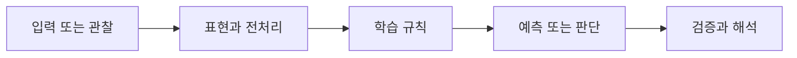

> [!abstract] 핵심
> RNN은 순서가 있는 입력을 은닉 상태로 전달하고, LSTM은 장기 의존성 문제를 완화하기 위해 장기 정보를 유지하는 구조를 사용한다.

## 문제를 모델로 바꾸기

RNN은 현재 입력과 이전 은닉 상태를 결합해 다음 상태를 계산한다. 이 순차적 구조는 문맥을 전달하지만 긴 구간의 정보를 안정적으로 유지하기 어렵고 병렬 처리에도 제약이 있다. LSTM은 장기 정보를 보존하는 셀 상태와 조절 장치를 두어 이 한계를 완화한다.



| 관점 | 이 노트에서 확인할 질문 | 학습할 때의 점검 |
| --- | --- | --- |
| 은닉 상태 | 앞선 입력의 요약 | 시간 단계에 따라 정보가 어떻게 변하는지 본다 |
| 장기 의존성 | 멀리 떨어진 정보의 필요 | 긴 시퀀스에서 손실과 예측을 확인한다 |
| LSTM 셀 | 장기 정보의 유지 통로 | 무엇을 보존·갱신할지 해석한다 |

> [!note] 흐름
> 시퀀스를 시간 순서대로 벡터화하고, 각 시점의 출력 또는 전체 시퀀스의 출력을 정답과 비교한다. RNN과 LSTM은 같은 과제에서 손실 변화와 긴 문맥의 처리 차이를 관찰하며 비교한다.

```html preview h=170
<div style="font-family:system-ui,sans-serif;padding:16px;border:1px solid var(--background-modifier-border);background:var(--background-primary-alt);color:var(--foreground);border-radius:10px">
  <div style="font-weight:700;margin-bottom:10px">01. RNN과 LSTM 기초 · 학습 흐름</div>
  <div style="display:grid;grid-template-columns:repeat(4,1fr);gap:8px">
    <div style="padding:10px;border:1px solid var(--background-modifier-border);border-radius:8px">입력</div>
    <div style="padding:10px;border:1px solid var(--background-modifier-border);border-radius:8px">표현</div>
    <div style="padding:10px;border:1px solid var(--background-modifier-border);border-radius:8px">학습</div>
    <div style="padding:10px;border:1px solid var(--background-modifier-border);border-radius:8px">점검</div>
  </div>
</div>
```

## 관점을 나누어 보기

<Tabs>
<Tab label="개념">

RNN은 순서를 가진 데이터를 상태의 연속으로 표현한다. LSTM은 RNN의 장기 의존성 문제를 완화한 개선 구조다.

</Tab>
<Tab label="실행">

자연어처럼 이산적인 입력은 모델이 다룰 수 있는 벡터로 바꾼다. 예측한 전체 시퀀스와 정답 시퀀스를 비교해 손실을 계산한다.

</Tab>
<Tab label="검증">

짧은 예시의 정확도만으로 장기 의존성 해결을 판단하지 않는다. 길이와 문맥 조건을 바꾼 검증이 필요하다.

</Tab>
</Tabs>

<details>
<summary>복습 질문</summary>

RNN의 순차 처리 특성이 병렬 처리에 어떤 제약을 주는가? LSTM에서 장기 정보를 유지한다는 말은 어떤 학습 문제를 겨냥하는가?

</details>

> [!tip] 학습 전략
> 입력, 모델의 가정, 평가 기준을 한 문장씩 연결해 설명해 본다. 계산 결과만 적지 말고 어떤 선택이 결과를 바꾸는지도 기록한다.

> [!warning] 해석 주의
> LSTM은 장기 의존성 문제를 완화하지만 모든 긴 시퀀스 문제를 자동으로 해결한다고 해석해서는 안 된다.
