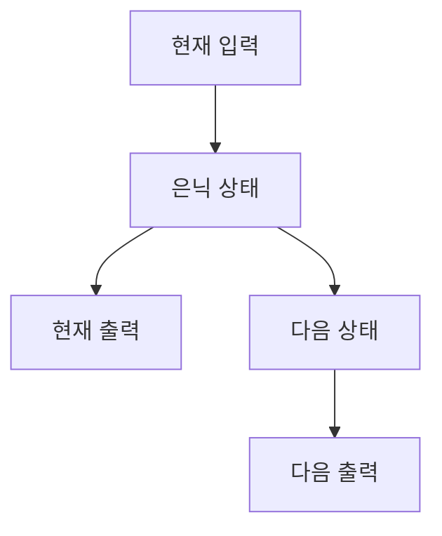

> [!NOTE]
> RNN은 이전 시점의 상태를 다음 시점 계산에 전달하고, LSTM은 별도의 cell state와 세 gate로 기억과 망각을 조절한다.

---

## 순차 데이터가 필요한 이유

**핵심:** 같은 값이라도 시간 순서와 앞선 문맥에 따라 다음 상태의 의미가 달라질 수 있다.

| 시각 | 특성 1 | 특성 2 | 특성 3 | 판정 |
| :-- | --: | --: | --: | :-- |
| 12:00 | 0 | 98.9 | 3.9 | 정상 |
| 13:00 | 0 | 98.9 | 3.9 | 정상 |
| 14:00 | 0.3 | 74.5 | 6.7 | 불량 |
| 15:00 | 6.8 | 98.9 | 7.9 | 불량 |
| 24:00 | -0.9 | 78.3 | 6.6 | 정상 |

원본은 독립적인 다변량 입력과 달리 시계열에서는 앞선 시점과 현재 시점의 연결을 함께 보아야 한다고 설명한다.

---

## DNN, RNN, LSTM

<Tabs>
  <Tab label="DNN">현재 입력을 가중합과 활성화 함수에 통과시켜 현재 출력을 만든다. 시점 사이의 상태 전달은 없다.</Tab>
  <Tab label="RNN">현재 입력과 이전 상태를 결합해 hidden state를 갱신하고, 같은 가중치를 시간축에서 공유한다.</Tab>
  <Tab label="LSTM">hidden state 외에 cell state를 두고 forget, input, output gate로 정보의 흐름을 조절한다.</Tab>
</Tabs>

---

## 원본의 순환 상태 식

원본은 일반 변환을 다음과 같이 제시한다.

$$
h_i=f(W_{xh}x_i+\mathrm{bias}),\qquad
y_i=f(W_{hy}h_i+\mathrm{bias})
$$

이어지는 RNN 슬라이드에는 다음 식이 적혀 있다.

$$
h_t=f(W_{xh}x_t+W_{hh}x_{t-1}+\mathrm{bias})
$$

> [!WARNING]
> 두 번째 항의 가중치 이름은 hidden-to-hidden인데 입력 기호가 $x_{t-1}$로 표기되어 있다. 이전 hidden state를 뜻하는지 source 표기 오류인지 원본만으로 확정할 수 없으므로 식을 조용히 바꾸지 않는다.

---

## Sequence-to-sequence

**핵심:** encoder는 입력 sequence의 정보를 상태에 모으고, decoder는 SOS 토큰에서 시작해 출력 sequence를 순서대로 만든다.

| 입력 sequence | decoder 시작 | 출력 sequence |
| :-- | :-- | :-- |
| 나는 → 머신러닝이 → 좋다 | SOS | I → Like → Machine Learning |

원본은 이 구조를 many-to-many 변환으로 설명하며, 입력과 출력의 순서가 서로 다를 수 있음을 보여 준다.

---

## BPTT와 장기 의존성

> [!IMPORTANT]
> BPTT는 각 시점의 loss를 시간축을 따라 연결된 가중치로 역전파한다. sequence가 길어지면 0과 1 사이의 미분 인자가 계속 곱해져 앞쪽 정보의 영향이 0에 가까워질 수 있다.

원본의 장기 의존성 예

- 시간축은 0에서 100까지 길어진다.
- 각 단계의 gradient 인자는 0과 1 사이 값으로 설명된다.
- “Don’t look up”을 “위를 쳐다보지 마세요”로 옮길 때 앞의 “Don’t”가 뒤의 “마세요”에 영향을 주어야 한다.
- 원본의 BPTT 수식은 일부 문자와 합 기호가 깨져 있어 여기서는 관계만 보존한다.

---

## LSTM의 세 gate

| Gate | 입력으로 판단하는 것 | 상태에 미치는 역할 |
| :-- | :-- | :-- |
| Forget gate | $x_t$, $h_{t-1}$ | 이전 cell state에서 잊을 정보 선택 |
| Input gate | $x_t$, $h_{t-1}$ | 새 candidate 중 저장할 정보 선택 |
| Output gate | $x_t$, $h_{t-1}$ | 현재 hidden state로 내보낼 정보 선택 |

forget gate가 모두 0이면 이전 정보를 지우고, 모두 1이면 이전 cell state를 유지하는 예가 제시된다.

---

## Cell state에 새 정보 더하기

원본의 input gate와 candidate 예는 element-wise 곱으로 저장 후보를 만든다.

$$
\begin{aligned}
&[0.1,0,0.8,0.2,0.8,0.7,1]\\
&\quad\odot[0.1,0.3,0.6,0.2,0.9,0.1,0.4]\\
&=[0.01,0,0.48,0.04,0.72,0.07,0.4]
\end{aligned}
$$

이 값은 이전 cell state와 결합될 새 정보의 각 차원별 크기를 보여 준다.

---

## LSTM 이후에도 남는 한계

| 한계 | 원본의 설명 | 다음 연결 |
| :-- | :-- | :-- |
| 긴 sequence | LSTM으로 완화해도 장기 의존성 문제가 남음 | Seq2Seq로 추가 완화 |
| 순차 계산 | 입력과 출력을 차례로 처리 | 병렬처리가 어려움 |
| 전체 문맥 | 긴 sequence 전체를 한 상태에 담는 부담 | self-attention 기반 Transformer로 연결 |

> [!WARNING]
> BPTT 구간에는 깨진 합 기호와 잘못 결합된 글자가 있다. 판독되지 않는 수식은 복원하거나 외부 식으로 대체하지 않았다.

---

## 정리

| 핵심 개념 | 의미 | 적용 또는 경계 |
| :-- | :-- | :-- |
| Hidden state | 이전 시점의 정보를 현재 계산에 전달 | 긴 시간축에서 정보가 약해질 수 있음 |
| BPTT | 시간축으로 펼친 recurrent 계산의 역전파 | source 수식 일부는 glyph corruption |
| Cell state | LSTM의 장기 기억 경로 | gate가 기억과 망각을 조절 |
| 세 gate | forget, input, output | source가 제시한 역할 범위로 해석 |