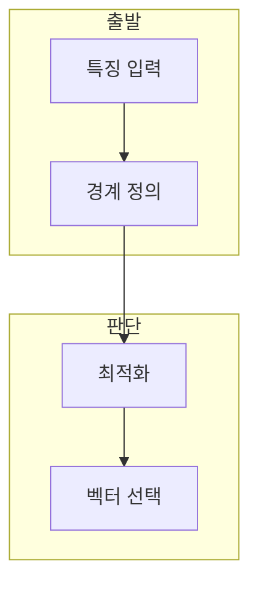

> [!abstract] 한 줄 요약
> SVM은 두 클래스를 가장 넓게 분리하는 결정 경계를 찾고, 강의는 경사 하강법과 이차 계획법을 그 해법으로 제시한다.

## 이 노트의 지도



## 1. 최대 마진의 목표

SVM은 서포트 벡터에 가까운 경계를 조절해 두 클래스를 분리한다. ==결정 경계== 는 분류 결과가 바뀌는 초평면.

> [!important] 제약 조건
> 분류 조건을 만족시키는 범위 안에서 가중치 크기를 줄이는 것이 최대 마진 관점의 핵심이다.

## 2. 두 가지 학습 경로

강의는 경사 하강법으로 $W,b$를 갱신하는 방법과 이차 계획법으로 최적화 문제를 푸는 방법을 함께 제시한다.

$$
y_i(W^T x_i+b)\geq 1
$$

<details>
<summary>마진과 계수</summary>

결정 경계는 $W^T x+b=0$으로 표현하며, 마진은 가중치 벡터의 크기와 연결된다.

</details>

## 데이터로 보기

```html preview
<div style="font-family:system-ui,sans-serif;padding:20px">
  <div id="cards" style="display:flex;gap:14px;flex-wrap:wrap"></div>
  <script>
    var stats = [
      ['목표', '마진', '분리 폭 확대', 'var(--chart-1)'],
      ['해법', 'GD', '반복 갱신', 'var(--chart-2)'],
      ['해법', 'QP', '제약 최적화', 'var(--chart-3)']
    ];
    document.getElementById('cards').innerHTML = stats.map(function (s) {
      return '<div style="flex:1;min-width:150px;padding:16px;background:var(--card);' +
        'color:var(--card-foreground);border:1px solid var(--border);' +
        'border-radius:var(--radius)">' +
        '<div style="font-size:13px;color:var(--muted-foreground)">' + s[0] + '</div>' +
        '<div style="font-size:26px;font-weight:700;margin-top:4px">' + s[1] + '</div>' +
        '<div style="font-size:12px;font-weight:600;margin-top:4px;color:' + s[3] + '">' + s[2] + '</div>' +
        '</div>';
    }).join('');
  </script>
</div>
```

> [!warning] 경계만 보지 않기
> 결정 경계 그림만으로 일반화 성능을 판단하지 않는다. 학습·검증 데이터와 매개변수 선택을 함께 점검한다.

## 핵심 정리

| 개념 | 정의 | 학습 판단 |
| :-- | :-- | :-- |
| 서포트 벡터 | 경계에 가까운 샘플 | 마진을 규정 |
| 경사 하강법 | 반복적 파라미터 갱신 | 근사 해법 |
| 이차 계획법 | 제약 최적화 | QP 해법 |

## 관련 개념

- SVC는 SVM 모델을 학습하는 라이브러리 인터페이스다.
- 힌지 손실은 마진 위반을 다루는 손실이다.

> [!question]- 스스로 점검
> **Q.** SVM에서 제약 조건을 확인하는 이유는?
>
> **A.** 분류 마진을 만족하는 경계만 최적화 대상이 되기 때문이다.
