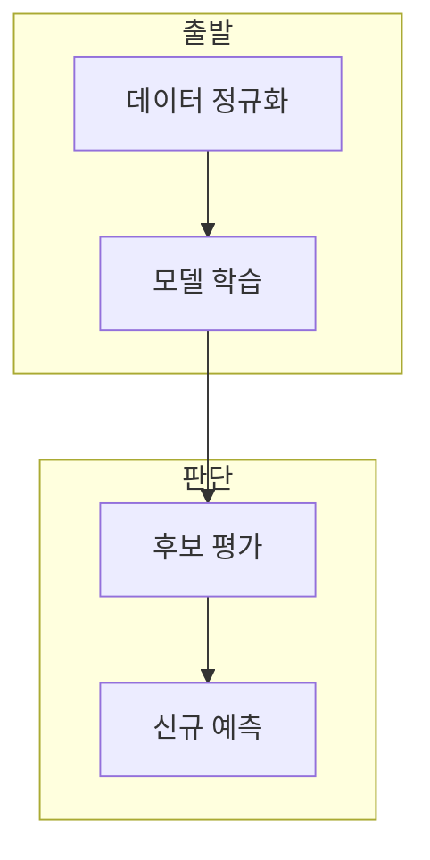

> [!abstract] 한 줄 요약
> 대비 문제는 정규화와 train/test 분리 뒤 SVM의 다중 분류와 KNN의 최적 K 선택을 각각 검증하게 한다.

## 이 노트의 지도



## 1. 문제의 입력과 분리

영화 장르 점수를 입력으로 쓰고, 가우시안 정규화 뒤 학습과 테스트 데이터로 나눈다. ==가우시안 정규화== 는 평균 0과 표준편차 1 기준으로 스케일을 맞추는 변환.

**평가 순서.** 신규 입력을 예측하기 전에 후보 모델을 학습 데이터로 만들고 테스트 기준을 정한다.

## 2. SVM과 KNN의 선택

SVM은 클래스별 모델의 점수를 비교하고, KNN은 후보 K별 정확도를 측정해 최적 K를 고른다.

<Tabs>
  <Tab label="SVM">클래스별 결정 점수를 계산해 가장 높은 점수를 고르는 방식으로 구성한다.</Tab>
  <Tab label="KNN">홀수 K 후보에 대해 정확도를 비교해 최적값을 선택한다.</Tab>
</Tabs>

<details>
<summary>신규 입력 처리</summary>

새 입력도 학습 데이터와 같은 평균·표준편차로 정규화한 뒤 모델에 전달해야 한다.

</details>

<details>
<summary>후보 K 기록</summary>

후보 K마다 정확도를 기록한 뒤 가장 높은 값을 선택한다.

</details>

## 데이터로 보기

```html preview
<div style="font-family:system-ui,sans-serif;padding:20px;color:var(--foreground)">
  <label for="amt" style="font-size:14px;font-weight:600">K 후보</label>
  <div id="out" style="font-size:30px;font-weight:700;color:var(--chart-1);margin:6px 0">15</div>
  <input id="amt" type="range" min="1" max="30" step="2" value="15"
    style="width:100%;accent-color:var(--primary)" />
  <p style="font-size:13px;color:var(--muted-foreground)">홀수 후보별 정확도를 비교한 뒤 선택한다.</p>
  <script>
    var amt = document.getElementById('amt');
    var out = document.getElementById('out');
    amt.addEventListener('input', function () {
      out.textContent = Number(amt.value).toLocaleString();
    });
  </script>
</div>
```

> [!warning] 시험 답과 일반화
> 특정 입력의 예측 결과를 다른 데이터셋의 성능 보장으로 해석하지 않는다.

## 핵심 정리

| 개념 | 정의 | 학습 판단 |
| :-- | :-- | :-- |
| 정규화 | 스케일 통일 | 거리·갱신을 안정화 |
| 다중 SVM | 클래스별 분류기 | 점수 비교 |
| 최적 K | 검증 정확도 기준 | KNN 과적합을 줄임 |

## 관련 개념

- KNN은 이웃 거리와 투표로 분류한다.
- SVM은 마진 기반 결정 경계를 찾는다.

> [!question]- 스스로 점검
> **Q.** KNN에서 홀수 K 후보를 비교하는 이유는?
>
> **A.** 이진 다수결의 동률 가능성을 줄이고 검증 정확도로 선택하기 위해서다.
