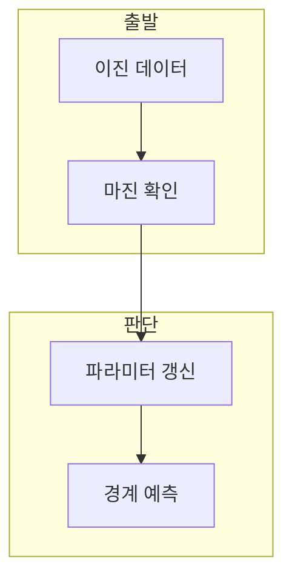

> [!abstract] 한 줄 요약
> 선형 SVM 구현은 마진 조건을 만족하지 않는 샘플에서 가중치와 편향을 갱신해 결정 경계를 만든다.

## 이 노트의 지도



## 1. 분류 조건

구현은 레이블을 -1과 1로 바꾸고 각 샘플이 마진 조건을 만족하는지 확인한다. ==힌지 손실== 는 마진을 만족하지 않는 경우를 벌점으로 다루는 손실.

> [!important] 갱신 대상
> 강의 구현에서는 마진 조건을 만족하지 않는 샘플에서만 가중치와 편향을 갱신한다.

## 2. 결정 경계 읽기

예측은 $w^T x+b$의 부호로 -1 또는 1을 선택하고, 경계와 마진선은 서로 다른 역할을 한다.

$$
w^T x+b=0
$$

<details>
<summary>학습률과 반복</summary>

학습률은 갱신 크기, 반복 횟수는 데이터셋을 순회하는 횟수다. 두 값은 결과에 영향을 준다.

</details>

## 데이터로 보기

```html preview
<div style="font-family:system-ui,sans-serif;padding:20px;color:var(--foreground)">
  <label for="amt" style="font-size:14px;font-weight:600">반복 횟수</label>
  <div id="out" style="font-size:30px;font-weight:700;color:var(--chart-1);margin:6px 0">1000</div>
  <input id="amt" type="range" min="100" max="2000" step="100" value="1000"
    style="width:100%;accent-color:var(--primary)" />
  <p style="font-size:13px;color:var(--muted-foreground)">반복과 학습률을 별개의 하이퍼파라미터로 본다.</p>
  <script>
    var amt = document.getElementById('amt');
    var out = document.getElementById('out');
    amt.addEventListener('input', function () {
      out.textContent = Number(amt.value).toLocaleString();
    });
  </script>
</div>
```

> [!warning] 레이블 규약
> 이 구현의 조건식은 -1·1 레이블을 전제로 한다. 0·1 레이블을 그대로 넣으면 해석이 달라진다.

## 핵심 정리

| 개념 | 정의 | 학습 판단 |
| :-- | :-- | :-- |
| 결정 함수 | $w^T x+b$ | 예측 부호의 근거 |
| 마진 조건 | 분류 여유 기준 | 갱신 여부 결정 |
| 학습률 | 갱신 크기 | 발산·수렴에 영향 |

## 관련 개념

- QP SVM은 제약 최적화로 경계를 구한다.
- 결정 경계는 마진선과 구별해 해석한다.

> [!question]- 스스로 점검
> **Q.** 마진 조건을 만족한 샘플을 같은 방식으로 갱신하지 않는 이유는?
>
> **A.** 강의 구현은 마진 위반을 우선 바로잡는 규칙이기 때문이다.
