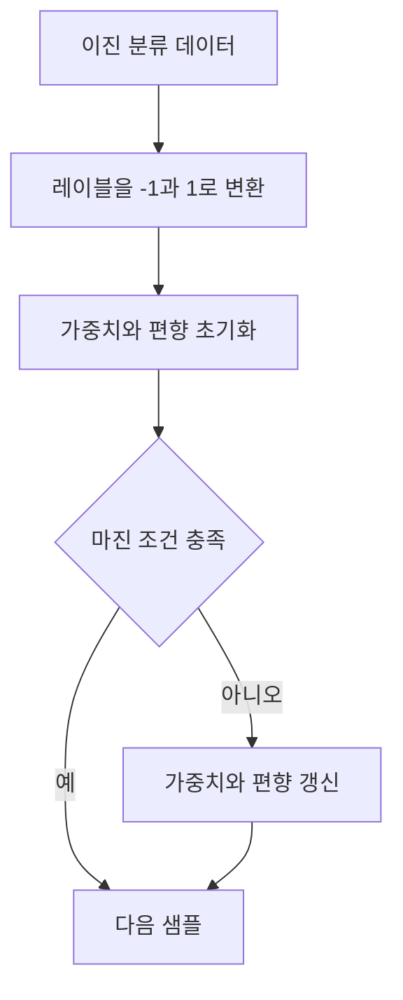

# SVM의 마진과 경사 하강법

> [!abstract] 핵심
> SVM은 분류를 위한 지도학습 알고리즘으로, 두 클래스를 가장 잘 분리하는 결정 경계를 찾는다. 선형 SVM의 초평면은 $w^Tx+b=0$으로 표현한다.

## 마진 조건을 이용한 갱신

이진 레이블을 $-1$과 $1$로 표현하면 각 관측치는 $y_i(w^Tx_i+b)\geq1$을 만족하도록 학습된다. 조건을 만족하지 않는 샘플에서 가중치와 편향을 갱신한다.



| 요소 | 의미 | 학습에서의 사용 |
| --- | --- | --- |
| $w$ | 가중치 벡터 | 경계의 방향 결정 |
| $b$ | 편향 | 경계의 위치 이동 |
| $w^Tx+b$ | 결정 함수 | 클래스 판단의 기준 |
| 마진 조건 | 분류 여유 조건 | 갱신 여부 판단 |

> [!note] 서포트 벡터 후보
> 마진 조건을 만족하지 않는 샘플은 경계 조정에 직접 관여한다. 이 구현 흐름에서는 그러한 샘플에 대해 경사 하강법 갱신을 수행한다.

```html preview h=170
<div style="font-family:system-ui,sans-serif;padding:16px;border:1px solid var(--border);background:var(--card);color:var(--foreground)">
  <div style="font-weight:700">마진 검사 루프</div>
  <div style="display:flex;align-items:center;gap:8px;flex-wrap:wrap;margin-top:10px">
    <span style="padding:8px;border:1px solid var(--border)">샘플</span>
    <span aria-hidden="true">→</span>
    <span style="padding:8px;border:1px solid var(--border)">조건 검사</span>
    <span aria-hidden="true">→</span>
    <span style="padding:8px;border:1px solid var(--border)">필요 시 갱신</span>
  </div>
</div>
```

<Tabs>
<Tab label="결정 경계">
결정 함수의 값이 경계의 어느 쪽에 있는지를 나타내며, 부호로 클래스를 정한다.
</Tab>
<Tab label="학습률">
학습률은 갱신 크기를 조절한다. 너무 큰 변화와 너무 작은 변화를 모두 점검한다.
</Tab>
<Tab label="반복 횟수">
반복 횟수는 전체 데이터에 대한 학습을 몇 번 수행할지 정한다.
</Tab>
</Tabs>

<details>
<summary>분류 구현 점검 질문</summary>

- 입력의 행은 샘플, 열은 특성으로 구성되었는가?
- 레이블이 $-1$과 $1$로 정리되었는가?
- 마진 조건을 만족하지 않을 때만 갱신하는가?
- 예측에서는 결정 함수의 부호를 사용하는가?
</details>

> [!tip] 조건식을 먼저 기록하기
> 업데이트 식보다 먼저 마진 조건을 확인하면, 어떤 샘플이 모델 변화에 영향을 주는지 더 명확히 볼 수 있다.

> [!warning] 선형 경계의 범위
> 이 흐름은 선형 커널을 이용한 구현이다. 비선형 분리 문제에 같은 경계를 그대로 적용할 수 있는지는 별도로 검토해야 한다.
