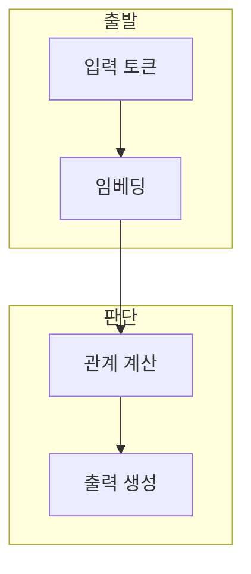

> [!abstract] 한 줄 요약
> Transformer는 self-attention으로 시퀀스 내 관계를 다루고, 인코더와 디코더가 입력 표현과 출력 생성을 나눠 처리한다.

## 이 노트의 지도



## 1. 인코더의 표현 만들기

인코더는 임베딩과 위치 정보를 바탕으로 self-attention과 feed-forward 단계를 거친다. ==self-attention== 는 각 토큰이 같은 시퀀스의 다른 토큰과 관계를 계산하는 방식.

> [!important] 관계 계산의 범위
> attention은 토큰의 관계를 다루지만 입력 순서 정보는 positional encoding으로 별도 제공한다.

## 2. 디코더의 출력 만들기

디코더는 인코더 결과와 현재까지의 출력 토큰을 함께 사용해 다음 토큰을 생성한다.

<Tabs>
  <Tab label="인코더">입력 토큰의 문맥 표현을 만든다. self-attention 뒤 Add & Norm과 feed-forward를 적용한다.</Tab>
  <Tab label="positional encoding,순서 정보 표현,토큰 순서를 보완,multi-head attention,여러 관계 관점,문맥 표현 강화,feed-forward,토큰별 변환,표현을 갱신">현재 출력과 인코더 표현을 결합해 다음 토큰을 생성한다.</Tab>
</Tabs>

<details>
<summary>잔차 연결과 정규화</summary>

강의는 Add & Norm을 잔차 연결과 layer normalization의 결합으로 제시한다. 각 블록의 입력·출력 위치를 구분해 추적한다.

</details>

## 데이터로 보기

```html preview
<div style="font-family:system-ui,sans-serif;padding:20px">
  <div id="cards" style="display:flex;gap:14px;flex-wrap:wrap"></div>
  <script>
    var stats = [
      ['입력', '토큰', '임베딩 시작', 'var(--chart-1)'],
      ['관계', 'Attention', '문맥 결합', 'var(--chart-2)'],
      ['출력', 'Decoder', '다음 토큰', 'var(--chart-3)']
    ];
    document.getElementById('cards').innerHTML = stats.map(function (s) {
      return '<div style="flex:1;min-width:150px;padding:16px;background:var(--card);' +
        'color:var(--card-foreground);border:1px solid var(--border);' +
        'border-radius:var(--radius)">' +
        '<div style="font-size:13px;color:var(--muted-foreground)">' + s[0] + '</div>' +
        '<div style="font-size:26px;font-weight:700;margin-top:4px">' + s[1] + '</div>' +
        '<div style="font-size:12px;font-weight:600;margin-top:4px;color:' + s[3] + '">' + s[2] + '</div>' +
        '</div>';
    }).join('');
  </script>
</div>
```

> [!warning] 구조 이름만 외우지 않기
> 인코더·디코더·attention의 이름만으로 데이터 흐름을 바꾸어 해석하지 않는다.

## 핵심 정리

| 개념 | 정의 | 학습 판단 |
| :-- | :-- | :-- |
| positional encoding | 순서 정보 표현 | 토큰 순서를 보완 |
| multi-head attention | 여러 관계 관점 | 문맥 표현 강화 |
| feed-forward | 토큰별 변환 | 표현을 갱신 |

## 관련 개념

- Transformer 언어 모델링은 다음 토큰 확률을 다룬다.
- RNN·LSTM은 순차 상태 전달을 사용한다.

> [!question]- 스스로 점검
> **Q.** 인코더와 디코더의 역할을 나눠 보는 이유는?
>
> **A.** 입력 문맥 표현과 출력 토큰 생성의 데이터 흐름이 다르기 때문이다.
