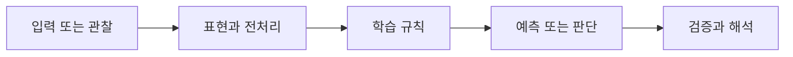

> [!abstract] 핵심
> Self-attention은 Query, Key, Value를 이용해 단어 사이의 관련도를 계산하고, multi-head 방식은 여러 관점의 attention을 결합한다.

## 문제를 모델로 바꾸기

Self-attention에서 Query는 현재 비교의 기준, Key는 비교 대상, Value는 attention 가중치를 적용할 정보로 사용된다. Scaled dot-product attention은 Query와 Key의 점수를 계산해 가중치로 만들고 Value를 결합한다. Multi-head self-attention은 여러 head의 결과를 함께 사용한다.



| 관점 | 이 노트에서 확인할 질문 | 학습할 때의 점검 |
| --- | --- | --- |
| Query | 무엇을 찾는가 | 현재 토큰의 비교 기준을 본다 |
| Key | 무엇과 비교하는가 | 연관도 계산의 대상 집합을 정한다 |
| Value | 무엇을 모으는가 | 가중치 적용 뒤 정보가 결합되는지 확인한다 |

> [!note] 흐름
> 입력 표현에서 Query·Key·Value를 만들고 점수의 크기를 조정한 뒤 가중치를 적용한다. 여러 head의 출력을 결합할 때 차원과 head 수의 관계를 확인한다.

```html preview h=170
<div style="font-family:system-ui,sans-serif;padding:16px;border:1px solid var(--background-modifier-border);background:var(--background-primary-alt);color:var(--foreground);border-radius:10px">
  <div style="font-weight:700;margin-bottom:10px">01. Transformer Self-Attention · 학습 흐름</div>
  <div style="display:grid;grid-template-columns:repeat(4,1fr);gap:8px">
    <div style="padding:10px;border:1px solid var(--background-modifier-border);border-radius:8px">입력</div>
    <div style="padding:10px;border:1px solid var(--background-modifier-border);border-radius:8px">표현</div>
    <div style="padding:10px;border:1px solid var(--background-modifier-border);border-radius:8px">학습</div>
    <div style="padding:10px;border:1px solid var(--background-modifier-border);border-radius:8px">점검</div>
  </div>
</div>
```

## 관점을 나누어 보기

<Tabs>
<Tab label="개념">

Self-attention은 한 단어가 다른 단어와 얼마나 연관되는지 학습하는 메커니즘이다. Query·Key·Value는 이 비교를 역할로 나눈 표현이다.

</Tab>
<Tab label="실행">

점수 계산, 스케일 조정, 가중치 적용, Value 결합의 순서를 추적한다. Multi-head에서는 각 head의 결과를 결합하는 단계가 추가된다.

</Tab>
<Tab label="검증">

attention 행렬이 특정 입력에 그럴듯해 보여도 과제 성능이나 일반화의 충분한 증거는 아니다. 마스크와 길이를 바꾼 조건에서 검증한다.

</Tab>
</Tabs>

<details>
<summary>복습 질문</summary>

Query와 Key를 분리하면 어떤 비교를 표현할 수 있는가? 여러 head를 쓰는 경우 결합 뒤의 차원을 왜 점검해야 하는가?

</details>

> [!tip] 학습 전략
> 입력, 모델의 가정, 평가 기준을 한 문장씩 연결해 설명해 본다. 계산 결과만 적지 말고 어떤 선택이 결과를 바꾸는지도 기록한다.
> [!warning] 해석 주의
> attention 가중치를 설명으로 바로 등치하면 안 된다. 가중치는 특정 계산 단계의 관계도이며, 전체 모델의 모든 의사결정을 단독으로 설명하지 않는다.
