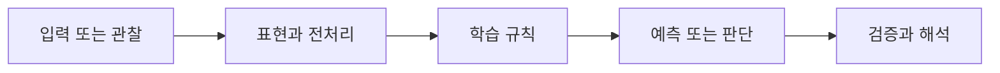

> [!abstract] 핵심
> 언어 모델은 단어 시퀀스에 확률을 할당하며, Transformer는 단어 임베딩에 위치 정보를 더하고 attention으로 문맥 관계를 학습한다.

## 문제를 모델로 바꾸기

언어 모델링은 주어진 단어들로부터 다음 단어 또는 빈 자리를 예측하는 확률적 문제다. 자기회귀 방식은 앞선 단어를 이용해 다음 단어를 예측하고, 양방향 방식은 양쪽 문맥을 이용해 가운데 단어를 예측한다. Transformer는 임베딩만으로는 순서를 알 수 없으므로 positional encoding으로 위치 정보를 더한다.



| 관점 | 이 노트에서 확인할 질문 | 학습할 때의 점검 |
| --- | --- | --- |
| 언어 모델 | 시퀀스에 확률 할당 | 예측 목표와 문맥 범위를 명시한다 |
| 임베딩 | 토큰의 수치 표현 | 어휘·차원·특수 토큰을 관리한다 |
| 위치 정보 | 순서의 단서 | 임베딩과 결합되는 방식을 확인한다 |

> [!note] 흐름
> 토큰을 임베딩으로 바꾸고 위치 정보를 결합한 뒤 attention 층에 전달한다. 과제의 예측 방향에 맞춰 입력 마스크, 정답 위치, 평가 단위를 정한다.

```html preview h=170
<div style="font-family:system-ui,sans-serif;padding:16px;border:1px solid var(--background-modifier-border);background:var(--background-primary-alt);color:var(--foreground);border-radius:10px">
  <div style="font-weight:700;margin-bottom:10px">01. Transformer 언어 모델링 · 학습 흐름</div>
  <div style="display:grid;grid-template-columns:repeat(4,1fr);gap:8px">
    <div style="padding:10px;border:1px solid var(--background-modifier-border);border-radius:8px">입력</div>
    <div style="padding:10px;border:1px solid var(--background-modifier-border);border-radius:8px">표현</div>
    <div style="padding:10px;border:1px solid var(--background-modifier-border);border-radius:8px">학습</div>
    <div style="padding:10px;border:1px solid var(--background-modifier-border);border-radius:8px">점검</div>
  </div>
</div>
```

## 관점을 나누어 보기

<Tabs>
<Tab label="개념">

언어 모델은 자연스러운 단어 시퀀스를 찾기 위해 확률을 사용한다. 자기회귀와 양방향 모델은 이용 가능한 문맥의 방향이 다르다.

</Tab>
<Tab label="실행">

Transformer 입력은 토큰 임베딩과 위치 정보를 결합한다. 이후 attention은 단어 사이 연관성이 높은 정도를 학습한다.

</Tab>
<Tab label="검증">

다음 단어 예측과 빈칸 예측은 같은 점수로 바로 비교할 수 없다. 마스크와 정답 정의를 과제에 맞춰 고정한다.

</Tab>
</Tabs>

<details>
<summary>복습 질문</summary>

위치 정보가 없다면 attention 기반 처리에서 어떤 구분이 어려워지는가? 자기회귀와 양방향 모델의 입력 문맥은 어떻게 다른가?

</details>

> [!tip] 학습 전략
> 입력, 모델의 가정, 평가 기준을 한 문장씩 연결해 설명해 본다. 계산 결과만 적지 말고 어떤 선택이 결과를 바꾸는지도 기록한다.
> [!warning] 해석 주의
> 언어 모델의 높은 확률은 문장의 사실성이나 안전성을 자동으로 보장하지 않는다. 확률적 자연스러움과 과제의 정답 기준을 구분한다.
